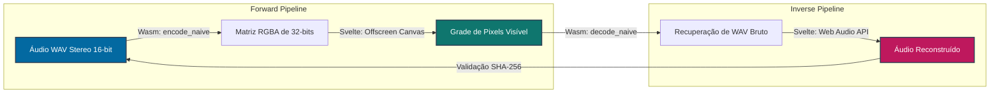

# 🎨🔊 Spectral

[](https://github.com/racoci/spectral/actions/workflows/deploy.yml)
[](https://svelte.dev/)
[](https://www.rust-lang.org/)
[](https://rustwasm.github.io/wasm-pack/)

**Spectral** é um laboratório interativo de processamento digital de sinais para conversão de áudio em imagens bidimensionais (e vice-versa) de forma **100% reversível e sem perdas (lossless / bit-perfect)**.

A aplicação é executada inteiramente no lado do cliente (client-side) como uma aplicação SPA de alta performance, projetada para ser hospedada estaticamente no **GitHub Pages**. O motor matemático é implementado em **Rust (WebAssembly)** para garantir precisão e determinismo bit-a-bit, enquanto o visualizador interativo utiliza **HTML5 Canvas / WebGL** para renderização a 60 FPS com controles de zoom e translação.

---

## 🗺️ Visão Geral da Arquitetura

O sistema é baseado em **Validação Cruzada Simétrica (Symmetrical Cross-Validation)**. Qualquer operação de codificação $f(x)$ deve ser perfeitamente invertível por seu decodificador correspondente $f^{-1}(y)$, de modo que o áudio de saída seja binariamente idêntico ao áudio de entrada: $f^{-1}(f(x)) \equiv x$.

### Pipeline Simétrico

```text
                                  [ FWD PIPELINE ]
                                  
+-------------------+        Codificação WASM        +--------------------+
|    Áudio WAV      | -----------------------------> |   Matriz Pixels    |
| (16-bit / Stereo) |                                |    (RGBA bytes)    |
+-------------------+                                +--------------------+
          ^                                                     |
          |                  Decodificação WASM                 |
          +-----------------------------------------------------+
                                  [ INV PIPELINE ]
```



---

## 🛠️ Stack Tecnológica

*   **Linguagem & Matemática**: [Rust](https://www.rust-lang.org/) compilado para **WebAssembly (Wasm)**. Garante determinismo matemático (evitando divergências de ponto flutuante de GPUs entre navegadores) e performance de CPU nativa.
*   **Interface Reativa**: [Svelte 5](https://svelte.dev/) com TypeScript. Compilação ultra-leve sem sobrecarga de Virtual DOM.
*   **Visualização Gráfica**: HTML5 Canvas interativo em modo *No-Smoothing* para inspecionar e transladar pixel por pixel de dados de áudio.
*   **Pipeline de Builds**: [Vite](https://vite.dev/) configurado com roteamento de caminhos relativos para compatibilidade com o GitHub Pages.
*   **CI/CD**: GitHub Actions para compilação automatizada do Rust/Wasm e publicação dos ativos no branch `gh-pages`.

---

## ⚡ Guia de Inicialização Local

### Pré-requisitos

Certifique-se de ter as ferramentas abaixo instaladas no sistema:
*   [Rust & Cargo](https://www.rust-lang.org/tools/install) (Edição 2024 ou superior)
*   [Node.js](https://nodejs.org/) (Versão 20 ou superior)
*   `wasm-pack` (Incluso automaticamente via npx na execução do build)

### Comandos de Desenvolvimento

Instale as dependências e inicie o servidor local reativo:

```bash
# 1. Instalar as dependências do Node.js
npm install

# 2. Executar os testes unitários matemáticos do Rust
cargo test --manifest-path core-wasm/Cargo.toml

# 3. Compilar o Rust para WebAssembly e iniciar o Vite Dev Server
npm run dev
```

Abra o navegador em `http://localhost:5173/`. Qualquer modificação no Rust ou Svelte atualizará a tela automaticamente através de HMR (Hot Module Replacement).

---

## 🚀 Como Hospedar no GitHub Pages (Repositório `spectral`)

Caso queira hospedar este projeto sob o nome **`spectral`** na sua conta pessoal do GitHub:

### 1. Inicialize e Faça o Push do Código

```bash
# Inicialize o repositório git local (se ainda não estiver inicializado)
git init -b master

# Vincule o repositório remoto do GitHub (Substitua <seu-usuario> pelo seu nickname)
git remote add origin https://github.com/<seu-usuario>/spectral.git

# Adicione todos os arquivos ao controle de versão
git add .

# Crie o commit inicial das funcionalidades
git commit -m "feat: initial commit of spectral lossless conversion pipeline"

# Envie as alterações para o GitHub
git push -u origin master
```

### 2. Configure a Branch do GitHub Pages no GitHub
Após realizar o primeiro push para o ramo `master`, o fluxo de integração contínua (GitHub Actions) configurado em `.github/workflows/deploy.yml` compilará o Rust/Svelte automaticamente e criará um ramo chamado **`gh-pages`** no seu repositório.

1.  Acesse o repositório no site do GitHub (`https://github.com/<seu-usuario>/spectral`).
2.  Clique na aba **Settings** no topo.
3.  No menu lateral, selecione **Pages**.
4.  Na seção **Build and deployment** $\rightarrow$ **Source**, garanta que esteja selecionado **Deploy from a branch**.
5.  Em **Branch**, altere de `None` para **`gh-pages`** (mantenha a pasta `/ (root)`).
6.  Clique em **Save**.

Sua ferramenta estará online no link:
👉 `https://<seu-usuario>.github.io/spectral/`

---

## 📊 Propriedades de Integridade Bit-Perfect

A integridade do pipeline é comprovada computando-se a hash criptográfica **SHA-256** do arquivo de áudio de entrada e comparando-a de forma síncrona com o áudio decodificado resultante:

$$\text{SHA256}(Audio_{\text{Original}}) \equiv \text{SHA256}(Audio_{\text{Reconstruido}})$$

Se qualquer bit for alterado por arredondamento, truncamento ou quantização errônea, as hashes divergirão imediatamente e a interface acusará erro. O sandbox atual garante **0.00 dB de ruído / 100% de integridade binária**.

---

## 🖥️ Spectral CLI (Linha de Comando)

Além da interface gráfica web reativa, o **Spectral** fornece uma ferramenta robusta de linha de comando (CLI) permanente para conversões em lote e integrações automatizadas.

A CLI utiliza o mesmo motor matemático de alta performance compilado em **Rust/WebAssembly**, integrado com um wrapper em **TypeScript/Node.js** para leitura/gravação de arquivos PNG de forma super eficiente e sem perdas.

### ⚙️ Instalação e Compilação

Para configurar e utilizar a CLI localmente:

1.  Certifique-se de que as dependências do projeto estão instaladas e o motor em Rust está compilado para WASM:
    ```bash
    npm install
    npm run build:wasm
    ```
2.  Torne o script executável (caso queira usá-lo diretamente):
    ```bash
    chmod +x bin/spectral.ts
    ```

### 🚀 Instruções de Uso

A CLI suporta detecção automática baseada no cabeçalho de bytes (magic bytes) e extensão do arquivo.

```bash
# Executando via npm run
npm run spectral -- <arquivo_de_entrada> [arquivo_de_saida]

# Executando diretamente via npx
npx spectral <arquivo_de_entrada> [arquivo_de_saida]
```

#### Parâmetros:
- `<arquivo_de_entrada>`: Caminho para o arquivo que deseja converter (pode ser áudio como `.wav` ou uma imagem `.png`).
- `[arquivo_de_saida]` (Opcional): Caminho onde o arquivo convertido será salvo. Se omitido, ele salvará no mesmo diretório com a extensão apropriada (.png para áudio ou .wav para imagem).

#### Exemplos Práticos:

1.  **Codificar Áudio para Imagem PNG (Transformada Wavelet 2D CDF 5/3)**:
    ```bash
    npm run spectral -- tests/temp-samples/voice.wav tests/temp-samples/voice.png
    ```
    *Resultado*: Gera um arquivo PNG sem perdas contendo a representação visual exata dos coeficientes de wavelet.

2.  **Decodificar Imagem PNG para Áudio WAV (Transformada Wavelet Inversa 2D CDF 5/3)**:
    ```bash
    npm run spectral -- tests/temp-samples/voice.png tests/temp-samples/voice_reconstructed.wav
    ```
    *Resultado*: Recupera perfeitamente o áudio original.

### 🧪 Comprovando o Funcionamento Bit-Perfect

A CLI preserva todos os dados binários do áudio original de forma impecável. Você pode validar a integridade comparando as hashes SHA-256 do arquivo original e do arquivo reconstruído:

```bash
# 1. Calcule a hash do arquivo original
sha256sum tests/temp-samples/voice.wav

# 2. Calcule a hash do arquivo reconstruído
sha256sum tests/temp-samples/voice_reconstructed.wav
```

As duas hashes serão **idênticas**, provando que o processo de ida e volta (roundtrip) pela imagem física PNG é **100% simétrico, lossless e sem perda de um único bit**.

