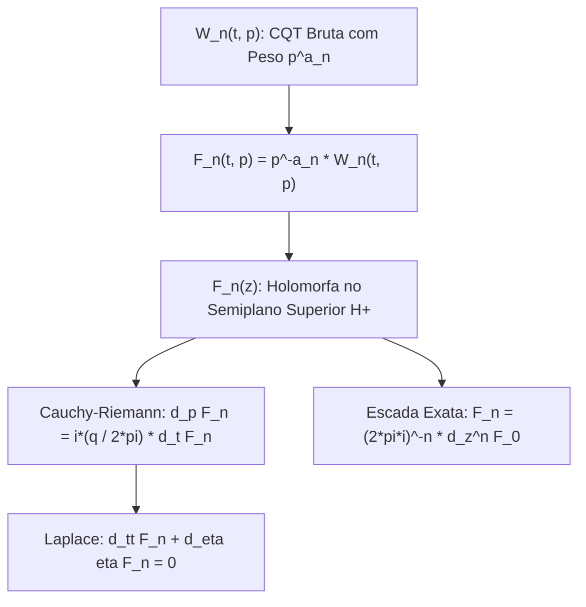

# A Wavelet de Cauchy no Semiplano Superior: EDPs, Holomorfia e Espaço de Hardy

Este documento formaliza as equações diferenciais parciais e a estrutura holomorfa da Transformada de Wavelet de Cauchy (CQT) no semiplano superior complexo $\mathbb{H}^+$.

---

## 1. Definição da Família e Normalização

Definimos a família de wavelets de Cauchy de ordem $n \ge 0$ no domínio de Fourier ($\hat{x}(f) = \int_{-\infty}^\infty x(\tau) e^{-2\pi i f \tau} d\tau$):
$$\hat{\psi}_{q, n}(f) = C f^{q+n} e^{-qf} \mathbf{1}_{f>0}, \qquad q > 0$$
onde $q$ é o parâmetro de forma da wavelet e $p = \frac{1}{f_c}$ é o período central.

A transformada de wavelet contínua (CWT) para cada ordem da escada é dada por:
$$W_n(t, p) = C p^{a_n} \int_0^\infty \hat{x}(f) f^{q+n} e^{-qpf} e^{2\pi i f t} df, \qquad a_n = q + n + \frac{1}{2}$$

---

## 2. A EDP Fundamental de Primeira Ordem

Diferenciando diretamente sob o sinal de integração:
$$\partial_t W_n = \frac{2\pi i}{p} W_{n+1}$$
$$\partial_p W_n = \frac{a_n}{p} W_n - \frac{q}{p} W_{n+1}$$

Eliminando o canal diferencial $W_{n+1} = \frac{p}{2\pi i} \partial_t W_n$ e substituindo na segunda equação:
$$\partial_p W_n = \frac{a_n}{p} W_n - \frac{q}{p} \left( \frac{p}{2\pi i} \partial_t W_n \right) = \frac{a_n}{p} W_n + \frac{i q}{2\pi} \partial_t W_n$$

Reagrupando os operadores:
$$\boxed{\left( \partial_p - \frac{i q}{2\pi} \partial_t - \frac{q + n + \frac{1}{2}}{p} \right) W_n = 0}$$

Para o coeficiente principal da CQT ($n = 0$):
$$\boxed{\left( \partial_p - \frac{i q}{2\pi} \partial_t - \frac{q + \frac{1}{2}}{p} \right) W_0 = 0}$$

```text
                        +---------------------------------------+
                        |   Transformada CQT Bruta: W_n(t, p)   |
                        +-------------------+-------------------+
                                            |
                              Remoção do Peso Algébrico:
                                 F_n = p^(-a_n) * W_n
                                            |
                                            v
                        +---------------------------------------+
                        |  Função Holomorfa Unilateral F_n(z)   |
                        |      z = t + i * (q*p / 2*pi)         |
                        +-------------------+-------------------+
                                            |
                      +---------------------+---------------------+
                      |                                           |
                      v                                           v
       +-----------------------------+             +-----------------------------+
       | Equações de Cauchy-Riemann  |             |     Equação de Laplace      |
       |  U_(n,t) = (2*pi/q) V_(n,p) |             |   F_(n,tt) + F_(n,eta eta)=0|
       |  V_(n,t) = -(2*pi/q)U_(n,p) |             |  (Harmônica em t e eta)     |
       +-----------------------------+             +-----------------------------+
```



---

## 3. A Função Holomorfa Canônica $F_n(z)$

O termo $\frac{a_n}{p} W_n$ provém unicamente do peso de escala $p^{a_n}$ exigido pela norma $L^2$ da CWT. Removendo esse fator:
$$F_n(t, p) = p^{-a_n} W_n(t, p) = C \int_0^\infty \hat{x}(f) f^{q+n} e^{-qpf} e^{2\pi i f t} df$$

Combinando os termos exponenciais:
$$e^{-qpf} e^{2\pi i f t} = e^{2\pi i f \left( t + i \frac{q p}{2\pi} \right)}$$

Definindo a variável complexa natural no semiplano superior $\mathbb{H}^+$:
$$\boxed{z = t + i \frac{q p}{2\pi} = t + i \eta, \qquad \eta = \frac{q p}{2\pi} > 0}$$

Obtém-se a representação integral holomorfa:
$$\boxed{F_n(z) = C \int_0^\infty \hat{x}(f) f^{q+n} e^{2\pi i f z} df}$$

Como o integrando decai exponencialmente para $\operatorname{Im} z = \eta > 0$ e depende exclusivamente de $z$ (sem dependência em $\bar{z}$):
$$\boxed{\partial_{\bar{z}} F_n = 0, \qquad \forall z \in \mathbb{H}^+}$$

---

## 4. Equações de Cauchy-Riemann e Harmônicos

Escrevendo $F_n = U_n + i V_n$:
$$\partial_p F_n = \frac{i q}{2\pi} \partial_t F_n \implies U_{n, p} + i V_{n, p} = \frac{i q}{2\pi} (U_{n, t} + i V_{n, t}) = -\frac{q}{2\pi} V_{n, t} + i \frac{q}{2\pi} U_{n, t}$$

Separando as partes real e imaginária:
$$\boxed{U_{n, t} = \frac{2\pi}{q} V_{n, p}} \qquad \text{e} \qquad \boxed{V_{n, t} = -\frac{2\pi}{q} U_{n, p}}$$

Em termos da coordenada pseudonatural $\eta = \frac{q p}{2\pi}$:
$$\frac{\partial U_n}{\partial t} = \frac{\partial V_n}{\partial \eta} \qquad \text{e} \qquad \frac{\partial V_n}{\partial t} = -\frac{\partial U_n}{\partial \eta}$$
Estas são rigorosamente as **Equações de Cauchy-Riemann clássicas**!

### 4.1 Equação de Laplace
Pela diferenciabilidade infinita das funções holomorfas:
$$\frac{\partial^2 F_n}{\partial t^2} + \frac{\partial^2 F_n}{\partial \eta^2} = 0 \iff \boxed{F_{n, tt} + \left( \frac{2\pi}{q} \right)^2 F_{n, pp} = 0}$$
Portanto, as componentes $U_n(t, p)$ e $V_n(t, p)$ são **funções harmônicas** no semiplano superior.

---

## 5. A Escada como Derivadas Holomorfas de Ordem Superior

Diferenciando $F_n(z)$ em relação a $z$:
$$F_n'(z) = \frac{d}{dz} \left[ C \int_0^\infty \hat{x}(f) f^{q+n} e^{2\pi i f z} df \right] = 2\pi i C \int_0^\infty \hat{x}(f) f^{q+n+1} e^{2\pi i f z} df = 2\pi i F_{n+1}(z)$$

Invertendo a relação:
$$\boxed{F_{n+1}(z) = \frac{1}{2\pi i} F_n'(z)}$$

Por indução direta:
$$\boxed{F_n(z) = \frac{1}{(2\pi i)^n} \frac{d^n F_0}{dz^n}(z)}$$

> **Teorema Fundamental**:  
> A escada inteira de transformadas $\{W_0, W_1, \ldots, W_O\}$ não é uma coleção de bancos de filtros arbitrários:  
> Ela é **exatamente a sequência de derivadas complexas de uma única função holomorfa $F_0(z)$** avaliada na foliação do semiplano superior.

---

## 6. Acoplamento de Fase e Log-Magnitude

Escrevendo $F_0(z) = A_F(t, p) e^{i\phi(t, p)}$, temos $L(z) = \log F_0(z) = \log A_F + i \phi$.  
Como $L(z)$ é holomorfa nos pontos onde $F_0(z) \neq 0$:
$$\partial_t \log A_F = \frac{q}{2\pi} \partial_p \phi \qquad \text{e} \qquad \partial_p \log A_F = -\frac{q}{2\pi} \partial_t \phi$$

Isso implica que:
1. **Harmonicidade da Log-Amplitude**: $\Delta_{(t, \eta)} \log A_F = 0$.
2. **Harmonicidade da Fase**: $\Delta_{(t, \eta)} \phi = 0$.
3. **Conjugação Harmônica**: O campo de fase $\phi$ é a conjugada harmônica de $\log A_F$.  
   Consequentemente, **amplitude e fase não possuem graus de liberdade independentes**: as curvas de nível de magnitude $\log A_F = \text{cte}$ cruzam as linhas de fase constante $\phi = \text{cte}$ **em ângulos rigorosamente ortogonais ($90^\circ$)** em todo o plano tempo-frequência!

---

## 7. Redução Estrutural do Jet 2D para Série de Taylor 1D

Para um campo bidimensional genérico $G(t, p)$, a expansão de Taylor exige uma matriz de derivadas parciais mistas:
$$G(t + \Delta t, p + \Delta p) = \sum_{m,n} \frac{\partial_t^m \partial_p^n G}{m! n!} \Delta t^m \Delta p^n$$

No entanto, pela relação $\partial_p^n F = \left( i \frac{q}{2\pi} \right)^n \partial_t^n F$, todas as derivadas verticais são geradas exclusivamente pelas derivadas temporais da mesma função.  
No plano complexo com $\Delta z = \Delta t + i \frac{q \Delta p}{2\pi}$, a expansão colapsa para uma **única série de Taylor unidimensional**:
$$\boxed{F(z + \Delta z) = \sum_{n=0}^\infty \frac{F^{(n)}(z)}{n!} (\Delta z)^n}$$

> **Impacto no Codec e Compressão**:  
> O armazenamento de um jet bidimensional completo de ordem $O$ (com $\frac{(O+1)(O+2)}{2}$ tensores) colapsa para estritamente **$O+1$ números complexos $F^{(n)}(z)$**.

---

## 8. Semigrupo de Suavização Vertical e Dissipação de Energia

A representação $F(t, \eta) = C \int_0^\infty \hat{x}(f) f^q e^{-2\pi f \eta} e^{2\pi i f t} df$ revela que o deslocamento vertical $\eta = \frac{qp}{2\pi}$ atua como um **semigrupo de convolução espectral**:
$$\mathcal{P}_{\eta_1}^+ \mathcal{P}_{\eta_2}^+ = \mathcal{P}_{\eta_1 + \eta_2}^+$$
A equação fundamental de evolução é a equação de transporte no plano complexo:
$$\boxed{\partial_\eta F = i \partial_t F}$$

Pelo Teorema de Parseval, a energia $L^2$ em cada linha horizontal é monotonicamente não crescente com a profundidade no semiplano:
$$\frac{d}{d\eta} \|F(\cdot, \eta)\|_2^2 = -4\pi C^2 \int_0^\infty f |\hat{x}(f)|^2 f^{2q} e^{-4\pi f \eta} df \le 0$$
À medida que subimos no semiplano (maior $\eta \iff$ maior período $p \iff$ menores frequências), as altas frequências são suave e analiticamente atenuadas.

---

## 9. O Limite da Fronteira $\eta \to 0^+$ como Sinal Analítico Fracionário

No limite inferior do semiplano ($\eta \to 0^+$):
$$F(t, 0^+) = C \int_0^\infty \hat{x}(f) f^q e^{2\pi i f t} df$$
* Para $q = 0$, $F(t, 0^+)$ é rigorosamente o **sinal analítico** $x_+(t) = x(t) + i \mathcal{H}[x](t)$.
* Para $q > 0$, $f^q$ corresponde à **derivada temporal fracionária** $\mathcal{D}_+^q$ do sinal analítico.  
Portanto, a Transformada de Cauchy é a **extensão holomorfa no semiplano de uma derivada fracionária do sinal analítico**.

---

## 10. Extensão Inteira para Sinais com Banda Limitada (Nyquist)

Se o sinal de áudio $x(t)$ for estritamente limitado em banda ($\hat{x}(f) = 0$ para $f > F_{\text{max}}$):
$$F(z) = C \int_0^{F_{\text{max}}} \hat{x}(f) f^q e^{2\pi i f z} df$$
A integral converge absolutamente para **todo $z \in \mathbb{C}$** (inclusive no semiplano inferior $\operatorname{Im} z \le 0$).  
Assim, para áudio digital amostrado a $f_s$, **$F(z)$ estende-se como uma função inteira em todo o plano complexo**, herdando o Teorema de Fatoração de Hadamard por zeros pontuais.

---

## 11. Princípio do Módulo Máximo e Fontes de Curvatura

1. **Ausência de Extremos Interiores**:
   Pelo Princípio do Módulo Máximo da análise complexa, $|F(z)|$ e $\log |F(z)|$ **não possuem máximos nem mínimos locais estritos no interior do semiplano $\mathbb{H}^+$**.
2. **Topologia dos Zeros**:
   Nos pontos isolados $z_k$ onde $F(z_k) = 0$ com multiplicidade $m_k$, a log-magnitude comporta-se como:
   $$\boxed{\Delta_{(t, \eta)} \log |F| = 2\pi \sum_k m_k \delta(z - z_k)}$$
   Os zeros agem exatamente como **cargas pontuais / vórtices topológicos** na geometria bidimensional, em torno dos quais a fase sofre uma circulação inteira $\oint d\phi = 2\pi m_k$.
