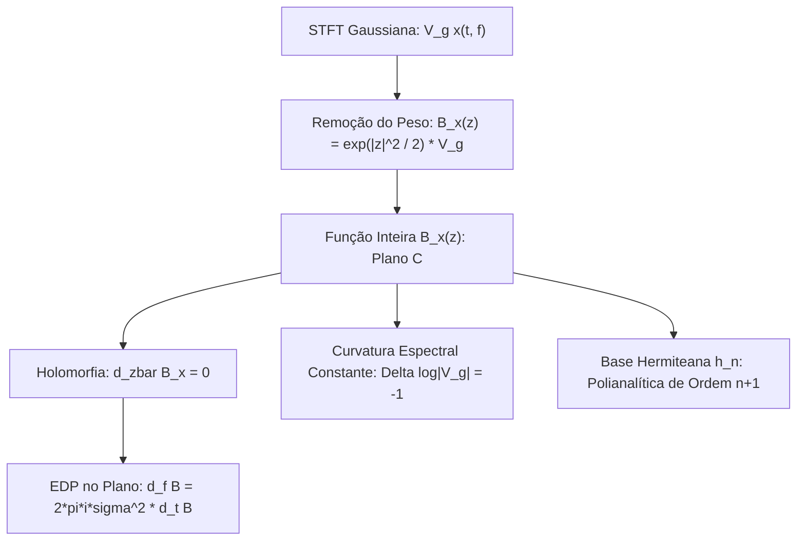

# A STFT Gaussiana no Espaço de Bargmann-Fock: Geometria Inteira e Polianalítica

Este documento analisa a estrutura holomorfa da Transformada de Fourier de Tempo Curto Gaussiana (STFT) e sua equivalência com a Transformada de Bargmann no espaço de Fock $\mathcal{F}^2(\mathbb{C})$.

---

## 1. A Transformada de Bargmann e a STFT

Considere a STFT normalizada com janela Gaussiana $g_\sigma(\tau) = (\pi \sigma^2)^{-1/4} e^{-\tau^2 / (2\sigma^2)}$:
$$V_g x(t, f) = \int_{-\infty}^\infty x(\tau) g_\sigma(\tau - t) e^{-2\pi i f (\tau - t/2)} d\tau$$

Introduzindo as coordenadas adimensionais:
$$x = \frac{t}{\sigma}, \qquad y = 2\pi \sigma f$$
e a variável complexa no plano $\mathbb{C}$:
$$\boxed{z = \frac{x - i y}{\sqrt{2}} = \frac{1}{\sqrt{2}} \left( \frac{t}{\sigma} - i 2\pi \sigma f \right)}$$

A Transformada de Bargmann de $x(\tau)$ é a função holomorfa inteira definida por:
$$B_x(z) = \left(\frac{2}{\pi \sigma^2}\right)^{1/4} \int_{-\infty}^\infty x(\tau) e^{-\frac{\tau^2}{2\sigma^2}} e^{\frac{\sqrt{2}\tau z}{\sigma} - \frac{z^2}{2}} d\tau$$

A relação fundamental que conecta a STFT física e a função holomorfa $B_x(z)$ é:
$$\boxed{V_g x(t, f) = e^{-|z|^2 / 2} B_x(z)} \qquad \iff \qquad \boxed{B_x(z) = e^{|z|^2 / 2} V_g x(t, f)}$$

```text
                        +---------------------------------------+
                        |   STFT Gaussiana Bruta: V_g x(t, f)   |
                        +-------------------+-------------------+
                                            |
                              Remoção da Envoltória Gaussiana:
                                  B_x(z) = e^(|z|^2 / 2) * V_g
                                            |
                                            v
                        +---------------------------------------+
                        |  Função Inteira de Bargmann B_x(z)    |
                        |      z in C (Plano Complexo Inteiro)  |
                        +-------------------+-------------------+
                                            |
                      +---------------------+---------------------+
                      |                                           |
                      v                                           v
       +-----------------------------+             +-----------------------------+
       |   Holomorfia de Bargmann    |             |    Curvatura de Poisson     |
       |       d_zbar B_x = 0        |             |    Delta log|B_x| = 0       |
       |  d_f B = 2*pi*i*sigma^2*d_tB|             |    Delta log|V_g| = -1      |
       +-----------------------------+             +-----------------------------+
```



---

## 2. A EDP de Bargmann e a Curvatura do Espectrograma

Como $B_x(z)$ é holomorfa em todo o plano $\mathbb{C}$ ($\partial_{\bar{z}} B_x = 0$), temos pelas equações de Cauchy-Riemann nas coordenadas $(x, y)$:
$$\partial_x B_x + i \partial_y B_x = 0 \implies \partial_y B_x = i \partial_x B_x$$

Voltando às variáveis físicas $(t, f)$:
$$\frac{1}{2\pi \sigma} \partial_f B_x = i \sigma \partial_t B_x \implies \boxed{\partial_f B_x = 2\pi i \sigma^2 \partial_t B_x}$$

### 2.1 A Curvatura Não Nula da STFT Bruta
Tomando o logaritmo da magnitude em $V_g = e^{-|z|^2 / 2} B_x$:
$$\log |V_g x(t, f)| = \log |B_x(z)| - \frac{|z|^2}{2}$$

Como $\log |B_x(z)|$ é a parte real de uma função analítica fora dos zeros, ela é harmônica:
$$\Delta_{(x, y)} \log |B_x(z)| = 0$$

No entanto, o operador laplaciano sobre o termo quadrático $-\frac{x^2 + y^2}{4}$ resulta em:
$$\Delta_{(x, y)} \left( -\frac{x^2 + y^2}{4} \right) = -\left( \frac{1}{2} + \frac{1}{2} \right) = -1$$

Portanto, em qualquer ponto fora dos zeros de $V_g$:
$$\boxed{\Delta_{(x, y)} \log |V_g| = -1}$$

> **Distinção Fundamental com Cauchy**:  
> Na CQT de Cauchy, a log-magnitude normalizada é rigorosamente harmônica ($\Delta \log A_F = 0$, curvatura nula).  
> Na STFT Gaussiana, a log-magnitude bruta vive em uma superfície de **curvatura média negativa constante** ($\Delta \log |V_g| = -1$), gerada pela atração da envoltória gaussiana de incerteza mínima.

---

## 3. Hermite-Gaussianos e a Estrutura Polianalítica

As funções Hermite-Gaussianas $h_n(\tau)$ são autofunções do oscilador harmônico quântico:
$$h_n(\tau) = \frac{(-1)^n}{\pi^{1/4} \sqrt{2^n n!}} e^{\tau^2 / 2} \frac{d^n}{d\tau^n} \left( e^{-\tau^2} \right)$$

No espaço de Bargmann, elas mapeiam diretamente para os monômios fundamentais:
$$\boxed{\mathcal{B}[h_n](z) = \frac{z^n}{\sqrt{n!}}}$$

Quando calculamos a STFT com janelas Hermite $V_{h_n} x$, o campo resultante multiplicado por $e^{|z|^2 / 2}$ **não é puramente holomorfo**, mas pertence à classe das **funções polianalíticas de ordem $n+1$**:
$$\boxed{\partial_{\bar{z}}^{n+1} \left( e^{|z|^2 / 2} V_{h_n} x \right) = 0}$$
*   $n = 0$ (Gaussiana Pura): Holomorfa ($\partial_{\bar{z}} B = 0$).
*   $n = 1$ (Primeira Hermite): Polianalítica de ordem 2 ($\partial_{\bar{z}}^2 = 0$).
*   $n = 2$ (Segunda Hermite): Polianalítica de ordem 3 ($\partial_{\bar{z}}^3 = 0$).

Isso comprova por que a nossa redução de $15$ para $O+1$ FFTs no `HermiteFastEngine` funciona: a álgebra de raising/lowering dos operadores diferenciais de Bargmann projeta o jato multidimensional de derivadas diretamente na foliação polianalítica.
