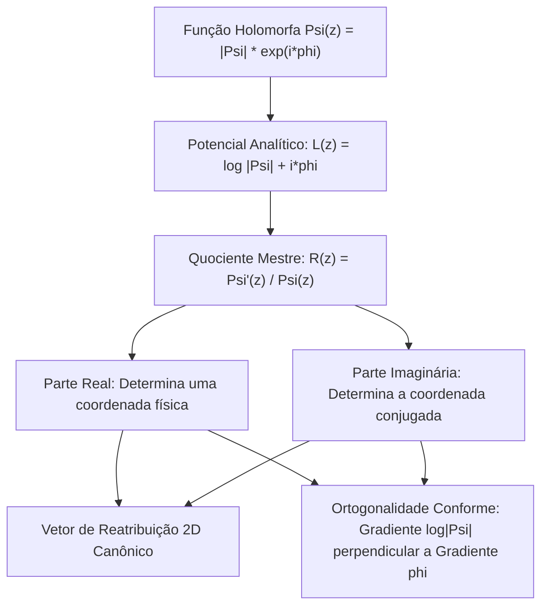

# Dualidade Holomorfa e Reatribuição: O Quociente Logarítmico Mestre

Este documento unifica o método de reatribuição tempo-frequência (*time-frequency reassignment*) como a **derivada logarítmica complexa de uma representação holomorfa**, demonstrando que as correções em tempo e frequência são componentes conjugadas de um único vetor conforme.

---

## 1. Reatribuição como Derivada Logarítmica Complexa

Seja $\Psi(z)$ uma representação holomorfa do sinal (seja $F_0(z)$ no semiplano de Hardy $\mathbb{H}^+$ para Cauchy, ou $B_x(z)$ no plano de Bargmann $\mathbb{C}$ para STFT Gaussiana).

Definindo o potencial analítico complexo:
$$L(z) = \log \Psi(z) = \log |\Psi(z)| + i \phi(z)$$

Sua derivada complexa ordinária é a **derivada logarítmica**:
$$\boxed{L'(z) = \frac{\Psi'(z)}{\Psi(z)}}$$

Pela holomorfia ($\partial_{\bar{z}} L = 0$), $L'(z)$ contém **simultaneamente** o gradiente da log-magnitude e o gradiente do campo de fase:
$$\partial_x L = \partial_x \log |\Psi| + i \partial_x \phi$$
$$\partial_y L = \partial_y \log |\Psi| + i \partial_y \phi = i \partial_x L = -\partial_x \phi + i \partial_x \log |\Psi|$$

```text
                     +---------------------------------------+
                     |    Potencial Analítico L(z) = log Psi |
                     +-------------------+-------------------+
                                         |
                            Derivada Logarítmica Complexa:
                                  L'(z) = Psi'(z) / Psi(z)
                                         |
                                         v
                     +---------------------------------------+
                     |     Quociente Mestre Único R(z)       |
                     +-------------------+-------------------+
                                         |
                   +---------------------+---------------------+
                   |                                           |
                   v                                           v
    +-----------------------------+             +-----------------------------+
    |   Gradiente de Log-Magnitude|             |      Gradiente de Fase      |
    |      nabla log |Psi(z)|     |             |         nabla phi           |
    |   (Curvatura e Cristas)     |             |   (Tempo e Freq Instantâneas|
    +-----------------------------+             +-----------------------------+
```



---

## 2. A Unificação dos Dois Domínios

| Domínio de Análise | Quociente Físico | Frequência Reatribuída ($\hat{f}$ ou $\hat{\omega}$) | Tempo Reatribuído ($\hat{t}$) |
| :--- | :---: | :---: | :---: |
| **STFT Gaussiana** | $R = \frac{V_1}{V_0} = \frac{\mathcal{F}[x \cdot g']}{\mathcal{F}[x \cdot g]}$ | $\hat{\omega} = \omega - \operatorname{Im}(R)$ | $\hat{t} = t - \sigma^2 \operatorname{Re}(R)$ |
| **CQT de Cauchy** | $R = \frac{W_1}{W_0} = \frac{\text{CQT}[f \cdot \hat{\psi}]}{\text{CQT}[\hat{\psi}]}$ | $\hat{f} = f_c \operatorname{Re}(R)$ | $\hat{t} = t - \frac{q p}{2\pi} \operatorname{Im}(R)$ |

### 2.1 Por que o Quociente $R$ é suficiente?
Tanto na Gaussiana quanto na Cauchy:
1. O canal de ordem 0 ($V_0$ ou $W_0$) avalia a função holomorfa.
2. O canal de ordem 1 ($V_1$ ou $W_1$) avalia a **primeira derivada complexa** $\Psi'(z)$.
3. Uma única divisão complexa $R = \frac{\Psi_1}{\Psi_0}$ produz **ambas as coordenadas de reassignment**, eliminando a necessidade histórica de uma 3ª FFT ou banco de filtros extra.

---

## 3. Interpretação Geométrica: O Fluxo Conforme para as Cristas

No plano complexo, o vetor de reatribuição aponta exatamente na direção do **gradiente de subida mais íngreme da magnitude**, que é perpendicular às linhas de fase constante:
$$\mathbf{v}_{\text{reassign}} \propto \nabla \log |\Psi|$$

Como $\nabla \log |\Psi| \perp \nabla \phi$:
*   As **cristas de ressonância** (ressonâncias vocais, harmônicos de instrumentos) são bacias de atração do fluxo de reatribuição.
*   Os **zeros do sinal** (singularidades topológicas de fase onde $\Psi(z) = 0$) são pontos de repulsão onde o campo de fase circula com índice de enrolamento (*winding number*) não nulo:
    $$\oint_{\gamma} d\phi = 2\pi k, \quad k \in \mathbb{Z}$$
