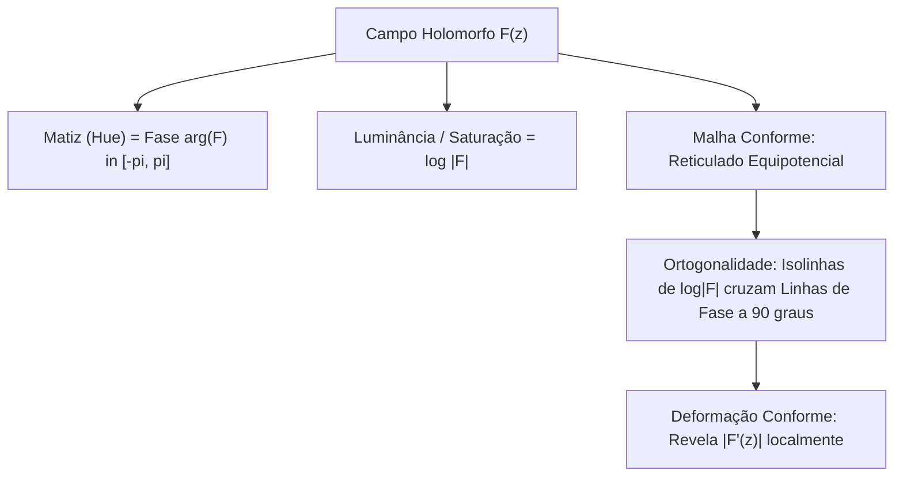
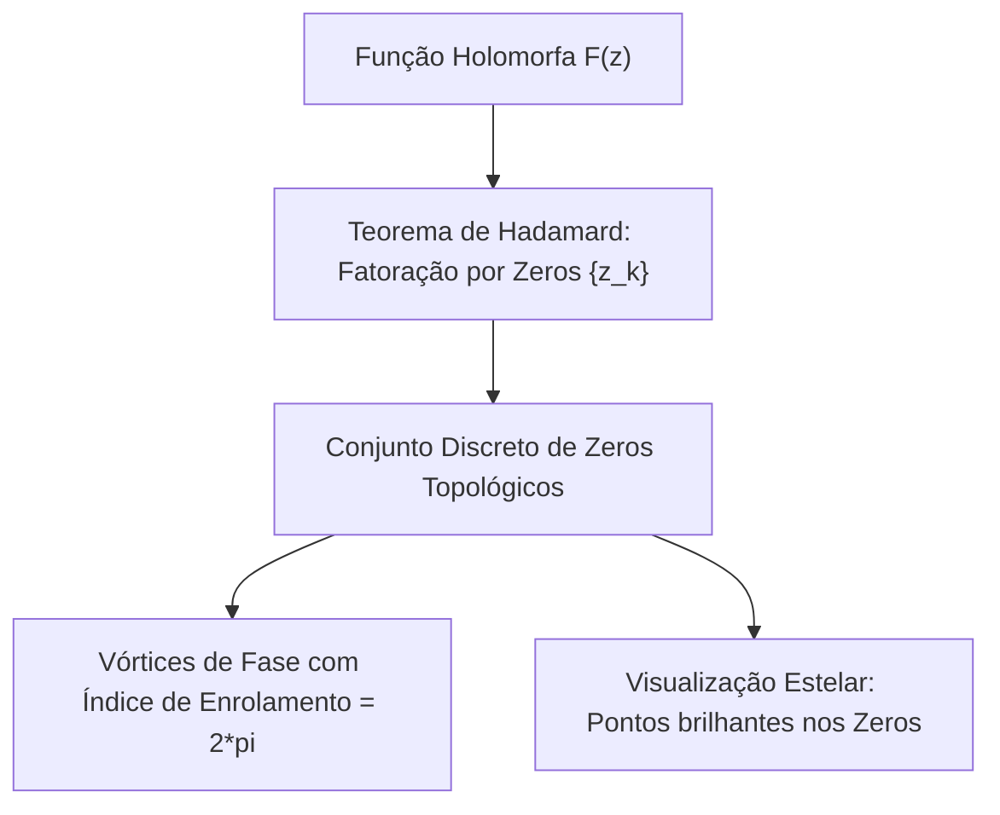

# Paradigmas de Visualização Natural de Campos Holomorfos de Áudio

Este documento propõe e detalha as quatro formas mais naturais, matematicamente rigorosas e perceptualmente expressivas de visualizar os campos holomorfos da STFT Gaussiana e da CQT de Cauchy no Spectral.

---

## 1. Reticulados Conformes Ortogonais (Domain Coloring + Malha de Equipotenciais)

A visualização clássica de espectrogramas descarta a fase e exibe apenas a magnitude como intensidade de escala de cinza ou mapa de calor térmico. Essa abordagem esconde a estrutura holomorfa subjacente.

Como $L(z) = \log |F(z)| + i \phi(z)$ é analítica, suas curvas de nível formam um **mapa conforme ortogonal**:
*   As curvas de nível de log-magnitude $\log |F(z)| = c_k$ são curvas equipotenciais.
*   As linhas de fase constante $\phi(z) = \theta_j$ são linhas de fluxo ortogonais.
*   Em qualquer ponto onde $F'(z) \neq 0$, essas duas famílias de curvas **cruzam-se em ângulos rigorosamente ortogonais ($90^\circ$)**, formando uma malha de pequenos quadrados conformes curvilíneos.

```text
                  Curvas de Nivel de Log-Magnitude (Equipotenciais)
                            log|F(z)| = c_1, c_2, ...
                                      |
                     +----------------v----------------+
                     |         |              |        |
    Linhas de Fase --+---------+--------------+--------+-- Linhas de Fase
     phi = theta_1   |         |              |        |   phi = theta_2
                     |      90 | graus        |        |
                     +---------+--------------+--------+
                     |         |              |        |
                     +---------------------------------+
                                      |
               O estiramento do reticulado revela |F'(z)|
```



### Proposta de Renderização no WebGL:
*   **Shader de Fragmento Conforme**:
    Combinar o mapeamento YCbCr de magnitude-fase com um grid procedural fino de linhas periódicas:
    $$\text{grid} = \sin^2(M \cdot \log |F|) + \sin^2(N \cdot \phi)$$
    As regiões onde o grid se condensa indicam altos gradientes espectrais (transientes e ataques); regiões onde o grid se expande indicam sustentação harmônica limpa.

---

## 2. Constelação de Zeros Topológicos (Representação Estelar de Majorana)

Pelo Teorema de Fatoração de Hadamard para funções inteiras e da classe de Nevanlinna/Hardy:
Toda função holomorfa $B_x(z)$ ou $F(z)$ é **completamente e unicamente determinada (a menos de um fator exponencial suave) pela distribuição discreta de seus zeros**:
$$F(z) = e^{g(z)} \prod_{k=1}^\infty \left( 1 - \frac{z}{z_k} \right) e^{\dots}$$

Cada zero $z_k = (t_k, p_k)$ onde $F(z_k) = 0$ é uma **singularidade topológica de fase (vórtice de fase)**:
$$\oint_{\gamma_k} d\phi = 2\pi \cdot \operatorname{sign}(z_k)$$

```text
                                Fase ao redor do zero z_k:
                                           phi = pi/2
                                               ^
                                               |
                          phi = pi <--- [ ZERO z_k ] ---> phi = 0
                                         (Vórtice)
                                               |
                                               v
                                          phi = -pi/2
```



### Proposta de Renderização no WebGL:
*   Identificar os mínimos locais estritos de magnitude $|F(z)| < \epsilon$ que possuem descontinuidades de fase de $2\pi$ nos 4 pixels vizinhos.
*   Renderizar um glifo luminoso (um anel de Airy ou estrela estelar) em cada $z_k$.
*   A distribuição dos zeros age como a "impressão digital topológica" do timbre sonoro.

---

## 3. Métrica Hiperbólica de Poincaré no Semiplano $\mathbb{H}^+$

Para a CQT de Cauchy, o plano natural é o semiplano superior $\mathbb{H}^+ = \{ (t, \eta) \in \mathbb{R}^2 \mid \eta = \frac{qp}{2\pi} > 0 \}$.

A métrica riemanniana natural invariante sob dilatações temporais e translações é a **Métrica Hiperbólica de Poincaré**:
$$\boxed{ds^2 = \frac{dt^2 + d\eta^2}{\eta^2}}$$

### Propriedades Notáveis:
1. **Invariância de Oitava**:
   O intervalo musical de 1 oitava (dobrar a frequência $\implies$ dividir $\eta$ por 2) possui **exatamente a mesma distância hiperbólica**, independentemente de estarmos em $50$ Hz ou em $5000$ Hz:
   $$d_{\mathbb{H}^+}(\eta_1, \eta_2) = \left| \ln \frac{\eta_1}{\eta_2} \right| = \ln 2 \approx 0.693$$
2. **Geodésicas Musicais**:
   As geodésicas da variedade são semicírculos ortogonais à linha de horizonte $\eta = 0$. Glissandos lineares e modulações exponenciais de pitch seguem trajetórias geodésicas na geometria hiperbólica.

---

## 4. Campo de Fluxo da Derivada Logarítmica (Bacias de Atração de Reassignment)

Como demonstrado, o quociente $R(z) = \frac{F'(z)}{F(z)}$ é um vetor no plano que aponta na direção de convergência da reatribuição.

Podemos visualizar esse campo como um **gráfico de linhas de corrente (*streamplot*)**:
*   Traçar as linhas de fluxo $\frac{dz}{ds} = R(z)$.
*   As linhas de corrente colapsam diretamente sobre as **cristas espectrais** (linhas de atração estáveis).
*   Os zeros topológicos emergem como nós de repulsão (*saddles* e fontes).
*   Isso fornece ao usuário uma compreensão intuitiva instantânea de para onde a energia sonora está convergindo durante a reatribuição.
