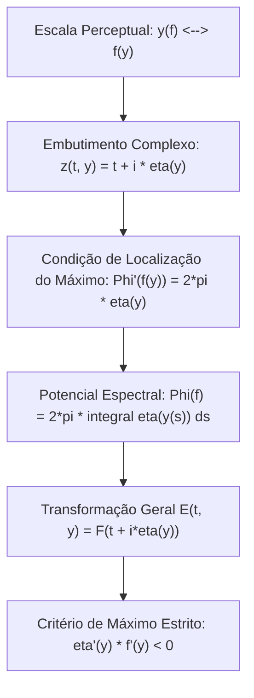
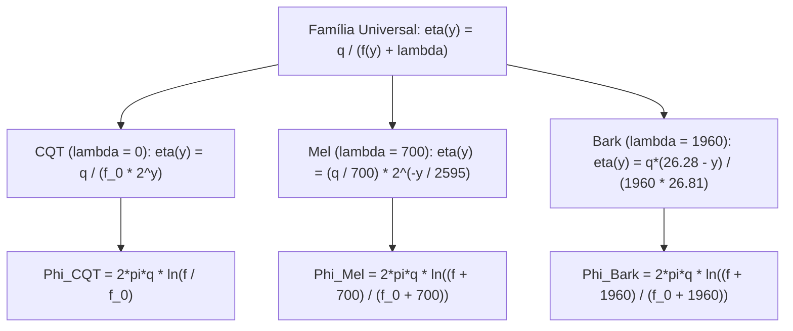

# Embutimentos Holomorfos em Escalas Perceptuais Gerais (Mel, Bark e CQT)

Este documento estabelece a teoria geral que unifica **qualquer escala de frequência monotônica** (CQT, Mel, Bark, ERB ou aprendida) como o traço de uma função holomorfa no semiplano complexo $\mathbb{H}^+$.

---

## 1. A Tríade Fundamental da Construção

A formulação separa explicitamente três objetos matemáticos fundamentais:

```text
                      +---------------------------------------+
                      |         Escala Perceptual:            |
                      |    y(f) <=================> f(y)      |
                      |   (Monotônica Estrita e Bijetiva)     |
                      +-------------------+-------------------+
                                          |
                                          v
                      +---------------------------------------+
                      |       Curva de Embutimento:           |
                      |               eta(y)                  |
                      |       z(t, y) = t + i * eta(y)        |
                      +-------------------+-------------------+
                                          |
                                          v
                      +---------------------------------------+
                      |    Potencial Espectral Unificado:     |
                      |   Phi(f) = 2*pi * int eta(y(s)) ds    |
                      +---------------------------------------+
```



1. **Escala Perceptual**: $y: I_f \to I_y$ estritamente monotônica e bijetiva com inversa $f: I_y \to I_f$ ($f(y(f_0)) = f_0$).
2. **Curva de Embutimento no Semiplano**: $\eta: I_y \to \mathbb{R}^+$, definindo o caminho analítico:
   $$\boxed{z(t, y) = t + i \eta(y)}$$
3. **Transformação Geral do Sinal**:
   $$\boxed{E(t, y) = F(t + i \eta(y)) = C \int_{I_f} \widehat{x}(f) \exp\left[ \Phi(f) - 2\pi f \eta(y) + 2\pi i f t \right] df}$$

---

## 2. Condição de Localização e Critério de Máximo Estrito

Definindo o expoente de amplitude $\Psi(f, y) = \Phi(f) - 2\pi f \eta(y)$:
Para que na linha horizontal $y$ a resposta espectral atinja seu ponto de máximo estritamente na frequência $f = f(y)$:
$$\frac{\partial \Psi}{\partial f}(f(y), y) = \Phi'(f(y)) - 2\pi \eta(y) = 0 \iff \boxed{\Phi'(f) = 2\pi \eta(y(f))}$$

Integrando a relação:
$$\boxed{\Phi(f) = 2\pi \int_{f_0}^f \eta(y(s)) ds}$$

### 2.1 A Condição de Máximo Estrito
A segunda derivada do expoente de amplitude em relação a $f$ é:
$$\frac{\partial^2 \Psi}{\partial f^2} = \Phi''(f) = 2\pi \eta'(y(f)) y'(f) = 2\pi \frac{\eta'(y)}{f'(y)}$$
Para que $f(y)$ seja um **máximo estrito** ($\Psi_{ff} < 0$):
$$\boxed{\frac{\eta'(y)}{f'(y)} < 0 \iff \eta'(y) f'(y) < 0}$$

Como a frequência sempre cresce com a escala perceptual ($f'(y) > 0$), a coordenada imaginária $\eta$ deve **necessariamente decrescer com a escala**:
$$\boxed{\eta'(y) < 0}$$
Ou seja: frequências mais agudas situam-se mais próximas da fronteira real ($\eta \to 0^+$), enquanto graves penetram profundamente no semiplano ($\eta \to \infty$).

---

## 3. A Família Unificada de Escalas Deslocadas ($\lambda$)

Podemos unificar **CQT, Mel e Bark** através da família de embutimentos de polo deslocado por uma constante característica $\lambda \ge 0$:
$$\boxed{\eta(y) = \frac{q}{f(y) + \lambda}}$$

Como $\eta(y(f)) = \frac{q}{f + \lambda}$, o potencial espectral integrado é identicamente:
$$\Phi(f) = 2\pi \int_{f_0}^f \frac{q}{s + \lambda} ds = \boxed{2\pi q \ln\left( \frac{f + \lambda}{f_0 + \lambda} \right)}$$

Resultando no campo holomorfo universal:
$$\boxed{F_\lambda(z) = C \int_0^\infty \widehat{x}(f) \left( \frac{f + \lambda}{f_0 + \lambda} \right)^{2\pi q} e^{2\pi i f z} df}$$

```text
               +--------------------------------------------------+
               |        Familia Universal de Polo Deslocado       |
               |             eta(y) = q / (f(y) + lambda)         |
               +------------------------+-------------------------+
                                        |
             +--------------------------+--------------------------+
             |                          |                          |
             v                          v                          v
       CQT / Cauchy                    Mel                       Bark
       lambda = 0                  lambda = 700              lambda = 1960
    f(y) = f_0 * 2^y         f(y) = 700*(2^(y/2595)-1)  f(y)=1960*(y+0.53)/(26.28-y)
 eta(y) = q / (f_0 * 2^y)    eta(y) = (q/700)*2^(-y/2595) eta(y) = q*(26.28-y)/(1960*26.81)
```



### 3.1 CQT ($\lambda = 0$)
*   $y(f) = \log_2(f / f_0) \iff f(y) = f_0 2^y$.
*   $\eta(y) = \frac{q}{f_0 2^y}$.
*   Largura relativa constante: $\frac{\sigma_f}{f} \approx \frac{1}{\sqrt{2\pi q}}$.

### 3.2 Mel ($\lambda = 700$)
*   $y(f) = 2595 \log_{10}(1 + f/700) \iff f(y) = 700(2^{y/2595} - 1)$.
*   $\eta(y) = \frac{q}{700} 2^{-y/2595}$.
*   Largura relativa: $\frac{\sigma_f}{f} \propto \frac{f + 700}{f}$ (resolução linear em graves, logarítmica em agudos).

### 3.3 Bark ($\lambda = 1960$)
*   Fórmula de Traunmüller: $y(f) = 26.81 \frac{f}{1960 + f} - 0.53 \iff f(y) = \frac{1960(y + 0.53)}{26.28 - y}$.
*   $\eta(y) = \frac{q(26.28 - y)}{1960 \times 26.81}$ (**linear em $y$**!).

---

## 4. O Colapso das Derivadas Verticais

Como $E(t, y) = F(t + i \eta(y))$ e $F$ é holomorfa ($\partial_\eta F = i \partial_t F$):
Pela regra da cadeia:
$$\boxed{\frac{\partial E}{\partial y} = i \eta'(y) \frac{\partial E}{\partial t}}$$
E para a segunda derivada:
$$\boxed{\frac{\partial^2 E}{\partial y^2} = i \eta''(y) \frac{\partial E}{\partial t} - [\eta'(y)]^2 \frac{\partial^2 E}{\partial t^2}}$$

> **Propriedade Fundamental de Redução**:  
> Em qualquer escala perceptual (seja Mel, Bark ou CQT), **nenhuma derivada vertical em $y$ precisa ser estimada numericamente**: todas as derivadas direcionais são geradas unicamente pelas derivadas temporais $\partial_t^n E$.

---

## 5. Operador Matricial Discreto e Inversão por Mínimos Quadrados

Para um sinal discreto $x[n]$ com DFT $X[k]$ ($k = 0 \dots N/2$):
Definindo o filtro espectral analítico para cada linha vertical $j \in 0 \dots M-1$:
$$G_j[k] = \exp\left[ \Phi(f_k) - 2\pi f_k \eta(y_j) \right] = A[k] e^{-2\pi f_k \eta(y_j)}$$

A representação tempo-frequência discreta $E[m, j]$ é calculada como uma família de IFFTs:
$$\boxed{E[:, j] = C \Delta f \operatorname{IFFT}_k \left( X[k] G_j[k] \right)}$$

### 5.1 Reconstrução Inversa Estável
A reconstrução exata por mínimos quadrados que cobre toda a redundância espectral é dada por:
$$\boxed{X[k] = \frac{\sum_{j=0}^{M-1} G_j^*[k] \widehat{E}[k, j]}{C \sum_{j=0}^{M-1} |G_j[k]|^2}}$$
com a condição de estabilidade de frame $0 < \inf_k \sum_j |G_j[k]|^2 \le \sup_k \sum_j |G_j[k]|^2 < \infty$.
