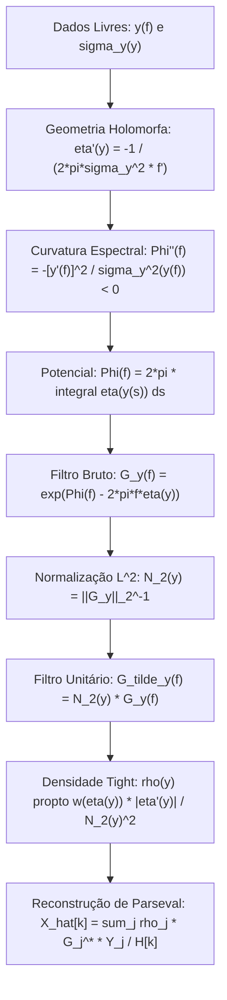

# Normalização Natural $L^2$, Teoria de Frames Tight e o Problema Inverso Universal

Este documento estabelece a teoria unificada da **normalização natural** e do **problema inverso** para representações holomorfas em multiescala, demonstrando que, dados a escala perceptual $y(f)$ e a resolução local prescrita $\sigma_y(y)$, a geometria holomorfa $\eta(y)$, o potencial espectral $\Phi(f)$, a normalização $L^2$ e a medida de frame tight $\rho(y)$ são determinados de forma analítica e sistemática.

---

## 1. O Problema Inverso Fundamental

O sistema a ser resolvido simultaneamente possui apenas **dois dados livres fundamentais**:
1. Uma escala perceptual estritamente monotônica e bijetiva: $y: I_f \to I_y \iff f: I_y \to I_f$.
2. Uma resolução local desejada na escala perceptual: $\sigma_y(y) > 0$.

```text
               +------------------------------------------------+
               |        DADOS FUNDAMENTAIS DE PROJETO:          |
               |         y(f)  <======>  sigma_y(y)             |
               +-----------------------+------------------------+
                                       |
                   1. Geometria do Semiplano Complexo:
                      eta'(y) = -1 / (2*pi * sigma_y^2(y) * f'(y))
                                       |
                                       v
               +------------------------------------------------+
               |  Curvatura e Potencial Espectral:              |
               |  Phi''(f) = -[y'(f)]^2 / sigma_y^2(y(f)) < 0   |
               |  Phi(f) = 2*pi * integral eta(y(s)) ds         |
               +-----------------------+------------------------+
                                       |
                   2. Normalizacao L^2 Unitaria:
                      N_2(y) = ( integral |G_y(f)|^2 df )^(-1/2)
                                       |
                                       v
               +------------------------------------------------+
               |  Filtro Espectral Unitario ||G_tilde_y||_2 = 1 |
               |  G_tilde_y(f) = N_2(y) * exp(Phi(f) - 2pi*f*eta)|
               +-----------------------+------------------------+
                                       |
                   3. Medida de Frame Tight dmu(y) = rho(y) dy:
                      integral rho(y) |G_tilde_y(f)|^2 dy = K
                                       |
                                       v
               +------------------------------------------------+
               |  Isometria Global Exata de Parseval            |
               |  integral |E_tilde(t,y)|^2 dt dmu(y) = K*||x||^2|
               +------------------------------------------------+
```



---

## 2. Dedução do Sistema e Curvatura do Envelope

Para uma representação $E(t, y) = F(t + i\eta(y)) = C \int \widehat{x}(f) G_y(f) e^{2\pi i f t} df$:
$$G_y(f) = \exp\left[ \Phi(f) - 2\pi f \eta(y) \right] = \exp\left[ \Psi(f, y) \right]$$

1. **Posicionamento do Pico em $f = f(y)$**:
   $$\frac{\partial \Psi}{\partial f}(f(y), y) = \Phi'(f(y)) - 2\pi \eta(y) = 0 \implies \boxed{\Phi'(f(y)) = 2\pi \eta(y)}$$
2. **Resolução Local $\sigma_y(y)$**:
   A expansão quadrática de $\Psi(f, y)$ ao redor do pico define a curvatura $\kappa(y) = -\Psi_{ff}(f(y), y) = -\Phi''(f(y))$:
   $$\sigma_f^2(y) = \frac{1}{\kappa(y)} = -\frac{f'(y)}{2\pi \eta'(y)}$$
   Como $\sigma_f(y) = f'(y) \sigma_y(y)$, temos $f'(y)^2 \sigma_y^2(y) = -\frac{f'(y)}{2\pi \eta'(y)}$, resultando em:
   $$\boxed{\eta'(y) = -\frac{1}{2\pi \sigma_y^2(y) f'(y)} = -\frac{y'(f(y))}{2\pi \sigma_y^2(y)} < 0}$$
3. **Equação Mestre de Curvatura para $\Phi''(f)$**:
   Derivando $\Phi'(f) = 2\pi \eta(y(f))$ em relação a $f$:
   $$\Phi''(f) = 2\pi \eta'(y(f)) y'(f) = 2\pi \left( -\frac{y'(f)}{2\pi \sigma_y^2(y(f))} \right) y'(f) \implies \boxed{\Phi''(f) = -\frac{[y'(f)]^2}{\sigma_y^2(y(f))}}$$

> **Propriedade Notável**:  
> Como $\sigma_y > 0$ e $y'(f) \neq 0$, o lado direito é **estritamente negativo** ($\Phi''(f) < 0$).  
> O ponto estacionário $f = f(y)$ é **garantidamente um máximo estrito global côncavo**, sem necessidade de hipóteses ad-hoc!

---

## 3. O Ganho de Pico e a Impossibilidade de Normalização Bruta Constante

O ganho de pico do filtro bruto é $A(y) = G_y(f(y)) = \exp\left[ \Phi(f(y)) - 2\pi f(y) \eta(y) \right]$.  
Sua derivada logarítmica é:
$$\frac{d}{dy} \ln A(y) = -2\pi f(y) \eta'(y) = \boxed{\frac{f(y) y'(f(y))}{\sigma_y^2(y)} > 0}$$
Portanto:
$$A'(y) = 0 \iff \eta'(y) = 0$$
No entanto, $\eta'(y) = 0$ anula a curvatura $\Phi'' = 0$, destruindo a localização do filtro.  
Analogamente, para qualquer $p \ge 1$, a norma $L^p$ bruta $I_p(y) = \int |G_y(f)|^p df$ satisfaz $\frac{d}{dy} I_p(y) = -2\pi p \eta'(y) \int f |G_y|^p df \neq 0$.

> **Teorema da Invariância $L^p$**:  
> Nenhuma norma $L^p$ da janela bruta pode ser constante sem degenerar a geometria holomorfa.  
> A normalização unitária $N_2(y) = \left( \int |G_y(f)|^2 df \right)^{-1/2}$ é **matematicamente obrigatória**.

---

## 4. Soluções Analíticas Fundamentais

### 4.1 O Caso Linear: STFT Gaussiana de Bargmann
*   Escala: $y(f) = f \implies f'(y) = 1$.
*   Resolução constante: $\sigma_y(y) = \sigma = \text{const}$.
*   Geometria: $\eta'(y) = -\frac{1}{2\pi \sigma^2} \implies \eta(y) = \eta_0 - \frac{y}{2\pi \sigma^2}$.
*   Potencial: $\Phi''(f) = -\frac{1}{\sigma^2} \implies \Phi(f) = -\frac{f^2}{2\sigma^2} + 2\pi \eta_0 f$.
*   Envelope Bruto: $G_y(f) = e^{y^2 / (2\sigma^2)} e^{-(f - y)^2 / (2\sigma^2)}$.
*   Normalização $L^2$: $N_2(y) = (\sqrt{\pi} \sigma)^{-1/2} e^{-y^2 / (2\sigma^2)}$ (elimina o fator de crescimento de Bargmann!).
*   Densidade Tight: $\rho(y) = 1, \ K = 1$.  
    $\implies$ **Recupera rigorosamente a STFT Gaussiana com medida de Lebesgue uniforme em $y$.**

### 4.2 O Caso Logarítmico: CQT de Cauchy
*   Escala: $y(f) = \log_2(f / f_0) \implies f(y) = f_0 2^y, \ f'(y) = \ln 2 \cdot f(y)$.
*   Resolução constante na oitava: $\sigma_y(y) = \sigma_y = \text{const}$.
*   Geometria: $\eta'(y) = -\frac{1}{2\pi \sigma_y^2 \ln 2 \cdot f(y)} \implies \eta(y) = \frac{q}{f(y)}$, com $\boxed{q = \frac{1}{2\pi \sigma_y^2 (\ln 2)^2}}$.
*   Potencial: $\Phi''(f) = -\frac{1}{\sigma_y^2 (\ln 2)^2 f^2} \implies \Phi(f) = 2\pi q \ln(f / f_0)$.
*   Normalização $L^2$: $N_2(y) \propto f(y)^{-(2\pi q + 1/2)} = \boxed{p^{2\pi q + 1/2}}$.
*   Densidade Tight: $\rho(y) = (\ln 2) f(y)$.  
    $\implies$ **Recupera o fator de escala clássico $p^{2\pi q + 1/2}$ da CQT e demonstra que a densidade tight cresce proporcionalmente a $f(y)$.**

### 4.3 O Caso Mel
*   Escala: $y_M(f) = 2595 \log_{10}(1 + f/700) \implies f_M(y) = 700 (2^{y/2595} - 1)$.
*   Resolução constante em Mel ($\sigma_y = \text{const}$):
    $$\eta_M(y) = \frac{q_M}{f_M(y) + 700}, \qquad q_M = \frac{2595^2}{2\pi \sigma_y^2 (\ln 2)^2}$$
*   Potencial: $\Phi_M(f) = 2\pi q_M \ln\left( \frac{f + 700}{f_0 + 700} \right)$.
*   Normalização $L^2$: Dada pela função Gamma incompleta superior $\Gamma\left( 4\pi q + 1, \frac{2800\pi q}{f_M(y) + 700} \right)$.

### 4.4 O Caso Bark: Potencial Racional vs Logarítmico Deslocado
Na fórmula de Traunmüller ($y_B(f) = 26.81 \frac{f}{1960 + f} - 0.53$):
1. **Resolução Constante em Bark ($\sigma_y = \text{const}$)**:
   Como $f_B'(y) = \frac{1960 \times 26.81}{(26.28 - y)^2}$, a condição $\eta'(y) \propto -(26.28 - y)^2$ produz:
   $$\eta_B(y) = \eta_0 + \frac{(26.28 - y)^3}{6\pi \sigma_y^2 \cdot 1960 \cdot 26.81} \implies \boxed{\Phi_B(f) = 2\pi \eta_0 f - \frac{26.81^2 \times 1960^2}{6\sigma_y^2 (f + 1960)^2}}$$
   *O potencial para resolução estritamente constante em Bark é racional de ordem $-2$, não logarítmico!*
2. **Geometria de Polo Deslocado ($\eta = \frac{q}{f + 1960}$)**:
   Mantém o potencial analítico logarítmico $\Phi(f) = 2\pi q \ln(f + 1960)$, permitindo unificação matricial direta com Mel e CQT via polo deslocado $\lambda$.

---

## 5. Implementação Discreta: Otimização Convexa de Pesos $\rho_j \ge 0$

Para uma grade discreta de $M$ canais em frequências $f_k = \frac{k F_s}{N}$ ($k = 0 \dots N/2$):
1. **Matriz de Energia Espectral**:
   $$A_{k, j} = |\widetilde{G}_j[k]|^2 = |N_j G_j[k]|^2, \qquad \text{onde } N_j = \left( \Delta f \sum_k |G_j[k]|^2 \right)^{-1/2}$$
2. **Otimização Convexa dos Pesos de Frame**:
   Buscamos os pesos não negativos $\rho_j \ge 0$ e a constante de frame $K > 0$ que minimizam a ondulação (*ripple*) do operador de frame:
   $$\boxed{\min_{\rho_j \ge 0, K > 0} \sum_{k=k_{\text{min}}}^{k_{\text{max}}} \left( \sum_{j=0}^{M-1} \rho_j A_{k, j} - K \right)^2}$$
3. **Reconstrução Estável por Mínimos Quadrados**:
   $$\boxed{\widehat{X}[k] = \frac{\sum_{j=0}^{M-1} \rho_j \widetilde{G}_j[k] Y_j[k]}{\sum_{j=0}^{M-1} \rho_j |\widetilde{G}_j[k]|^2}}$$
   Garantindo condicionamento numérico perfeito, supressão de ruído e preservação rigorosa de energia para qualquer escala $y(f)$ arbitrária.
