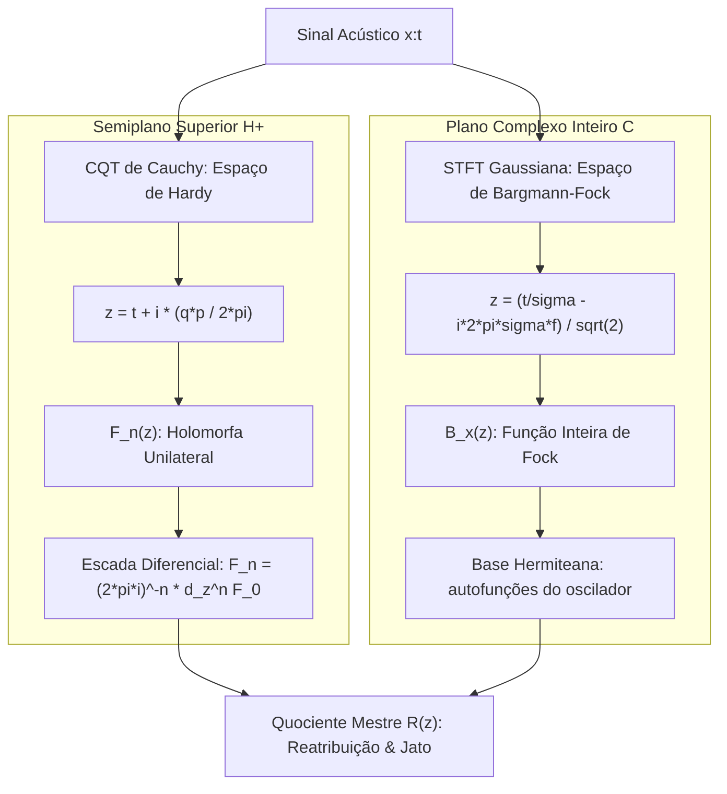

# Geometria Holomorfa do Processamento Tempo-Frequência e Multiescala

Este diretório documenta a unificação analítica profunda entre a **Transformada de Wavelet de Cauchy (CQT)** e a **Transformada de Fourier de Tempo Curto Gaussiana (STFT)** sob a perspectiva da análise complexa, equações diferenciais parciais (EDPs) e geometria conforme.

---

## 1. Visão Geral: As Duas Realizações Holomorfas do Sinal

Longe de serem operadores de banco de filtros heurísticos desconectados, a STFT Gaussiana e a CQT de Cauchy constituem as **duas realizações canônicas de representações holomorfas de sinais acústicos**:

```text
                        +-----------------------------------------+
                        |           Sinal Acústico x(t)           |
                        +--------------------+--------------------+
                                             |
                   +-------------------------+-------------------------+
                   |                                                   |
                   v                                                   v
     +---------------------------+                       +---------------------------+
     |   CQT de Cauchy (Hardy)   |                       |   STFT Gaussiana (Bargmann)|
     |  z = t + i * (qp / 2*pi)  |                       |  z = (t/sigma - i*2pi*s*f)|
     |  Dominio: Semiplano H^+   |                       |  Dominio: Plano Complexo C|
     |  d_zbar F_n = 0           |                       |  d_zbar B_x = 0           |
     +-------------+-------------+                       +-------------+-------------+
                   |                                                   |
                   +-------------------------+-------------------------+
                                             |
                                             v
                           +-----------------------------------+
                           |    Álgebra do Jato Holomorfo      |
                           |   Quociente Logarítmico R(z):     |
                           |   R = W_1 / W_0 = F'(z) / F(z)    |
                           |   Gradiente de Log-A e Fase phi   |
                           +-----------------------------------+
```



---

## 2. Mapa Estrutural Comparativo

| Propriedade Matemática | Wavelet de Cauchy (CQT) | STFT Gaussiana |
| :--- | :---: | :---: |
| **Coordenada Complexa Natural ($z$)** | $z = t + i \frac{q p}{2\pi}$ | $z = \frac{1}{\sqrt{2}} \left( \frac{t}{\sigma} - i 2\pi\sigma f \right)$ |
| **Domínio Complexo** | Semiplano Superior $\mathbb{H}^+$ ($\operatorname{Im} z > 0$) | Plano Complexo Inteiro $\mathbb{C}$ |
| **Espaço Funcional** | Espaço de Hardy $H^2(\mathbb{H}^+)$ | Espaço de Bargmann-Fock $\mathcal{F}^2(\mathbb{C})$ |
| **Condição de Holomorfia** | $\partial_{\bar{z}} F_n = 0$ | $\partial_{\bar{z}} B_x = 0$ |
| **Fator de Ponderação Físico** | Algébrico: $W_n = p^{q+n+1/2} F_n$ | Gaussiano: $V_g = e^{-|z|^2 / 2} B_x$ |
| **Equação de Laplace ($\Delta = 0$)** | $\Delta_{(t, \eta)} F_n = 0, \quad \eta = \frac{qp}{2\pi}$ | $\Delta_{(x, y)} B_x = 0$ |
| **Curvatura do Campo Log-Magnitude** | $\Delta \log |F_n| = 0$ (Harmônica) | $\Delta \log |V_g| = -1$ (Poisson com curvatura constante) |
| **Geração do Jato Diferencial ($J_O$)** | Escada Monomial Direta: $F_n = \frac{1}{(2\pi i)^n} \partial_z^n F_0$ | Operadores Hermiteanos $h_n$ (Polianalíticos de ordem $n+1$) |
| **Quociente de Reatribuição ($R$)** | $R = \frac{W_1}{W_0} = \frac{F'(z)}{F(z)}$ | $R = \frac{V_1}{V_0} = \frac{B'(z)}{B(z)}$ |

---

## 3. Índice de Tópicos e Documentos

1. **[`01_cauchy_cqt_hardy_pde.md`](./01_cauchy_cqt_hardy_pde.md)**:
   * A CQT de Cauchy no Semiplano Superior $\mathbb{H}^+$.
   * Dedução analítica da EDP de 1ª ordem, equações de Cauchy-Riemann e equação de Laplace.
   * Prova da escada diferencial como derivadas puras de uma única função holomorfa: $F_n \propto \partial_z^n F_0$.
2. **[`02_gaussian_stft_bargmann_fock.md`](./02_gaussian_stft_bargmann_fock.md)**:
   * A STFT Gaussiana no Espaço de Bargmann-Fock.
   * O peso gaussiano $e^{-|z|^2/2}$, a curvatura $\Delta \log |V_g| = -1$ e a conexão com a física do oscilador quântico.
   * A natureza polianalítica das janelas Hermiteanas.
3. **[`03_holomorphic_duality_and_reassignment.md`](./03_holomorphic_duality_and_reassignment.md)**:
   * Unificação da Reatribuição como derivada logarítmica complexa $L'(z) = \frac{F'(z)}{F(z)}$.
   * Acoplamento rígido entre gradiente de log-magnitude e gradiente de fase.
4. **[`04_natural_holomorphic_visualizations.md`](./04_natural_holomorphic_visualizations.md)**:
   * Propostas de visualização natural baseadas na geometria conforme:
     - Reticulados Conformes Ortogonais (Linhas de Equipotencial de $\log |F|$ cruzando Linhas de Fluxo de $\phi$ a $90^\circ$).
     - Constelação de Zeros Topológicos e Singularidades de Fase ($\oint d\phi = 2\pi k$).
     - Métrica Hiperbólica de Poincaré no Semiplano ($ds^2 = \frac{dt^2 + d\eta^2}{\eta^2}$) para distâncias perceptuais invariantes.
     - Campo Vetorial do Fluxo Logarítmico (Bacias de Atração do Reassignment).
