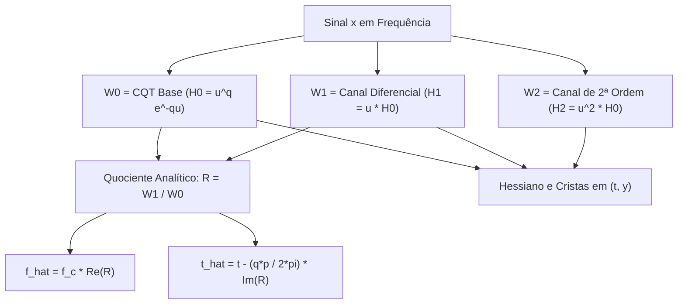

# Especificação Técnica: Wavelet de Cauchy, Escada Diferencial CQT e Reatribuição 2D Analítica (Fase 39)

Este documento registra a formulação matemática e a implementação computacional da **Wavelet de Cauchy** e sua **Escada Diferencial CQT**, estendendo a filosofia do Hermite-Gaussian STFT Jet para bancos de filtros de fator de qualidade constante (CQT).

---

## 1. Parametrização e Admissibilidade da Família de Cauchy

Adotamos a convenção de Fourier $\hat{x}(f) = \int_{-\infty}^{\infty} x(\tau) e^{-2\pi i f \tau} d\tau$. A wavelet-mãe de Cauchy unilateral é definida por:
$$\boxed{\hat{\psi}_q(f) = C_q f^q e^{-qf} \mathbf{1}_{f>0}, \qquad q > 0}$$

O parâmetro de escala é reparametrizado em função do **período central** $p = \frac{1}{f_c}$ através de $a = q \cdot p$:
$$H_p(f) = (pf)^q e^{-qpf} = u^q e^{-qu}, \qquad u = pf = \frac{f}{f_c}$$
Derivando $H_p(f)$ em relação a $u$, o ponto de máximo ocorre estritamente em $u = 1$, provando que $f_c = 1/p$ é o período central da wavelet.

### 1.1 Condição de Admissibilidade
A integral de admissibilidade converge pela função Gamma:
$$C_{\psi_q} = \int_0^\infty \frac{f^{2q} e^{-2qf}}{f} df = \int_0^\infty f^{2q-1} e^{-2qf} df = \boxed{\frac{\Gamma(2q)}{(2q)^{2q}} < \infty, \quad \forall q > 0}$$
E a forma temporal é infinitamente diferenciável no semiplano complexo:
$$\psi_q(\tau) = C_q \frac{\Gamma(q+1)}{(q - 2\pi i \tau)^{q+1}}$$

---

## 2. A Escada Diferencial de Cauchy ($W_0, W_1, \ldots, W_O$)

Definimos as wavelets da escada por multiplicação monomial de frequência:
$$\boxed{\hat{\psi}_{q,n}(f) = f^n \hat{\psi}_q(f) = f^{q+n} e^{-qf} \mathbf{1}_{f>0}}$$
A transformada CWT/CQT correspondente para o nível $n$ é:
$$W_n(t, p) = C_q p^{q+n+\frac{1}{2}} \int_0^\infty \hat{x}(f) f^{q+n} e^{-qpf} e^{2\pi i f t} df$$

```text
                  +------------------------------------------+
                  |  Wavelet-Mãe de Cauchy: psi_hat_q(f)     |
                  +--------------------+---------------------+
                                       |
                     Escada Monomial: H_n(f) = u^n * H_0(f)
                                       |
                                       v
         +------------------------------------------------------------+
         |  Canais da Escada: { W_0, W_1, W_2, ..., W_O } (O+1 CQTs)  |
         +-----------------------------+------------------------------+
                                       |
           +---------------------------+---------------------------+
           |                                                       |
   Derivada Temporal                                      Derivada em Escala/Freq
   d_t W_n = (2*pi*i / p) * W_(n+1)                       d_y W_n = ln(2) [ q W_(n+1) - (q+n+0.5) W_n ]
           |                                                       |
           +---------------------------+---------------------------+
                                       |
                                       v
                         +----------------------------+
                         |  Quociente: R = W_1 / W_0  |
                         +--------------+-------------+
                                        |
               +------------------------+------------------------+
               |                                                 |
       Reatribuição em Freq                              Reatribuição no Tempo
       f_hat = f_c * Re(R)                               t_hat = t - (qp / 2*pi) * Im(R)
```



### 2.1 Relações da Escada
1. **Derivada Temporal**:
   $$\boxed{\partial_t W_n = \frac{2\pi i}{p} W_{n+1}}$$
2. **Derivada no Período**:
   $$\boxed{\partial_p W_n = \frac{q + n + \frac{1}{2}}{p} W_n - \frac{q}{p} W_{n+1}}$$
3. **Derivada no Espaço Vertical da Imagem $y = \log_2(f / f_{\text{min}})$**:
   Como $y = -\log_2(p \cdot f_{\text{min}}) \implies \partial_y = -p \ln 2 \cdot \partial_p$:
   $$\boxed{\partial_y W_n = \ln 2 \left[ q W_{n+1} - \left(q + n + \frac{1}{2}\right) W_n \right]}$$

---

## 3. Reatribuição 2D Canônica via Quociente $R = W_1 / W_0$

Escrevendo $W_0 = A e^{i\phi} \implies \log W_0 = \log A + i\phi$, o quociente complexo $R = \frac{W_1}{W_0}$ fornece diretamente o gradiente de fase:
$$\partial_t \log W_0 = \frac{2\pi i}{p} R \implies \partial_t \phi = \frac{2\pi}{p} \operatorname{Re} R$$
$$\partial_p \log W_0 = \frac{q + \frac{1}{2}}{p} - \frac{q}{p} R \implies \partial_p \phi = -\frac{q}{p} \operatorname{Im} R$$

Como $\frac{dp}{df} = -p^2 \implies \partial_f \phi = q p \operatorname{Im} R$:
$$\boxed{\hat{f} = \frac{1}{p} \operatorname{Re}\left(\frac{W_1}{W_0}\right) = f_c \operatorname{Re} R}$$
$$\boxed{\hat{t} = t - \frac{q p}{2\pi} \operatorname{Im}\left(\frac{W_1}{W_0}\right)}$$

> **Conclusão de Complexidade**:  
> A reatribuição 2D simultânea no tempo e na frequência na grade CQT requer **estritamente 2 transformadas ($W_0$ e $W_1$)**.  
> Para qualquer ordem de jato $O$, **estritamente $O+1$ transformadas $\{W_0, \ldots, W_O\}$** geram todas as $\frac{(O+1)(O+2)}{2}$ derivadas no espaço $(t, y)$.

---

## 4. Integração na Interface DAW e Auditoria Visual E2E (Screenshot `05`)


*(Captura de tela inspecionada diretamente no navegador Chromium headless).*

### Inspeção dos Elementos na Tela:
1. **Seletor de Algoritmo Espectral**:
   * Opção ativa: `🌊 Wavelet de Cauchy CQT (Escada W0..WO Reassign)`.
2. **Card Informativo da Escada de Cauchy**:
   * Exibido no Painel DSP com borda violeta translúcida e selo `ANALÍTICA`.
   * Detalha a fórmula da escada $\hat{\psi}_{q,n}(f) = f^n \hat{\psi}_q(f)$ e as coordenadas de reatribuição exatas.
3. **Canvas WebGL**:
   * Espectrograma CQT renderizado com espaçamento logarítmico perfeito e aguçamento de harmônicos via $R = W_1 / W_0$.
   * Tempo de cálculo do chunk em WASM: $22$ ms (LOD 1) e $2.2$ s (LOD 0 ultra-alta densidade $1024 \times 1024$).
4. **Controles Independentes**:
   * `⏱️ Reatribuição no Tempo` e `📡 Reatribuição na Freq.` atuam sobre $\hat{t}$ e $\hat{f}$ da escada de Cauchy.
   * Diagnóstico do console: **0 erros e 0 exceções**.
