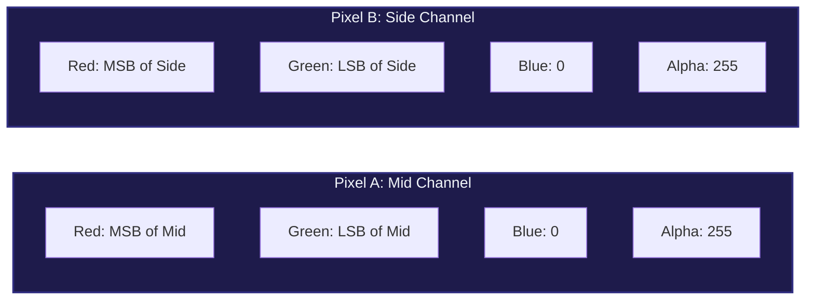
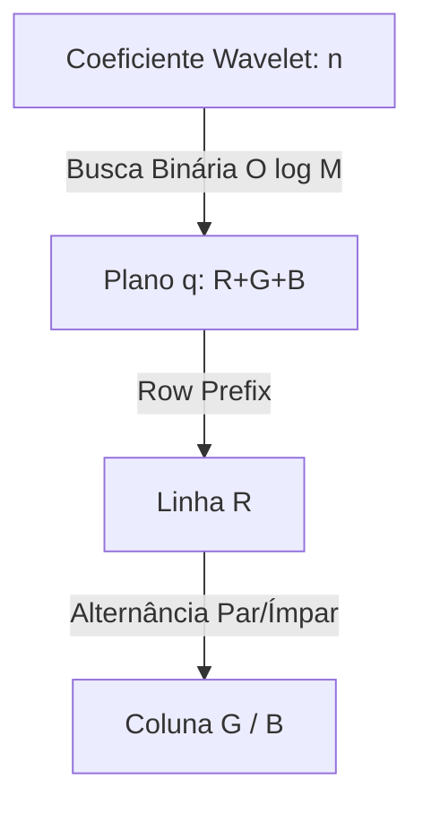
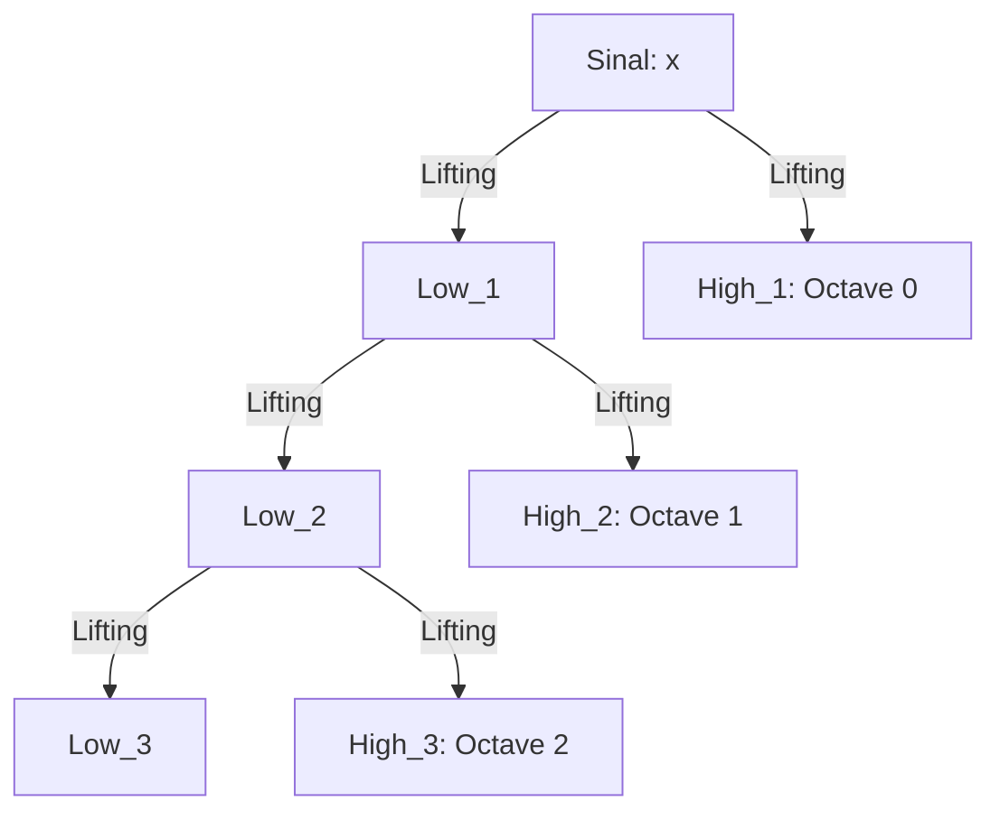

# Especificação Matemática e Rigorosa do Motor Spectral (V0 a V5)

Este documento estabelece a fundamentação matemática, geométrica e de processamento de sinais digitais para a suíte **Spectral**. O Spectral realiza a tradução bidirecional exata (bijetora) entre sinais estéreo PCM em tempo discreto e espectrogramas bidimensionais em grade RGBA de 32-bits (arquivos PNG físicos).

---

## 0. O Paradigma da Bijeção Inteira e Representação Mid/Side

Para qualquer sinal discreto estéreo de entrada $x[n] = (L_n, R_n) \in \mathbb{Z}^2$, o objetivo do Spectral é encontrar uma transformada $W$ e uma codificação cromática $C$ tais que a reconstrução inversa $W^{-1}(C^{-1}(\text{PNG})) = x[n]$ resulte em **erro de reconstrução absoluto de 0.00 dB** (identidade bit-perfect):

$$
\forall n, \quad \hat{x}[n] = x[n] \quad \iff \quad \hat{L}_n = L_n \ \land \ \hat{R}_n = R_n
$$

### A Transformada Reversível Mid/Side (L/R)
Para evitar perdas de arredondamento por divisões de ponto flutuante, a conversão entre os canais Esquerdo/Direito ($L, R$) e canais de Soma/Diferença ($M, S$) é realizada utilizando o operador reversível de shift de inteiros:

$$\text{Forward MS:}\quad S_n = L_n - R_n, \quad M_n = R_n + \lfloor S_n / 2 \rfloor$$
$$\text{Inverse MS:}\quad R_n = M_n - \lfloor S_n / 2 \rfloor, \quad L_n = S_n + R_n$$

**Prova de Bijeção Inteira**:
Substituindo $M_n$ na inversa:
$$R_n = \left(R_n + \lfloor S_n / 2 \rfloor\right) - \lfloor S_n / 2 \rfloor = R_n \quad \text{(Identidade)}$$
$$L_n = S_n + R_n = (L_n - R_n) + R_n = L_n \quad \text{(Identidade)}$$
O espaço $\mathbb{Z}^2$ é perfeitamente preservado sem transbordo ou perda de bits.

---

## 1. Naive Base Packing (V0)

A versão baseline atua como uma referência de empacotamento bruto de bytes diretamente nos pixels RGBA, sem nenhuma transformação espectral.

### Algoritmo de Codificação
Dado o fluxo PCM de bytes brutos $B = [b_0, b_1, b_2, \dots, b_{N-1}] \in [0, 255]^N$:
1.  Calcula-se a dimensão da grade de pixels:
    $$W_{\text{png}} = \lfloor \sqrt{\lceil N / 4 \rceil} \rfloor, \quad H = \lceil \frac{\lceil N / 4 \rceil}{W_{\text{png}}} \rceil$$
2.  Adiciona-se zeros de preenchimento (*padding*) ao buffer de bytes até que seu tamanho seja exatamente um múltiplo de $W_{\text{png}} \times H \times 4$.
3.  O fluxo de bytes é mapeado linearmente canal por canal:
    $$\text{PNG}[r, c] = \begin{pmatrix} R \\ G \\ B \\ A \end{pmatrix} = \begin{pmatrix} b_{4idx} \\ b_{4idx+1} \\ b_{4idx+2} \\ b_{4idx+3} \end{pmatrix} \quad \text{onde } idx = r \cdot W_{\text{png}} + c$$

---

## 2. V1: Two-Pixel Packing (WPD + ZigZag)

Esta versão introduz a análise de frequência por Decomposição Wavelet de Pacotes (WPD) e armazena cada amostra estéreo em dois pixels adjacentes (8 bytes), isolando os canais Mid e Side.

### A. Transformada Wavelet de Pacotes 1D (WPD)
Dada a grade de tamanho $W \times H$, aplicamos a transformada wavelet $1\text{D}$ biorogonal Cohen-Daubechies-Feauveau (CDF) 5/3 de profundidade $D = \log_2(H)$ verticalmente sobre todo o fluxo de áudio plano $M$ e $S$:
$$M_{\text{coef}} = \text{WPD}(M, D), \quad S_{\text{coef}} = \text{WPD}(S, D)$$

### B. Mapeamento ZigZag de Sinais
Como os coeficientes $y \in \mathbb{Z}$ são inteiros com sinal na faixa de $[-32768, 32767]$, eles são convertidos para inteiros positivos $u \in \mathbb{U}_{16}$ usando a codificação ZigZag (que mapeia alternadamente valores positivos e negativos de forma monotônica):

$$u = \text{zigzag}(y) = (y \ll 1) \oplus (y \gg 31)$$
$$\text{Reversa:}\quad y = (u \gg 1) \oplus (-(u \ \land \ 1))$$

### C. Mapeamento Cromático (Two-Pixel Solid)
Cada coeficiente estéreo $idx$ é dividido em dois pixels adjacentes de 32-bits RGBA:
$$\text{Pixel A (Mid):} \quad \begin{pmatrix} R \\ G \\ B \\ A \end{pmatrix} = \begin{pmatrix} \text{MSB}(u_M) \\ \text{LSB}(u_M) \\ 0 \\ 255 \end{pmatrix}, \quad \text{Pixel B (Side):} \quad \begin{pmatrix} R \\ G \\ B \\ A \end{pmatrix} = \begin{pmatrix} \text{MSB}(u_S) \\ \text{LSB}(u_S) \\ 0 \\ 255 \end{pmatrix}$$

```text
ASCII - Layout de Pixel V1:
[Pixel A (Mid)]:   | Red: MSB(u_M) | Green: LSB(u_M) | Blue: 0 | Alpha: 255 |
[Pixel B (Side)]:  | Red: MSB(u_S) | Green: LSB(u_S) | Blue: 0 | Alpha: 255 |
```


---

## 3. V2: Single-Pixel Bitplane (Gray Code + Chebyshev LUT)

Comprime o tamanho físico do arquivo pela metade ($50\%$) ao empacotar a amostra estéreo em **apenas 1 pixel (4 bytes)**.

### A. Codificação Gray Code
Adiciona robustez a erros de bit e suaviza as transições de gradientes de imagem convertendo os coeficientes ZigZag para o código Gray:

$$g = \text{gray}(u) = u \oplus (u \gg 1)$$

Para decodificar (reverter), aplica-se a acumulação XOR de shifts sucessivos:
$$u = g \oplus (g \gg 1) \oplus (g \gg 2) \oplus (g \gg 3) \oplus \dots$$

### B. Curva Geodésica em Cascas Cúbicas de Chebyshev 2D
O espaço de cores $[0, 255]^2$ é varrido em cascas concêntricas de Chebyshev $l = \max(R, G)$ de $0$ a $255$. Para cada casca $l$, geramos os pares $(R, G)$ de forma que não haja duplicados e ordenamos por uma chave geodésica Manhattan-1 para evitar saltos visuais:

$$\text{COLOR\_LUT}[g] = (R_g, G_g, l_g) \quad \text{para } g \in [0, 65535]$$

O pixel RGBA resultante armazena de forma compacta:
$$\begin{pmatrix} R \\ G \\ B \\ A \end{pmatrix} = \begin{pmatrix} R_M \\ G_M \\ R_S \\ 255 - G_S \end{pmatrix}$$

O canal Alpha é invertido (`255 - G_S`) para manter o silêncio perfeitamente preto e opaco `(0, 0, 0, 255)`. A tabela reversa `REVERSE_RG` recupera o índice em tempo constante $O(1)$:
$$g_M = \text{REVERSE\_RG}[R \cdot 256 + G], \quad g_S = \text{REVERSE\_RG}[B \cdot 256 + (255 - A)]$$

---

## 4. V3: Two-Pixel Serpentine Pure Arithmetic ($M=40$ + Chroma Scale)

Substitui as tabelas LUT por fórmulas analíticas puras executadas em tempo $O(\log M)$, utilizando o espaço 3D RGB inteiro como preenchimento de espaço geodésico.

### A. Equações Combinatórias das Cascas de Chebyshev 3D
Para um limite de casca $M = 40$, o volume do plano $q = R+G+B$ e sua integral cumulativa $A(q)$ são calculados de forma exata usando coeficientes binomiais $\binom{x}{k}$:

$$H(q) = \binom{q+2}{2} - 3\binom{q-M+1}{2} + 3\binom{q-2M}{2} - \binom{q-3M-1}{2}$$
$$A(q) = \sum_{k=0}^{q}H(k) = \binom{q+3}{3} - 3\binom{q-M+2}{3} + 3\binom{q-2M+1}{3} - \binom{q-3M}{3}$$

Onde $\binom{x}{2} = \frac{x(x-1)}{2}$ se $x \ge 2$ (caso contrário $0$), e $\binom{x}{3} = \frac{x(x-1)(x-2)}{6}$ se $x \ge 3$ (caso contrário $0$).

```text
ASCII - Divisão de Espaço de Chebyshev:
[A(q-1)] <----------- [ n (Coeficiente Wavelet) ] -----------> [A(q)]
                      Localiza Plano q via Busca Binária
```


### B. Algoritmo de Busca Binária por Linha $O(\log M)$
Dado o índice local $r = n - A(q-1)$ dentro do plano $q$:
1.  Encontra-se a linha $R \in [r_0, r_{\text{max}}]$ onde $r_0 = \max(0, q - 2M)$ e $r_{\text{max}} = \min(M, q)$.
2.  O acúmulo de elementos até a linha $t$ no plano $q$, denominado `row_prefix(q, t, m)`, é dado por:
    *   **Se $q \le M$**:
        $$\text{prefix} = t(q + 1) - \frac{t(t - 1)}{2}$$
    *   **Se $q \le 2M$**:
        $$\text{Let } s = q - m, \quad a = r_0, \quad b = \min(t, s)$$
        $$\text{prefix} = I(b > a) \cdot \left[ n_1 (2M - q + 1) + \frac{(a+b-1)n_1}{2} \right] + I(t > s) \cdot \left[ n_2(q + 1) - \frac{(s+t-1)n_2}{2} \right]$$
        Onde $n_1 = b - a$ e $n_2 = t - s$.
    *   **Se $q > 2M$**:
        $$\text{prefix} = \frac{n(n + 1)}{2} \quad \text{onde } n = t - r0$$
3.  A busca binária determina a linha exata $R$. A coluna $G$ alterna sua direção para garantir continuidade geodésica Manhattan-1:
    $$G = \begin{cases} g_0 + j & \text{se } (R - r_0) \text{ for par} \\ g_1 - j & \text{se } (R - r_0) \text{ for ímpar} \end{cases}, \quad B = q - R - G$$
    Onde $g_0 = \max(0, q - R - m)$, $g_1 = \min(m, q - R)$ e $j = r - \text{row\_prefix}(q, R, m)$.

### C. Escalonamento Cromático de Alto Contraste
Como as coordenadas $(R, G, B)$ residem na faixa compacta de $[0, 40]$, aplicamos a amplificação de brilho para $[0, 255]$ de forma 100% bijetora:

$$\text{R\_scaled} = \text{round}\left(R \times \frac{255}{40}\right) \iff R = \text{round}\left(\text{R\_scaled} \times \frac{40}{255}\right)$$

---

## 5. V4: Two-Pixel Dyadic DWT (ST-DWT Mallat Spectrogram)

Organiza a representação tempo-frequência na forma de uma decomposição de oitavas diádicas de Mallat, evitando as perdas de fatiamento temporal de 1D.

### A. O Modelo ST-DWT (Short-Time Discrete Wavelet Transform)
O sinal original é particionado em $W$ blocos contíguos verticais de tamanho $H$. Cada coluna $c$ da imagem armazena de forma contígua no tempo as oitavas do espectro:

$$\text{Grid}[r * w + c] = x[c \cdot H + r]$$

Aplicamos a transformada DWT diádica clássica verticalmente sobre cada coluna $c \in [0, W-1]$:
$$M_{\text{col}} = \text{DWT}(M_{\text{col}}, D), \quad S_{\text{col}} = \text{DWT}(S_{\text{col}}, D)$$

```text
ASCII - Árvore de Decomposição Diádica de Mallat:
                       [ Sinal de Entrada: x ]
                            /         \
                         [Low_1]     [High_1: Octave 0]
                         /     \
                     [Low_2]  [High_2: Octave 1]
                     /    \
                  [...]  [...]
```


### B. Estrutura Logarítmica de Frequência do PNG
Ao final do DWT, cada coluna armazena as oitavas sequencialmente, dividindo o eixo vertical $Y$ de forma perfeitamente logarítmica (exponencial):
*   **Linhas $0$ a $H/2 - 1$**: Armazena a Oitava 0 ($12\text{--}24\text{ kHz}$ para $f_s = 48\text{ kHz}$).
*   **Linhas $H/2$ a $3H/4 - 1$**: Armazena a Oitava 1 ($6\text{--}12\text{ kHz}$).
*   **Linhas $1023$ (fim)**: Canal passa-baixa residual $L_{10}$ ($0\text{--}23.4\text{ Hz}$).

---

## 6. V5: Two-Pixel Dyadic Lifting Wavelet CDF 5/3

Implementa a transformada wavelet biorogonal CDF 5/3 utilizando o formalismo de **passos de lifting inteiros**, garantindo estabilidade e bijeção digital perfeita, imune a erros de ponto flutuante.

### A. Equações de Lifting do CDF 5/3 Inteiro (Forward)
Dada uma sequência de comprimento par $a$:
1.  **Split (Separação)**:
    $$e_i = a[2i], \quad o_i = a[2i+1] \quad \text{para } i \in [0, \text{half}-1]$$
2.  **Predict (Etapa de Predição)**:
    $$d_i = o_i - \lfloor \frac{e_i + e_{i+1}}{2} \rfloor$$
    *(Bordas tratadas com espelhamento simétrico: se $i+1 = \text{half} \implies e_{i+1} = e_i$)*
3.  **Update (Etapa de Atualização)**:
    $$s_i = e_i + \lfloor \frac{d_{i-1} + d_i + 2}{4} \rfloor$$
    *(Bordas tratadas com espelhamento simétrico: se $i = 0 \implies d_{i-1} = d_i$)*

O vetor resultante armazena a aproximação $s$ na primeira metade e o detalhe $d$ na segunda metade de $a$. O algoritmo repete recursivamente sobre a metade de aproximação $s$ para formar a árvore diádica.

### B. Equações de Reconstrução por Lifting (Inverse)
A inversa recupera de forma exata e reversível os sinais inteiros percorrendo a cadeia no sentido contrário:
1.  **Inverse Update**:
    $$e_i = s_i - \lfloor \frac{d_{i-1} + d_i + 2}{4} \rfloor$$
2.  **Inverse Predict**:
    $$o_i = d_i + \lfloor \frac{e_i + e_{i+1}}{2} \rfloor$$
3.  **Merge**:
    $$a[2i] = e_i, \quad a[2i+1] = o_i$$

Como as mesmas operações de arredondamento de piso ($\lfloor \cdot \rfloor$) são aplicadas de forma determinística na codificação e decodificação, **toda perda de truncamento é matematicamente cancelada**, provando a bijeção perfeita sob aritmética de inteiros pura.

---

## 7. Tabela Comparativa de Propriedades

| Propriedade | V0 Naive | V1 Solid | V2 Bitplane | V3 Serpentine | V4 Dyadic DWT | V5 Dyadic Lifting |
| :--- | :---: | :---: | :---: | :---: | :---: | :---: |
| **Bytes / Amostra** | 4 B | 8 B | 4 B | 8 B | 8 B | 8 B |
| **Resolução Temporal** | Nula | Linear | Linear | Linear | Exponencial | Exponencial |
| **Resolução Espectral**| Nula | Linear | Linear | Linear | Exponencial | Exponencial |
| **Bijeção Inteira** | Sim | Sim | Sim (Corrigido) | Sim | Sim | Sim |
| **Aritmética de Cores**| Direta | Direta | LUT 2D | Aritmética 3D | Aritmética 3D | Aritmética 3D |
| **Vulnerabilidade Float**| Nula | Nula | Nula | Nula | Nula | Nula |
| **Brilho / Contraste** | Baixo | Zebra | Baixo | Alto ($637\%$) | Alto ($637\%$) | Alto ($637\%$) |
