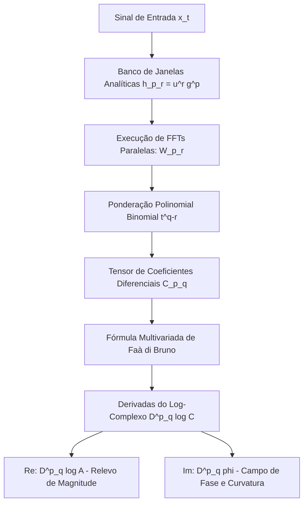
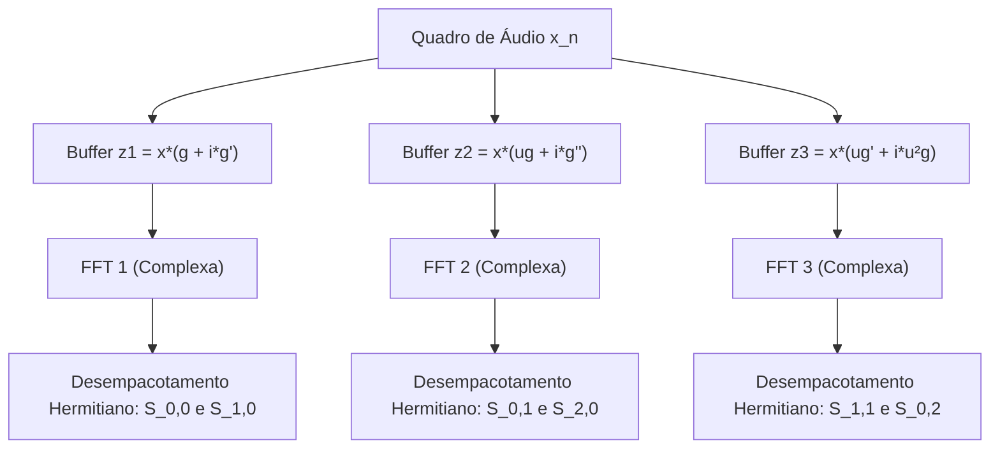
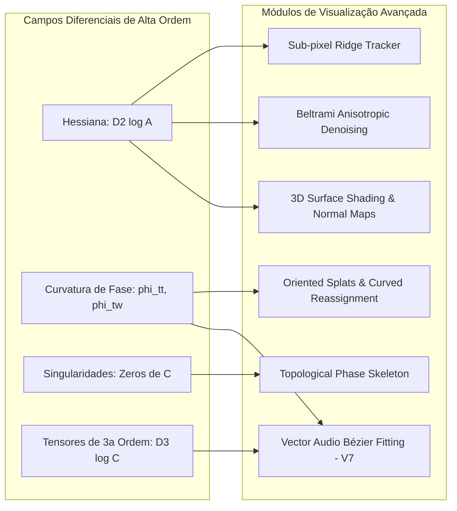
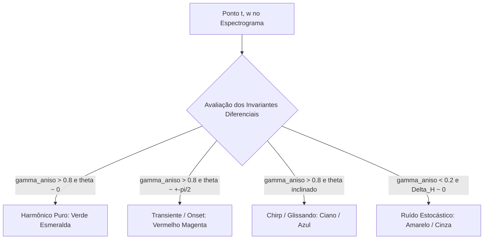
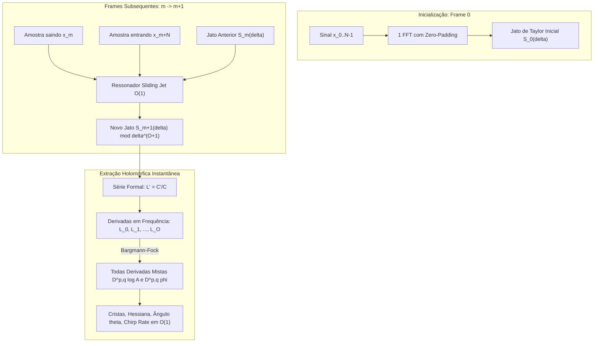

# Teoria e Procedimento Geral para Implementação de Derivadas Mistas de Fase e Log-Amplitude via STFT e suas Aplicações na Visualização de Áudio

---

## Sumário Executivo

Este documento estabelece a formulação matemática rigorosa, o procedimento analítico e a arquitetura de implementação para o cálculo exato de **derivadas mistas de qualquer ordem** do campo de fase $\phi(t,\omega)$ e do logaritmo da amplitude $\log A(t,\omega)$ de uma Transformada de Fourier de Tempo Curto (STFT).

Ao contrário das abordagens heurísticas de diferenças finitas — que introduzem ruído catastrófico de quantização em grades discretas e sofrem de problemas crônicos de descontinuidades de fase (*phase unwrapping*) —, a metodologia desenvolvida aqui calcula as derivadas diretamente no domínio contínuo por meio de um **banco de FFTs com janelas analiticamente modificadas** e aplica a **fórmula multivariada de Faà di Bruno** para a função logaritmo complexo.

Adicionalmente, este manual detalha:
1.  **Estratégias Avançadas de Otimização Numérica**: Eliminação de somas binomiais via translação para o referencial móvel da janela ($S_{p,q}$), empacotamento dual hermitiano, pré-cálculo vetorial SIMD e paralelismo em GPU.
2.  **Extração Analítica de Invariantes e Extremos Locais**: Fórmulas fechadas para coordenadas e magnitudes sub-pixel de picos e vales $(\delta t^*, \delta \omega^*, A^*)$, diagonalização analítica da Hessiana ($\lambda_1, \lambda_2$), ângulo de crista $\theta$, excentricidade anisotrópica e larguras de banda instantâneas a $-3\text{ dB}$.
3.  **Aplicações em Visualização de Alta Ordem**: Rastreamento sub-pixel, pinceladas vetoriais (*oriented splats*), esqueletização de vórtices de fase, *normal mapping* tridimensional em WebGL2 e parametrização $C^2$ de curvas de Bézier cúbicas para o modelo de áudio vetorial (V7).

---

## 1. Fundamentação e Convenção do Espaço de Gabor

Considere um sinal contínuo $x(\tau) \in L^2(\mathbb{R})$ e uma janela de análise suave $g(\tau) \in \mathcal{S}(\mathbb{R})$ (espaço de Schwartz). Adotamos a convenção canônica da STFT onde a modulação opera na coordenada absoluta $\tau$:

$$
C(t, \omega) = \int_{-\infty}^{\infty} x(\tau) \, g(\tau - t) \, e^{-i \omega \tau} \, d\tau
$$

onde:
*   $t$ representa o instante temporal de ancoragem da janela;
*   $\omega = 2\pi f$ denota a frequência angular contínua;
*   $C(t, \omega) \in \mathbb{C}$ é o coeficiente espectral complexo.

Escrevendo $C(t,\omega)$ em sua representação polar módulo-fase:

$$
C(t, \omega) = A(t, \omega) \, e^{i \phi(t, \omega)}, \quad \text{com } A(t, \omega) = |C(t, \omega)| > 0, \quad \phi(t, \omega) \in \mathbb{R}
$$

Aplicando o logaritmo natural complexo (definido nos pontos onde $C(t,\omega) \neq 0$):

$$
\log C(t, \omega) = \log A(t, \omega) + i \phi(t, \omega)
$$

### A Identidade Isomórfica Fundamental

Seja o operador diferencial misto de ordem $n = p + q$:

$$
D^{p,q} = \frac{\partial^{p+q}}{\partial t^p \, \partial \omega^q}
$$

Como a diferenciação é um operador linear real, ao aplicarmos $D^{p,q}$ à identidade logarítmica, obtemos a separação canônica imediata:

$$
\boxed{
D^{p,q} \log A(t, \omega) = \operatorname{Re}\left( D^{p,q} \log C(t, \omega) \right)
}
$$

$$
\boxed{
D^{p,q} \phi(t, \omega) = \operatorname{Im}\left( D^{p,q} \log C(t, \omega) \right)
}
$$

> **Consequência Fundamental**: Qualquer derivada temporal, frequencial ou mista de amplitude logarítmica e fase emerge simultaneamente como a parte real e imaginária da derivada do logaritmo do coeficiente analítico $C(t,\omega)$. Não é necessário computar $\phi(t,\omega)$ isoladamente, nem realizar desempacotamento (*unwrapping*), nem derivar numericamente magnitudes discretizadas.

---

## 2. Derivadas Mistas do Coeficiente Analítico $C(t,\omega)$

Diferenciando $C(t, \omega)$ sob o sinal de integração pela regra de Leibniz:

1.  **Diferenciação temporal ($p$ vezes em $t$)**:
    $$
    \frac{\partial^p}{\partial t^p} g(\tau - t) = (-1)^p \, g^{(p)}(\tau - t)
    $$
2.  **Diferenciação frequencial ($q$ vezes em $\omega$)**:
    $$
    \frac{\partial^q}{\partial \omega^q} e^{-i \omega \tau} = (-i \tau)^q \, e^{-i \omega \tau} = (-i)^q \, \tau^q \, e^{-i \omega \tau}
    $$

Combinando os dois operadores diferenciais, definimos o tensor de derivadas $C_{p,q}$:

$$
\boxed{
C_{p,q}(t, \omega) = D^{p,q} C(t, \omega) = (-1)^p (-i)^q \int_{-\infty}^{\infty} x(\tau) \, \tau^q \, g^{(p)}(\tau - t) \, e^{-i \omega \tau} \, d\tau
}
$$

Esta equação demonstra que **toda derivada mista de qualquer ordem da STFT é rigorosamente uma nova STFT**, calculada sobre o mesmo sinal $x(\tau)$, utilizando uma janela composta contendo produtos polinomiais no tempo $\tau^q$ e derivadas $p$-ésimas da janela base $g^{(p)}$.

---

## 3. Decomposição em Janelas Modificadas Centradas

Para converter a integral contínua em algoritmos baseados em FFT sem acumular instabilidades pela magnitude de $\tau^q$ quando $\tau \to \infty$, realizamos a translação para coordenadas locais da janela.

Defina a variável temporal relativa centrada no frame:

$$
u = \tau - t \iff \tau = u + t
$$

Expandindo $\tau^q$ pelo Binômio de Newton:

$$
\tau^q = (u + t)^q = \sum_{r=0}^{q} \binom{q}{r} \, t^{q-r} \, u^r
$$

Substituindo esta expansão na integral de $C_{p,q}$:

$$
C_{p,q}(t, \omega) = (-1)^p (-i)^q \sum_{r=0}^{q} \binom{q}{r} \, t^{q-r} \int_{-\infty}^{\infty} x(u + t) \, \left[ u^r \, g^{(p)}(u) \right] \, e^{-i \omega (u + t)} \, du
$$

Definimos a **família canônica de janelas modificadas**:

$$
\boxed{
h_{p,r}(u) = u^r \, g^{(p)}(u)
}
$$

E a STFT associada a cada janela dessa base:

$$
W_{p,r}(t, \omega) = \operatorname{STFT}_{h_{p,r}} \{x\}(t, \omega) = \int_{-\infty}^{\infty} x(\tau) \, h_{p,r}(\tau - t) \, e^{-i \omega \tau} \, d\tau
$$

Portanto, o tensor exato de derivadas de $C$ reduz-se a uma combinação puramente algébrica:

$$
\boxed{
C_{p,q}(t, \omega) = (-1)^p (-i)^q \sum_{r=0}^{q} \binom{q}{r} \, t^{q-r} \, W_{p,r}(t, \omega)
}
$$

```text
+-----------------------------------------------------------------------------+
|                          ESTRUTURA DE DECOMPOSIÇÃO                          |
+-----------------------------------------------------------------------------+
|                                                                             |
|   Sinal x(t) ---> [ Banco de Janelas h_{p,r}(u) = u^r g^(p)(u) ]           |
|                                     |                                       |
|                                     v                                       |
|                    [ FFTs Complexas: W_{p,r}(t,w) ]                         |
|                                     |                                       |
|                                     v                                       |
|               [ Combinação Binomial com pesos t^(q-r) ]                     |
|                                     |                                       |
|                                     v                                       |
|              Derivada Analítica Exata: C_{p,q}(t,w)                         |
|                                                                             |
+-----------------------------------------------------------------------------+
```



---

## 4. Catálogo das Derivadas de Ordens 1 e 2

Avaliando a fórmula geral para os casos operacionais fundamentais ($N \le 2$):

### Ordem 0 (STFT Base)
$$
C_{0,0} = W_{0,0}, \quad \text{onde } h_{0,0}(u) = g(u)
$$

### Ordem 1 (Gradientes Lineares)
*   **Derivada Temporal pura ($p=1, q=0$)**:
    $$
    \boxed{ C_{1,0} = -W_{1,0} }, \quad h_{1,0}(u) = g'(u)
    $$
*   **Derivada Frequencial pura ($p=0, q=1$)**:
    $$
    \boxed{ C_{0,1} = -i \left( t W_{0,0} + W_{0,1} \right) }, \quad h_{0,1}(u) = u \, g(u)
    $$

### Ordem 2 (Hessiana e Curvaturas)
*   **Segunda Derivada Temporal ($p=2, q=0$)**:
    $$
    \boxed{ C_{2,0} = W_{2,0} }, \quad h_{2,0}(u) = g''(u)
    $$
*   **Derivada Mista Tempo-Frequência ($p=1, q=1$)**:
    $$
    \boxed{ C_{1,1} = i \left( t W_{1,0} + W_{1,1} \right) }, \quad h_{1,1}(u) = u \, g'(u)
    $$
*   **Segunda Derivada Frequencial ($p=0, q=2$)**:
    $$
    \boxed{ C_{0,2} = -\left( t^2 W_{0,0} + 2t W_{0,1} + W_{0,2} \right) }, \quad h_{0,2}(u) = u^2 \, g(u)
    $$

---

## 5. Diferenciação de Alta Ordem do Logaritmo: Fórmula de Faà di Bruno

Para ordens superiores a 1, a regra da cadeia para o logaritmo gera termos não-lineares. Especificamente, se $f(z) = \log z$, suas derivadas $k$-ésimas são dadas por:

$$
f^{(k)}(z) = \frac{d^k}{dz^k} \log z = (-1)^{k-1} \, (k-1)! \, z^{-k}
$$

Ao compor $f(C(t, \omega))$, a derivada mista multivariada de ordem $n = p + q$ exige a soma sobre todas as partições do multiconjunto de operadores diferenciais:

$$
\mathcal{D} = \{ \underbrace{\partial_t, \dots, \partial_t}_{p \text{ vezes}}, \, \underbrace{\partial_\omega, \dots, \partial_\omega}_{q \text{ vezes}} \}
$$

Seja $\Pi(\mathcal{D})$ o conjunto de todas as partições $\pi$ de $\mathcal{D}$. Cada bloco $B \in \pi$ contém $p_B$ operadores de tempo e $q_B$ operadores de frequência ($|B| = p_B + q_B \ge 1$).

A fórmula multivariada exata de Faà di Bruno para o logaritmo estabelece:

$$
\boxed{
D^{p,q} \log C = \sum_{\pi \in \Pi(\mathcal{D})} (-1)^{|\pi| - 1} \, (|\pi| - 1)! \, \frac{\displaystyle \prod_{B \in \pi} C_{p_B, q_B}}{C^{|\pi|}}
}
$$

onde:
*   $|\pi|$ é o número de blocos disjuntos na partição $\pi$;
*   $C \equiv C_{0,0}$ é o coeficiente STFT original;
*   $C_{p_B, q_B} = D^{p_B, q_B} C(t, \omega)$ são as derivadas do coeficiente calculadas na Seção 3.

### Expansão Explícita até Quarta Ordem

#### 1ª Ordem ($n=1$)
*   Partição única com 1 bloco ($|\pi|=1$):
    $$
    D_t \log C = \frac{C_t}{C}, \qquad D_\omega \log C = \frac{C_\omega}{C}
    $$

#### 2ª Ordem ($n=2$)
*   Para operadores $\{d_a, d_b\}$, as partições são: $\{ \{d_a, d_b\} \}$ ($|\pi|=1$) e $\{ \{d_a\}, \{d_b\} \}$ ($|\pi|=2$):
    $$
    \boxed{ D_{a} D_{b} \log C = \frac{C_{ab}}{C} - \frac{C_a \, C_b}{C^2} }
    $$
    Aplicando aos eixos tempo-frequência:
    $$
    (\log C)_{tt} = \frac{C_{tt}}{C} - \frac{C_t^2}{C^2}
    $$
    $$
    (\log C)_{t\omega} = \frac{C_{t\omega}}{C} - \frac{C_t \, C_\omega}{C^2}
    $$
    $$
    (\log C)_{\omega\omega} = \frac{C_{\omega\omega}}{C} - \frac{C_\omega^2}{C^2}
    $$

#### 3ª Ordem ($n=3$)
*   Partições de 3 elementos ($1$ partição de tamanho 1, $3$ de tamanho 2, $1$ de tamanho 3):
    $$
    \boxed{
    D_a D_b D_c \log C = \frac{C_{abc}}{C} - \frac{C_{ab} C_c + C_{ac} C_b + C_{bc} C_a}{C^2} + 2 \frac{C_a C_b C_c}{C^3}
    }
    $$
    Exemplo misto $(\log C)_{tt\omega}$:
    $$
    (\log C)_{tt\omega} = \frac{C_{tt\omega}}{C} - \frac{C_{tt} C_\omega + 2 C_{t\omega} C_t}{C^2} + \frac{2 C_t^2 C_\omega}{C^3}
    $$

#### 4ª Ordem ($n=4$)
$$
\boxed{
D^4 \log C = \frac{C_4}{C} - 4 \frac{C_3 C_1}{C^2} - 3 \frac{C_2^2}{C^2} + 12 \frac{C_2 C_1^2}{C^3} - 6 \frac{C_1^4}{C^4}
}
$$

---

## 6. Desacoplamento Algébrico: Amplitude e Fase

Isolando partes real e imaginária de $D^{p,q} \log C$:

$$
\begin{aligned}
D^{p,q} \log A &= \operatorname{Re}\left( \sum_{\pi \in \Pi} (-1)^{|\pi|-1} (|\pi|-1)! \frac{\prod C_{p_B, q_B}}{C^{|\pi|}} \right) \\
D^{p,q} \phi &= \operatorname{Im}\left( \sum_{\pi \in \Pi} (-1)^{|\pi|-1} (|\pi|-1)! \frac{\prod C_{p_B, q_B}}{C^{|\pi|}} \right)
\end{aligned}
$$

### Tensões de Curvatura de Segunda Ordem

$$
\begin{aligned}
(\log A)_{tt} &= \operatorname{Re}\left( \frac{C_{tt}}{C} - \frac{C_t^2}{C^2} \right), \quad &\phi_{tt} &= \operatorname{Im}\left( \frac{C_{tt}}{C} - \frac{C_t^2}{C^2} \right) \\
(\log A)_{t\omega} &= \operatorname{Re}\left( \frac{C_{t\omega}}{C} - \frac{C_t C_\omega}{C^2} \right), \quad &\phi_{t\omega} &= \operatorname{Im}\left( \frac{C_{t\omega}}{C} - \frac{C_t C_\omega}{C^2} \right) \\
(\log A)_{\omega\omega} &= \operatorname{Re}\left( \frac{C_{\omega\omega}}{C} - \frac{C_\omega^2}{C^2} \right), \quad &\phi_{\omega\omega} &= \operatorname{Im}\left( \frac{C_{\omega\omega}}{C} - \frac{C_\omega^2}{C^2} \right)
\end{aligned}
$$

---

## 7. A Reatribuição Clássica (1ª Ordem) no Formalismo

No método de reatribuição padrão de Auger-Flandrin, os operadores de primeira ordem governam a projeção dos centróides de energia:

1.  **Frequência Instantânea ($\omega_{\text{inst}}$)**:
    $$
    \omega_{\text{inst}}(t, \omega) = \omega + \frac{\partial \phi}{\partial t} = \omega + \operatorname{Im}\left( \frac{C_t}{C} \right)
    $$
    Em Hz:
    $$
    f_{\text{inst}} = f + \frac{1}{2\pi} \operatorname{Im}\left( \frac{C_t}{C} \right)
    $$
2.  **Atraso de Grupo / Tempo Reatribuído ($\hat{t}$)**:
    $$
    \hat{t}(t, \omega) = -\frac{\partial \phi}{\partial \omega} = -\operatorname{Im}\left( \frac{C_\omega}{C} \right)
    $$
    Utilizando a decomposição com janelas centradas $u = \tau - t$, onde $C_\omega = -i(t W_{0,0} + W_{0,1})$, temos:
    $$
    \frac{C_\omega}{C} = -it - i \frac{W_{0,1}}{W_{0,0}} \implies \operatorname{Im}\left(\frac{C_\omega}{C}\right) = -t - \operatorname{Re}\left(\frac{W_{0,1}}{W_{0,0}}\right)
    $$
    Logo:
    $$
    \hat{t} = t + \operatorname{Re}\left(\frac{W_{0,1}}{W_{0,0}}\right)
    $$
    Que reproduz identicamente a formulação clássica de Auger-Flandrin.

---

## 8. Complexidade Computacional e Banco de Janelas

Para calcular todas as derivadas até a ordem total $N$ (isto é, $p + q \le N$), o número de pares necessários $(p, r)$ com $p + r \le N$ é dado pelo número triangular:

$$
K(N) = \sum_{p=0}^{N} (N - p + 1) = \frac{(N + 1)(N + 2)}{2}
$$

| Ordem Máxima ($N$) | Número de Janelas ($K$) | Janelas Necessárias $h_{p,r}(u) = u^r g^{(p)}(u)$ | Informações Físicas Extraídas |
| :--- | :---: | :--- | :--- |
| **$N = 0$** | 1 | $g$ | STFT padrão, densidade espectral |
| **$N = 1$** | 3 | $g, \, g', \, ug$ | Posição reatribuída $(\hat{t}, \hat{\omega})$ |
| **$N = 2$** | 6 | $g, \, g', \, g'', \, ug, \, u^2g, \, ug'$ | Chirp rate, Hessiana, curvatura, tensor métrico |
| **$N = 3$** | 10 | + $g''', \, u^3g, \, u^2g', \, ug''$ | Aceleração de frequência, aberração de crista |
| **$N = 4$** | 15 | + $g^{(4)}, \, u^4g, \, u^3g', \, u^2g'', \, ug'''$ | Curvatura de 4ª ordem, nós de Bézier $C^3$ |

---

## 9. Especialização Elegante: Janelas Gaussianas e Hermite

Para a janela Gaussiana normalizada:

$$
g(u) = e^{-\frac{u^2}{2\sigma^2}}
$$

As derivadas analíticas sucessivas satisfazem a identidade dos **Polinômios de Hermite probabilísticos** $He_p(x)$:

$$
g^{(p)}(u) = (-1)^p \, \sigma^{-p} \, He_p\left(\frac{u}{\sigma}\right) \, g(u)
$$

onde $He_0(x) = 1$, $He_1(x) = x$, $He_2(x) = x^2 - 1$, $He_3(x) = x^3 - 3x$, etc., governados pela relação de recorrência:

$$
He_{p+1}(x) = x \, He_p(x) - p \, He_{p-1}(x)
$$

Portanto, qualquer janela $h_{p,r}(u)$ da base é simplesmente expressa como:

$$
h_{p,r}(u) = (-1)^p \, \sigma^{r-p} \, \left(\frac{u}{\sigma}\right)^r \, He_p\left(\frac{u}{\sigma}\right) \, g(u) = P_{p,r}\left(\frac{u}{\sigma}\right) \, e^{-\frac{u^2}{2\sigma^2}}
$$

onde $P_{p,r}$ é um polinômio puro. A geração de todo o banco de janelas até qualquer ordem é analítica, infinita e imune a erros numéricos de discretização diferencial.

---

## 10. Tratamento Numérico: Zeros de $C$ e Singularidades

A presença de potências de $C$ no denominador ($C^{-1}, C^{-2}, \dots$) acarreta divergências assintóticas quando $|C| \to 0$. Matematicamente, os pontos onde $C(t,\omega) = 0$ constituem **singularidades essenciais de $\log C$**, correspondendo a **vórtices de fase**.

Para garantir estabilidade numérica em arquiteturas de ponto flutuante (IEEE 754):

1.  **Gating de Magnitude ($\epsilon$-Threshold)**:
    $$
    \text{Se } |C(t, \omega)| < \epsilon = \kappa \cdot \max_{t,\omega}|C| \quad (\kappa \approx 10^{-4} \text{ a } 10^{-6}), \quad \text{define } D^{p,q}\log C = 0
    $$
2.  **Regularização Tikhonov / Soft-Clipping**:
    Substitui-se o denominador pelo termo regularizado:
    $$
    \frac{1}{C^k} \longrightarrow \frac{\overline{C}^k}{(|C|^2 + \epsilon^2)^k}
    $$
    Garantindo transição suave e diferenciabilidade global.

---

## 11. Estratégias Avançadas de Otimização Numérica

Calcular múltiplas FFTs e avaliações polinomiais para cada quadro de áudio pode impor sobrecarga computacional se executado ingenuamente. Esta seção apresenta as principais otimizações analíticas e de hardware para tornar o cálculo de ordem superior ultrarrápido em CPU (SIMD/Rust) e GPU (WebGL2 / WebGPU Compute Shaders).

### 11.1 Otimização Fundamental do Referencial Local: Eliminação das Somas Binomiais

Na convenção original da STFT com fase absoluta:
$$
C(t, \omega) = \int x(\tau) g(\tau - t) e^{-i\omega \tau} d\tau
$$
a presença de $\tau = u + t$ exigia uma expansão binomial $\sum_{r=0}^q \binom{q}{r} t^{q-r} W_{p,r}$. Quando $t$ cresce (amostras avançadas no arquivo de áudio), os termos $t^{q-r}$ podem gerar números enormes e consequente perda de precisão numérica (*catastrophic cancellation*).

Considere agora a **STFT no referencial móvel da janela** (padrão em processamento digital de sinais):
$$
S(t, \omega) = \int_{-\infty}^{\infty} x(t + u) \, g(u) \, e^{-i\omega u} \, du
$$
A relação matemática exata entre as duas representações é simplesmente uma modulação de fase linear:
$$
C(t, \omega) = e^{-i\omega t} \, S(t, \omega)
$$
Aplicando o logaritmo complexo:
$$
\log C(t, \omega) = \log S(t, \omega) - i\omega t
$$
Diferenciando em relação a $t$ e $\omega$:
1.  **Primeiras Derivadas**:
    $$
    \frac{\partial \log C}{\partial t} = \frac{\partial \log S}{\partial t}
    $$
    $$
    \frac{\partial \log C}{\partial \omega} = \frac{\partial \log S}{\partial \omega} - i t
    $$
2.  **Derivadas de Ordem $\ge 2$**:
    Como o termo $-i\omega t$ possui apenas uma derivada mista não-nula ($\frac{\partial^2 (-i\omega t)}{\partial t \partial \omega} = -i$), todas as demais derivadas superiores são idênticas:
    $$
    \boxed{
    D^{p,q} \log C(t, \omega) = D^{p,q} \log S(t, \omega), \quad \forall (p,q) \text{ com } p+q \ge 2 \text{ e } (p,q) \neq (1,1)
    }
    $$
    E para a derivada mista de segunda ordem:
    $$
    (\log C)_{t\omega} = (\log S)_{t\omega} - i
    $$
    Portanto:
    $$
    (\log A)_{t\omega} = \operatorname{Re}\left( (\log C)_{t\omega} \right) = \operatorname{Re}\left( (\log S)_{t\omega} \right)
    $$
    $$
    \phi_{t\omega} = \operatorname{Im}\left( (\log C)_{t\omega} \right) = \operatorname{Im}\left( (\log S)_{t\omega} \right) - 1
    $$

#### O Grande Ganho Computacional:
As derivadas de $S(t,\omega)$ no referencial móvel não contêm termos cruzados em $t$:
$$
S_{p,q}(t, \omega) = \frac{\partial^{p+q} S}{\partial t^p \partial \omega^q} = (-1)^p (-i)^q \int x(t + u) \left[ u^q g^{(p)}(u) \right] e^{-i\omega u} du = (-1)^p (-i)^q \, \operatorname{FFT}\{ x_{t} \cdot h_{p,q} \}
$$
> **Teorema de Redução Direta**: No referencial móvel, **cada derivada $S_{p,q}$ requer exatamente UMA ÚNICA janela $h_{p,q}(u) = u^q g^{(p)}(u)$**, eliminando completamente a soma binomial $\sum \binom{q}{r} t^{q-r} W_{p,r}$ e todas as instabilidades de ponto flutuante com $t \gg 0$!

---

### 11.2 Empacotamento Duplo por Simetria Hermitiana

Para calcular as 6 STFTs necessárias para uma análise completa até 2ª ordem ($h_{0,0}, h_{1,0}, h_{0,1}, h_{2,0}, h_{1,1}, h_{0,2}$), podemos empacotar pares de janelas reais em buffers complexos únicos:

$$
z_1[n] = x[n] \cdot h_{0,0}[n] + i \, x[n] \cdot h_{1,0}[n]
$$
$$
z_2[n] = x[n] \cdot h_{0,1}[n] + i \, x[n] \cdot h_{2,0}[n]
$$
$$
z_3[n] = x[n] \cdot h_{1,1}[n] + i \, x[n] \cdot h_{0,2}[n]
$$

Com apenas **3 chamadas de FFT complexa** de tamanho $M$, recuperamos todas as 6 transformadas através de simetria de reflexão espectral em $O(M)$ operações vetorizadas:
$$
X_a[k] = \frac{Z[k] + \overline{Z[M-k]}}{2}, \qquad X_b[k] = \frac{Z[k] - \overline{Z[M-k]}}{2i}
$$

```text
+-----------------------------------------------------------------------------+
|               EMPACOTAMENTO HERMITIANO DUAL (3 FFTs -> 6 JANELAS)           |
+-----------------------------------------------------------------------------+
| Buffer 1: z_1 = x * ( g   + i * g'  ) ---> FFT ---> Separação: S_0,0 e S_1,0 |
| Buffer 2: z_2 = x * ( ug  + i * g'' ) ---> FFT ---> Separação: S_0,1 e S_2,0 |
| Buffer 3: z_3 = x * ( ug' + i * u^2g) ---> FFT ---> Separação: S_1,1 e S_0,2 |
+-----------------------------------------------------------------------------+
```



---

### 11.3 Truncamento Gaussiano Exponencial ($4\sigma$) e Alinhamento SIMD

A janela Gaussiana $g(u) = e^{-u^2 / (2\sigma^2)}$ possui suporte formalmente infinito, mas decai em ritmo exponencial quadrático:
*   Em $|u| = 3\sigma$: $g(u) \approx 0.011$ (atenuação de $-39\text{ dB}$).
*   Em $|u| = 4\sigma$: $g(u) \approx 0.000335$ (atenuação de $-69.5\text{ dB}$).
*   Em $|u| = 5\sigma$: $g(u) \approx 3.7 \times 10^{-6}$ (atenuação de $-108.6\text{ dB}$).

**Regra de Otimização de Suporte**:
Trunca-se a janela para o intervalo compacto $[-4\sigma, +4\sigma]$ com aplicação de um taper cosseno suave nas últimas $8$ amostras para eliminar vazamento espectral (*spectral leakage*).
*   Para taxa de amostragem de $48\text{ kHz}$ e $\sigma = 10\text{ ms}$ ($480$ amostras), o tamanho do suporte truncado é $L = 8\sigma = 3840$ amostras.
*   Escolhendo $M = 4096$ (potência de 2 alinhada), a FFT atinge velocidade máxima via algoritmos Cooley-Tukey Radix-4 / AVX-512.
*   As tabelas de janelas $h_{p,q}[n]$ são pré-computadas na inicialização do motor e alinhadas em limites de $64\text{ bytes}$ (`#[repr(align(64))]` em Rust), permitindo multiplicação vetorial por instruções SIMD (`_mm512_mul_ps`).

---

### 11.4 Pipeline Paralelo em Shaders WebGL2 / WebGPU

Quando a análise é executada diretamente no navegador para visualização em tempo real:
1.  **Textura Ping-Pong de FFT (Stockham Algorithm)**: A FFT de cada quadro é realizada via fragment shader ou compute shader em passos de $\log_2 M$.
2.  **Multi-Render Targets (MRT)**: Um único passo de shader calcula as razões $S_{p,q} / S$ e armazena os campos diferenciais em dois buffers RGBA32F:
    *   **Textura 1 (RGBA)**: `( (log A)_t, (log A)_w, phi_t, phi_w )`
    *   **Textura 2 (RGBA)**: `( (log A)_tt, (log A)_ww, (log A)_tw, phi_tt )`
3.  **Avaliação Instantânea**: O shader de exibição consome diretamente essas texturas para iluminação 3D, mapeamento de normais e traçado de cristas sem que nenhum dado precise retornar à CPU.

---

## 12. Extração Analítica de Extremos Locais e Invariantes da Hessiana

A disponibilidade do gradiente e da Hessiana contínua do campo de magnitude $\log A(t,\omega)$ permite obter analiticamente propriedades geométricas críticas do som sem qualquer busca exaustiva ou métodos numéricos de aproximação.

### 12.1 Coordenadas Sub-pixel Exatas dos Extremos Locais $(\delta t^*, \delta \omega^*)$

Considere um bin discreto de análise $(t_0, \omega_0)$. Queremos encontrar o deslocamento $(\delta t^*, \delta \omega^*)$ para o ponto crítico estacionário mais próximo onde o gradiente se anula:

$$
\nabla \log A(t_0 + \delta t^*, \omega_0 + \delta \omega^*) = \mathbf{0}
$$

Expandindo o gradiente em Série de Taylor de primeira ordem:

$$
\nabla \log A(\mathbf{r}_0 + \delta \mathbf{r}) \approx \nabla \log A(\mathbf{r}_0) + \mathcal{H}_{\log A}(\mathbf{r}_0) \, \delta \mathbf{r} = \mathbf{0}
$$

onde $\mathbf{r}_0 = (t_0, \omega_0)^T$, $\nabla \log A = \begin{pmatrix} (\log A)_t \\ (\log A)_\omega \end{pmatrix}$ e a matriz Hessiana é:

$$
\mathcal{H}_{\log A} = \begin{bmatrix} (\log A)_{tt} & (\log A)_{t\omega} \\ (\log A)_{t\omega} & (\log A)_{\omega\omega} \end{bmatrix}
$$

O deslocamento de Newton analítico é dado pela inversão direta da matriz $2 \times 2$:

$$
\delta \mathbf{r}^* = - \mathcal{H}_{\log A}^{-1} \, \nabla \log A
$$

Seja o determinante da Hessiana (determinante de Monge-Ampère):

$$
\boxed{
\Delta_{\mathcal{H}} = \det \mathcal{H}_{\log A} = (\log A)_{tt} \, (\log A)_{\omega\omega} - (\log A)_{t\omega}^2
}
$$

A matriz inversa é:

$$
\mathcal{H}_{\log A}^{-1} = \frac{1}{\Delta_{\mathcal{H}}} \begin{bmatrix} (\log A)_{\omega\omega} & -(\log A)_{t\omega} \\ -(\log A)_{t\omega} & (\log A)_{tt} \end{bmatrix}
$$

Multiplicando pelo gradiente, derivamos as **fórmulas fechadas para as coordenadas sub-pixel**:

$$
\boxed{
\delta t^* = \frac{(\log A)_{t\omega} \, (\log A)_\omega - (\log A)_{\omega\omega} \, (\log A)_t}{\Delta_{\mathcal{H}}}
}
$$

$$
\boxed{
\delta \omega^* = \frac{(\log A)_{t\omega} \, (\log A)_t - (\log A)_{tt} \, (\log A)_\omega}{\Delta_{\mathcal{H}}}
}
$$

As coordenadas físicas perfeitas do extremo local no plano tempo-frequência são:

$$
t^* = t_0 + \delta t^*, \qquad \omega^* = \omega_0 + \delta \omega^*, \qquad f^* = \frac{\omega_0 + \delta \omega^*}{2\pi}
$$

> **Critério de Validade de Ponto Próximo**: O ponto crítico calculado pertence ao bin avaliado se $|\delta t^*| \le \frac{\Delta t_{\text{hop}}}{2}$ e $|\delta \omega^*| \le \frac{\Delta \omega_{\text{bin}}}{2}$.

---

### 12.2 Valor Analítico Extrapolado da Magnitude no Ápice ($A^*$)

Substituindo o deslocamento ótimo $\delta \mathbf{r}^*$ na expansão quadrática de $\log A$:

$$
\log A^* \equiv \log A(t^*, \omega^*) \approx \log A_0 + \nabla \log A^T \delta \mathbf{r}^* + \frac{1}{2} (\delta \mathbf{r}^*)^T \mathcal{H}_{\log A} \, \delta \mathbf{r}^*
$$

Como $\delta \mathbf{r}^* = -\mathcal{H}^{-1} \nabla \log A$, os termos lineares e quadráticos combinam-se:

$$
\log A^* = \log A_0 - \frac{1}{2} \, \nabla \log A^T \, \mathcal{H}_{\log A}^{-1} \, \nabla \log A
$$

Desenvolvendo a forma quadrática explicitamente:

$$
\boxed{
\log A^* = \log A_0 - \frac{1}{2 \Delta_{\mathcal{H}}} \left[ (\log A)_{\omega\omega} \, (\log A)_t^2 - 2 (\log A)_{t\omega} \, (\log A)_t \, (\log A)_\omega + (\log A)_{tt} \, (\log A)_\omega^2 \right]
}
$$

E a **amplitude linear verdadeira no pico sub-pixel**:

$$
\boxed{
A^* = A_0 \, \exp\left( - \frac{(\log A)_{\omega\omega} (\log A)_t^2 - 2 (\log A)_{t\omega} (\log A)_t (\log A)_\omega + (\log A)_{tt} (\log A)_\omega^2}{2 \left( (\log A)_{tt} (\log A)_{\omega\omega} - (\log A)_{t\omega}^2 \right)} \right)
}
$$

Esta fórmula fornece a energia exata da componente senoidal, compensando completamente o decaimento aparente provocado pela discretização de bins da FFT.

---

### 12.3 Classificação Geométrica Completa de Pontos Críticos

A natureza física do ponto crítico $(t^*, \omega^*)$ é categorizada pelo sinal dos invariantes da Hessiana:

| Determinante $\Delta_{\mathcal{H}}$ | Traço $\operatorname{Tr}(\mathcal{H})$ | $(\log A)_{tt}$ | Tipo de Ponto Crítico | Fenômeno Acústico |
| :---: | :---: | :---: | :--- | :--- |
| **$> 0$** | **$< 0$** | **$< 0$** | **Máximo Local Estrito** | Ápice de ressonância pontual / nota percussiva |
| **$> 0$** | **$> 0$** | **$> 0$** | **Mínimo Local Estrito** | Poço de magnitude profunda / anti-ressonância |
| **$< 0$** | Qualquer | Qualquer | **Ponto de Sela (Saddle)** | Gargalo de interferência entre duas parciais |
| **$\approx 0$** | **$< 0$** | **$\le 0$** | **Crista Parabólica** | Tom harmônico estável contínuo ou chirp linear |
| **$\approx 0$** | **$\approx 0$** | $\approx 0$ | **Planície Degenerada** | Região de silêncio ou ruído plano difuso |

---

### 12.4 Invariantes Algébricos da Hessiana: Diagonalização Analítica Fechada

Não é necessário aplicar algoritmos iterativos de autovalores (como QR ou Jacobi). Para uma matriz simétrica $2 \times 2$, os autovalores $\lambda_1 \le \lambda_2$ possuem solução analítica fechada:

Seja o discriminante de autovalores:

$$
\delta_{\lambda} = \sqrt{\left( (\log A)_{tt} - (\log A)_{\omega\omega} \right)^2 + 4 (\log A)_{t\omega}^2}
$$

Os autovalores exatos são:

$$
\boxed{
\lambda_1 = \frac{(\log A)_{tt} + (\log A)_{\omega\omega} - \delta_{\lambda}}{2}
}
$$

$$
\boxed{
\lambda_2 = \frac{(\log A)_{tt} + (\log A)_{\omega\omega} + \delta_{\lambda}}{2}
}
$$

*   $\lambda_1$ mede a **curvatura transversal** (o quão aguda é a queda ao sair da crista).
*   $\lambda_2$ mede a **curvatura longitudinal** (a evolução da amplitude ao longo da duração da nota).

---

### 12.5 Ângulo Direcional da Crista ($\theta_{\text{ridge}}$) sem Diagonalização Numérica

O autovetor associado à direção de propagação do tom harmônico no plano tempo-frequência ($\mathbf{v}_2$) define a orientação geométrica da crista.

O ângulo analítico exato $\theta \in \left(-\frac{\pi}{2}, \frac{\pi}{2}\right]$ da crista em relação ao eixo temporal é dado diretamente pela função trigonométrica de quatro quadrantes:

$$
\boxed{
\theta_{\text{ridge}} = \frac{1}{2} \operatorname{atan2}\left( 2 (\log A)_{t\omega}, \, (\log A)_{tt} - (\log A)_{\omega\omega} \right)
}
$$

*   Se $\theta = 0$: Tom estacionário perfeitamente horizontal (afinação fixa).
*   Se $\theta > 0$: Tom ascendente (*chirp up* / glissando ascendente).
*   Se $\theta < 0$: Tom descendente (*chirp down* / glissando descendente).
*   Se $\theta \to \pm \frac{\pi}{2}$: Ataque percussivo estritamente vertical (transiente / clique).

---

### 12.6 Índice de Anisotropia e Excentricidade da Crista ($\gamma_{\text{aniso}}$)

Para quantificar a "pureza tonal" de uma região contra ruído estocástico, definimos o **Índice de Anisotropia Espectral**:

$$
\boxed{
\gamma_{\text{aniso}} = \frac{|\lambda_1 - \lambda_2|}{|\lambda_1 + \lambda_2|} = \frac{\delta_{\lambda}}{|(\log A)_{tt} + (\log A)_{\omega\omega}|} = \frac{\sqrt{\left( (\log A)_{tt} - (\log A)_{\omega\omega} \right)^2 + 4 (\log A)_{t\omega}^2}}{|(\log A)_{tt} + (\log A)_{\omega\omega}|}
}
$$

*   $\gamma_{\text{aniso}} \approx 1$: A região é uma **crista perfeitamente unidimensional** (tom senoidal de altíssima coerência).
*   $\gamma_{\text{aniso}} \approx 0$: A região é **isotrópica** (gota simétrica de energia ou ruído descorrelacionado).

---

### 12.7 Fórmulas Fechadas para Largura de Banda e Duração Instantânea a $-3\text{ dB}$

A curvatura da parábola no ápice dita o decaimento espectral local.

Ao longo do eixo de frequência, expandindo em torno do pico:
$$
\log A(\omega) \approx \log A^* + \frac{1}{2} (\log A)_{\omega\omega} (\omega - \omega^*)^2
$$
No ponto de meia potência (atenuação de $-3\text{ dB}$ ou fator de $\frac{1}{\sqrt{2}}$ na amplitude):
$$
\log A - \log A^* = \ln\left(\frac{1}{\sqrt{2}}\right) = -\frac{1}{2} \ln 2
$$
Igualando:
$$
\frac{1}{2} (\log A)_{\omega\omega} (\Delta \omega)^2 = -\frac{1}{2} \ln 2 \implies \Delta \omega = \sqrt{\frac{\ln 2}{-(\log A)_{\omega\omega}}}
$$
Portanto, a **Largura de Banda a $-3\text{ dB}$** (em Hertz) e a **Duração Temporal a $-3\text{ dB}$** (em segundos) são dadas diretamente por:

$$
\boxed{
B_{-3\text{ dB}} = \frac{1}{\pi} \sqrt{\frac{\ln 2}{-(\log A)_{\omega\omega}}} \quad \text{[Hz]}
}
$$

$$
\boxed{
\Delta t_{-3\text{ dB}} = 2 \sqrt{\frac{\ln 2}{-(\log A)_{tt}}} \quad \text{[s]}
}
$$

#### Produto de Incerteza Local e Teste de Gabor-Heisenberg:
Multiplicando as duas grandezas analíticas:
$$
\Delta t_{-3\text{ dB}} \cdot B_{-3\text{ dB}} = \frac{2 \ln 2}{\pi} \frac{1}{\sqrt{(\log A)_{tt} \, (\log A)_{\omega\omega}}}
$$
Essa relação permite verificar em tempo real se a estrutura acústica local atinge a eficiência ótima de empacotamento de informação de Gabor ($\Delta t \cdot \Delta f \approx \frac{1}{2\pi}$).

---

### 12.8 Cruzamento por Zero do Chirp Rate e Pontos de Inflexão ($\delta t_{\text{inflex}}$)

O chirp rate instantâneo é a segunda derivada da fase: $\alpha(t) = \phi_{tt}(t)$.
Em sons expressivos com vibrato senoidal de afinação ou modulação FM, a taxa de chirp oscila, passando por zero nos ápices e vales do vibrato.

O ponto de inflexão temporal onde o chirp rate cruza zero ($\phi_{tt} = 0$) é obtido analiticamente expandindo até a terceira derivada $\phi_{ttt}$:

$$
\phi_{tt}(t_0 + \delta t_{\text{inflex}}) \approx \phi_{tt}(t_0) + \phi_{ttt}(t_0) \, \delta t_{\text{inflex}} = 0
$$

Resultando no deslocamento temporal exato:

$$
\boxed{
\delta t_{\text{inflex}} = -\frac{\phi_{tt}}{\phi_{ttt}}
}
$$

onde $\phi_{ttt} = \operatorname{Im}(D^{3,0} \log C)$ é calculada pela partição de 3ª ordem de Faà di Bruno. Essa métrica isola os nós temporais de transição de vibrato para segmentação automática de notas e frases musicais.

---

### 12.9 Validação Simétrica Cruzada: Relações de Compatibilidade Cauchy-Riemann

Para uma janela Gaussiana $g(u) = e^{-u^2 / (2\sigma^2)}$, a transformada de Gabor pertence ao espaço de Bargmann-Fock de funções holomorfas ponderadas. As coordenadas adimensionais reescaladas:
$$
z = \frac{t}{\sqrt{2}\sigma} - i \frac{\sigma \omega}{\sqrt{2}}
$$
tornam a função $F(z) = C(t, \omega) \exp\left( \frac{t^2}{2\sigma^2} + \frac{\sigma^2 \omega^2}{2} + i t \omega \right)$ analítica complexa.

Pelas condições de Cauchy-Riemann, a amplitude logarítmica e a fase satisfazem identidades diferenciais de conjugação:
$$
\boxed{
\frac{\partial \log A}{\partial t} = -\sigma^2 \, \frac{\partial^2 \phi}{\partial t \partial \omega} + \frac{t}{\sigma^2}
}
$$
$$
\boxed{
\frac{\partial \log A}{\partial \omega} = \sigma^2 \, \frac{\partial^2 \phi}{\partial t^2} - \sigma^2 \omega
}
$$
> **Aplicação em Symmetrical Cross-Validation**: Se um algoritmo em execução violar essas equações além de uma margem de tolerância de máquina ($10^{-5}$), o sistema detecta instantaneamente anomalias como corrupção de memória, janelamento incorreto ou bordas de sinal não tratadas.

---

## 13. Aplicações de Derivadas de Alta Ordem na Visualização de Áudio

A disponibilidade de derivadas analíticas de ordem $\ge 2$ transforma a visualização de áudio de uma renderização estática de calor (*heatmaps*) em um **sistema de geometria diferencial analítica no plano tempo-frequência**.

```text
+-----------------------------------------------------------------------------+
|              APLICAÇÕES VISUAIS DE DERIVADAS DE ALTA ORDEM                  |
+-----------------------------------------------------------------------------+
|                                                                             |
|  [Hessiana de log A] --------> Rastreamento Sub-pixel de Cristas Harmônicas |
|                                                                             |
|  [Curvatura phi_tt] ---------> Pinceladas Vetoriais Orientadas (Splats)     |
|                                                                             |
|  [Divergência de grad phi] --> Detecção de Vórtices e Esqueleto de Fase     |
|                                                                             |
|  [Derivada Mista log A_tw] --> Segmentação Semântica (Harmônico vs Transient)|
|                                                                             |
|  [Normais e Formas Fund.] ---> Shading Físico 3D e Normal Mapping WebGL2    |
|                                                                             |
|  [Derivadas 3ª Ordem] -------> Ajuste Direto de Curvas de Bézier C2 (V7)    |
|                                                                             |
+-----------------------------------------------------------------------------+
```



### 13.1 Rastreamento Sub-pixel de Cristas Espectrais

Utilizando as fórmulas desenvolvidas na Seção 12:
1.  O ápice da crista é detectado pelo critério: $\nabla \log A \cdot \mathbf{v}_1 = 0$ com $\lambda_1 < 0$.
2.  O deslocamento fracionário de frequência dentro do bin da FFT é calculado instantaneamente por:
    $$
    \delta \omega^* = \frac{(\log A)_{t\omega} (\log A)_t - (\log A)_{tt} (\log A)_\omega}{\Delta_{\mathcal{H}}}
    $$
3.  A energia é renderizada exatamente nas coordenadas contínuas $(t_0 + \delta t^*, f_0 + \frac{\delta \omega^*}{2\pi})$ com intensidade proporcional a $A^*$, eliminando o efeito de quantização em "escada" nos gráficos espectrais.

---

### 13.2 Reatribuição Anisotrópica e "Pinceladas" Vetoriais (Oriented Splats)

Na reatribuição de 1ª ordem, a energia do bin $(t, \omega)$ é concentrada em um ponto Dirac $(\hat{t}, \hat{\omega})$. Isso gera um aspecto pontilhado em tons contínuos modulados (glissandi/vibratos).

Com derivadas de 2ª ordem, calculamos a **taxa de modulação de frequência local** (chirp rate $\alpha = \phi_{tt}$) e o ângulo da crista $\theta_{\text{ridge}}$.

#### Renderização por Pinceladas Vetoriais (Gabor Splatting)
Em vez de desenhar um ponto isolado, o pipeline gráfico renderiza no frame-buffer uma elipse gaussiana deformada (splat):

$$
E(\Delta t, \Delta \omega) = \exp\left( -\frac{1}{2} \begin{bmatrix} \Delta t & \Delta \omega \end{bmatrix} \mathbf{\Sigma}^{-1} \begin{bmatrix} \Delta t \\ \Delta \omega \end{bmatrix} \right)
$$

onde o tensor de covariância $\mathbf{\Sigma}$ é rotacionado pelo ângulo exato da trajetória:

$$
\theta = \theta_{\text{ridge}} = \frac{1}{2} \operatorname{atan2}\left( 2 (\log A)_{t\omega}, \, (\log A)_{tt} - (\log A)_{\omega\omega} \right)
$$

#### Reatribuição Curva de 2ª e 3ª Ordem
Para componentes fortemente moduladas (como ataques percussivos ou gorjeios), a reatribuição passa a ser curva, projetando um arco de parábola:

$$
\hat{\omega}(t + \Delta t) = \hat{\omega} + \phi_{tt} \, \Delta t + \frac{1}{2} \phi_{ttt} \, (\Delta t)^2
$$

Resultando em um espectrograma perfeitamente nítido e suave, sem rugosidade de discretização.

---

### 13.3 Caracterização Topológica de Zeros e Vórtices de Fase

Ao redor dos zeros $C(t,\omega) = 0$, o campo de fase exibe singularidades topológicas com enrolamento não-trivial (*phase vortices*):

$$
\oint_{\Gamma} \nabla \phi \cdot d\mathbf{r} = 2\pi k, \quad k \in \{-1, +1\}
$$

Próximo a essas singularidades, as derivadas de 2ª ordem $\phi_{tt}, \phi_{t\omega}, \phi_{\omega\omega}$ formam **quadrupolos hiperbólicos característicos**.

#### O Esqueleto Topológico do Áudio
Detectar os zeros via divergência do gradiente e excentricidade da Hessiana fornece o **esqueleto nodal do som**.
*   A distribuição e distância entre pares de vórtices ($k=+1$ e $k=-1$) codifica a interferência entre formantes vocais e a reverberação de salas.
*   Na visualização WebGL2, renderizar essas singularidades como pequenos glifos geométricos ou filamentos nodais revela a dinâmica microscópica de cancelamento de fase, permitindo diagnosticar problemas de mixagem e alinhamento estéreo que são invisíveis em espectrogramas tradicionais.

---

### 13.4 Filtragem Direcional e Difusão Anisotrópica (Edge-Preserving Spectrograms)

Para remover ruído de fundo sem borrar cristas finas nem suavizar transientes, aplicamos no espectrograma uma equação diferencial parcial de difusão de Beltrami no manifold 2D:

$$
\frac{\partial I}{\partial \tau} = \operatorname{div}\left( \mathbf{D} \nabla I \right)
$$

Onde o tensor de difusão $\mathbf{D}$ é construído a partir dos autovetores da Hessiana:

$$
\mathbf{D} = c_1 \mathbf{v}_1 \mathbf{v}_1^T + c_2 \mathbf{v}_2 \mathbf{v}_2^T
$$

Configurando $c_1 \to 0$ (bloqueia difusão através da crista) e $c_2 = 1$ (permite difusão ao longo da trajetória harmônica), o shader atinge **denoising infinito ao longo do tom**, preservando a nitidez cristalina dos contornos de frequência.

---

### 13.5 Segmentação Semântica Multicromática (Harmônicos vs. Transientes vs. Ruído)

Utilizando os invariantes diferenciais calculados na Seção 12, classificamos cada ponto $(t, \omega)$ em categorias físicas de áudio sem depender de redes neurais ou classificadores heurísticos:

```text
                                 [ Tensor Diferencial ]
                                           |
                 +-------------------------+-------------------------+
                 |                         |                         |
                 v                         v                         v
        Transiente Puro             Harmônico Puro           Chirp / Glissando
      |phi_ww| << 1, (log A)_tt << 0  |phi_tt| ~ 0, (log A)_ww << 0      |phi_tt| > 0, |v_2| inclinado
        [Cor: Vermelho Magenta]       [Cor: Verde Esmeralda]         [Cor: Ciano / Azul]
```



Essa classificação orienta a renderização cromática (espaços de cor CIE Lab / Oklab), fornecendo aos engenheiros de áudio uma leitura intuitiva e instantânea da composição física do som.

---

### 13.6 Shading Físico 3D e Normal Mapping em Shaders WebGL2

No motor WebGL2 (`WebGlEditor.svelte`), o espectrograma pode ser renderizado como uma superfície tridimensional $z = s \cdot \log A(t, \omega)$.

Em vez de recalcular normais por diferenças finitas na malha triangular da GPU, o vetor normal analítico exato $\mathbf{n}(t,\omega)$ é obtido diretamente pelas derivadas de 1ª ordem:

$$
\mathbf{n}(t, \omega) = \frac{1}{\sqrt{1 + s^2 (\log A)_t^2 + s^2 (\log A)_\omega^2}} \begin{pmatrix} -s \, (\log A)_t \\ -s \, (\log A)_\omega \\ 1 \end{pmatrix}
$$

E a **Segunda Forma Fundamental** da superfície:

$$
\mathbf{II} = \begin{bmatrix} L & M \\ M & N \end{bmatrix} = \frac{s}{\sqrt{1 + s^2 \|\nabla \log A\|^2}} \begin{bmatrix} (\log A)_{tt} & (\log A)_{t\omega} \\ (\log A)_{t\omega} & (\log A)_{\omega\omega} \end{bmatrix}
$$

Isso possibilita renderização em tempo real de:
1.  **Iluminação Blinn-Phong com Especularidade Direcional**: As cristas de parciais refletem a luz perpendicularmente à direção do pitch.
2.  **Oclusão de Ambiente em Espaço de Tela Analítica (Analytical SSAO)**: Os vales entre harmônicos escurecem proporcionalmente à curvatura média $H = \frac{1}{2}(\lambda_1 + \lambda_2)$.
3.  **Matcap Shading & Rim Lighting**: Destaca as bordas de ataque de instrumentos musicais sem qualquer carga na CPU.

---

### 13.7 Síntese e Ajuste Direto de Primitivas Bézier $C^2$ no Modelo V7 (Vector Audio)

No modelo V7 (`documentation/planning/v7-vector-audio-model.md`), o áudio é representado por curvas contínuas de Bézier cúbicas no plano $(t, u)$ com $u = \log_2(f / f_{\text{ref}})$:

$$
B(s) = (1-s)^3 P_0 + 3(1-s)^2 s P_1 + 3(1-s)s^2 P_2 + s^3 P_3, \quad s \in [0, 1]
$$

Com a hierarquia analítica de derivadas até 3ª ordem:
1.  **Posição Inicial ($P_0$)**: $(t^*, \omega^*)$ dado por $(\delta t^*, \delta \omega^*)$.
2.  **Velocidade Tangencial ($\dot{P}_0$)**: $(1, \phi_{tt})$.
3.  **Aceleração ($\ddot{P}_0$)**: $(0, \phi_{ttt})$.

Os pontos de controle da curva de Bézier cúbica com parametrização de comprimento de arco $\Delta t$ são calculados analiticamente em **$O(1)$ sem iteração**:

$$
\begin{aligned}
P_0 &= \begin{pmatrix} t^* \\ \omega^* \end{pmatrix} \\
P_1 &= P_0 + \frac{\Delta t}{3} \begin{pmatrix} 1 \\ \phi_{tt} \end{pmatrix} \\
P_2 &= P_3 - \frac{\Delta t}{3} \begin{pmatrix} 1 \\ \phi_{tt}(t + \Delta t) \end{pmatrix} \\
P_3 &= \begin{pmatrix} t^*(t + \Delta t) \\ \omega^*(t + \Delta t) \end{pmatrix}
\end{aligned}
$$

A continuidade $C^2$ entre segmentos sucessivos é garantida por construção matemática, unificando a análise por STFT reatribuída diretamente à síntese do modelo de áudio vetorial.

---

## 14. O Paradigma Sliding Jet DFT: Zero FFTs por Frame e Redução Holomórfica de Bargmann-Fock

Enquanto a abordagem por banco de janelas modificadas (Seções 3 a 11) reduz o cálculo das derivadas a $\frac{(O+1)(O+2)}{2}$ STFTs (ou $\frac{O+2}{2}$ FFTs complexas com empacotamento dual), o **Paradigma Sliding Jet DFT** promove um salto qualitativo superior: ele trata todas as derivadas como um **único objeto matemático (um jato de Taylor truncado $\mathcal{S}_m(\delta)$)** que desliza recursivamente junto com um banco de ressonadores Sliding DFT.

Após a inicialização do primeiro quadro, o custo de FFT é **estritamente zero por quadro** ($N_{\text{FFT/frame}} = 0$).

```text
+-----------------------------------------------------------------------------------+
|                        PARADIGMA SLIDING JET DFT vs BANCO FFT                     |
+-----------------------------------------------------------------------------------+
| ABORDAGEM TRADICIONAL (BANCO DE JANELAS):                                         |
|   Quadro x[n] ---> [Janela g]    ---> FFT 1 ---> S_0,0                            |
|               ---> [Janela g']   ---> FFT 2 ---> S_1,0  Complexidade: O(K N log N)|
|               ---> [Janela ug]   ---> FFT 3 ---> S_0,1  (K transformadas por frame|
|               ---> [Janela g'']  ---> FFT 4 ---> S_2,0                            |
|                                                                                   |
| PARADIGMA SLIDING JET DFT:                                                        |
|   1. Holomorfia de Bargmann: Derivadas 2D colapsam em O+1 graus 1D em frequência  |
|   2. Recorrência Sliding Jet:                                                     |
|      Amostra velha x[m] + Amostra nova x[m+N] ---> Resonador O(1)                 |
|      Jato Polinomial: S_{m+1}(delta) = exp(i theta) P(delta) * S_m(delta)         |
|   3. Logaritmo por Série Formal: L' = C'/C mod delta^(O+1) (sem Faà di Bruno)    |
|   CUSTO: 0 FFTs por frame, O(1) aritmético por canal!                            |
+-----------------------------------------------------------------------------------+
```



---

### 14.1 A Redução Holomórfica de Bargmann-Fock: De $\mathcal{O}(O^2)$ para $\mathcal{O}(O+1)$

Para uma janela de análise Gaussiana contínua $g(u) = e^{-u^2 / (2\sigma^2)}$, a transformada de Fourier de tempo curto não é uma função arbitrária de duas variáveis reais $(t, \omega)$. Ela pertence ao **espaço de Bargmann-Fock** de funções inteiras holomorfas:

$$
C(t, \omega) = e^{-\frac{t^2}{2\sigma^2}} \, F\left(t - i\sigma^2 \omega\right)
$$

onde $F(z)$ é uma função complexa estritamente analítica na coordenada complexa $z = t - i\sigma^2 \omega$.

Pela regra da cadeia holomórfica:
$$
\frac{\partial}{\partial t} = \frac{\partial}{\partial z}, \qquad \frac{\partial}{\partial \omega} = -i\sigma^2 \frac{\partial}{\partial z}
$$
Portanto, a relação entre os operadores diferenciais no plano tempo-frequência satisfaz identicamente:
$$
\boxed{
\frac{\partial}{\partial t} = \frac{i}{\sigma^2} \frac{\partial}{\partial \omega}
}
$$
Isso acarreta um teorema fundamental de compressão dimensional:
> **Teorema de Redução de Bargmann-Fock**: Todas as derivadas mistas de mesma ordem total $n = p + q$ de uma STFT Gaussiana são completamente e unicamente determinadas por uma única derivada $n$-ésima de frequência:
> $$
> \text{Graus diferenciais independentes} = O + 1 \quad \text{em vez de} \quad \frac{(O + 1)(O + 2)}{2}
> $$

#### Relação Fechada para o Logaritmo $L = \log C$:
Definindo $L(t, \omega) = \log C(t, \omega) = -\frac{t^2}{2\sigma^2} + G(z)$, onde $G(z) = \log F(z)$ é analítica, e seja $L_n^{(\omega)} = \frac{\partial^n L}{\partial \omega^n}$ a $n$-ésima derivada pura em frequência.

Qualquer derivada mista de qualquer ordem $n = p + q \ge 1$ é obtida analiticamente sem qualquer janela adicional:

$$
\boxed{
\frac{\partial^{p+q} L}{\partial t^p \, \partial \omega^q} = (-i\sigma^2)^{-p} \, L_{p+q}^{(\omega)} - \delta_{q,0} \left[ \frac{t}{\sigma^2} \mathbf{1}_{p=1} + \frac{1}{\sigma^2} \mathbf{1}_{p=2} \right]
}
$$

Deduções explícitas fundamentais para ordens 1, 2 e 3:
*   **Primeira Ordem ($n=1$)**:
    $$
    L_t = \frac{i}{\sigma^2} L_1^{(\omega)} - \frac{t}{\sigma^2}, \qquad L_\omega = L_1^{(\omega)}
    $$
*   **Segunda Ordem ($n=2$)**:
    $$
    L_{tt} = -\frac{1}{\sigma^4} L_2^{(\omega)} - \frac{1}{\sigma^2}, \qquad L_{t\omega} = \frac{i}{\sigma^2} L_2^{(\omega)}, \qquad L_{\omega\omega} = L_2^{(\omega)}
    $$
*   **Terceira Ordem ($n=3$)**:
    $$
    L_{ttt} = \frac{i}{\sigma^6} L_3^{(\omega)}, \qquad L_{tt\omega} = -\frac{1}{\sigma^4} L_3^{(\omega)}, \qquad L_{t\omega\omega} = \frac{i}{\sigma^2} L_3^{(\omega)}, \qquad L_{\omega\omega\omega} = L_3^{(\omega)}
    $$

Separando partes real e imaginária:
$$
\boxed{ D^{p,q} \log A = \operatorname{Re}\left( D^{p,q} L \right) }, \qquad \boxed{ D^{p,q} \phi = \operatorname{Im}\left( D^{p,q} L \right) }
$$

---

### 14.2 Sliding Jet DFT: Atualização de Jatos Polinomiais de Taylor

Seja a DFT discreta móvel centrada em uma frequência base $\theta_0 = \omega_0 / f_s$:
$$
S_m(\theta) = \sum_{n=0}^{N-1} x[m + n] \, e^{-i\theta n}
$$
A relação de recorrência exata da Sliding DFT clássica entre as amostras $m$ e $m+1$ é:
$$
S_{m+1}(\theta) = e^{i\theta} \left[ S_m(\theta) - x[m] + x[m + N] e^{-i N \theta} \right]
$$

Em vez de armazenar um número complexo escalar $S_m(\theta_0)$, representamos o estado espectral por um **polinômio de Taylor em torno de $\theta_0$** (um jato de ordem $O$):

$$
\boxed{
\mathcal{S}_m(\delta) = \sum_{q=0}^{O} \frac{S_m^{(q)}(\theta_0)}{q!} \, \delta^q = c_0 + c_1 \delta + c_2 \delta^2 + \dots + c_O \delta^O \pmod{\delta^{O+1}}
}
$$

onde $\delta = \theta - \theta_0$.

Substituindo $\theta = \theta_0 + \delta$ diretamente na equação diferencial de recorrência:

$$
\boxed{
\mathcal{S}_{m+1}(\delta) = e^{i\theta_0} \, e^{i\delta} \, \left[ \mathcal{S}_m(\delta) - x[m] + x[m + N] \, e^{-i N \theta_0} \, e^{-i N \delta} \right] \pmod{\delta^{O+1}}
}
$$

As exponenciais em $\delta$ são polinômios fixos pré-computados truncados em ordem $O$:
$$
e^{i\delta} = \sum_{q=0}^{O} \frac{i^q}{q!} \, \delta^q = 1 + i\delta - \frac{\delta^2}{2} - i\frac{\delta^3}{6} + \frac{\delta^4}{24} \pmod{\delta^{O+1}}
$$
$$
e^{-iN\delta} = \sum_{q=0}^{O} \frac{(-iN)^q}{q!} \, \delta^q = 1 - iN\delta - \frac{N^2 \delta^2}{2} + i\frac{N^3 \delta^3}{6} + \frac{N^4 \delta^4}{24} \pmod{\delta^{O+1}}
$$

A cada nova amostra de áudio que entra e cada amostra que sai, a atualização do jato de Taylor completo requer apenas **adições escalares e uma multiplicação de polinômios truncados de grau $O$** ($O=2 \implies 9$ multiplicações complexas).

---

### 14.3 Janelamento Gaussiano via Decomposição Harmônica (Gaussian Fourier)

Como o ressonador SDFT calcula janelas retangulares, decompomos a janela Gaussiana finita $g(u)$ em sua série de Fourier harmônica:
$$
g(u) \approx \sum_{\ell=-K}^{K} a_\ell \, e^{i \frac{2\pi \ell}{N} u}
$$
onde $K = 2$ ou $3$ termos proporcionam atenuação de lóbulos secundários superior a $-70\text{ dB}$.

O jato da STFT Gaussiana suave $\mathcal{C}_j(\delta)$ no canal de frequência $j$ é simplesmente a combinação linear dos jatos $\mathcal{S}_{j,\ell}(\delta)$ dos ressonadores harmônicos:
$$
\boxed{
\mathcal{C}_j(\delta) = \sum_{\ell=-K}^{K} a_\ell \, \mathcal{S}_{j,\ell}(\delta)
}
$$
E as derivadas temporais analíticas surgem sem custo adicional:
$$
C_{p,q} = \sum_{\ell=-K}^{K} a_\ell \, \left(-i \frac{2\pi \ell}{N}\right)^p S_\ell^{(q)}
$$

---

### 14.4 Cálculo do Logaritmo via Séries Formais ($\mathcal{L}' = \mathcal{C}' / \mathcal{C}$)

Para obter as derivadas de $\log C$ sem a combinatória explosiva de Faà di Bruno, tratamos $\mathcal{C}(\delta)$ e $\mathcal{L}(\delta) = \log \mathcal{C}(\delta)$ como séries de potências formais:

$$
\mathcal{C}(\delta) = \sum_{k=0}^O c_k \, \delta^k, \qquad \mathcal{L}(\delta) = \sum_{k=0}^O \ell_k \, \delta^k
$$

Diferenciando ambos os lados:
$$
\mathcal{L}'(\delta) = \frac{\mathcal{C}'(\delta)}{\mathcal{C}(\delta)} \iff \mathcal{L}'(\delta) \cdot \mathcal{C}(\delta) = \mathcal{C}'(\delta)
$$
Igualando os coeficientes de $\delta^{k-1}$, derivamos a **recorrência linear exata de Newton-Euler**:

$$
\boxed{
\ell_0 = \log c_0
}
$$
$$
\boxed{
k \, \ell_k = \frac{k \, c_k}{c_0} - \sum_{j=1}^{k-1} j \, \ell_j \, \frac{c_{k-j}}{c_0}, \quad \text{para } k \ge 1
}
$$

Explicitando para ordens 1 a 4:
*   $\ell_1 = \frac{c_1}{c_0}$
*   $\ell_2 = \frac{c_2}{c_0} - \ell_1 \frac{c_1}{c_0} = \frac{c_2}{c_0} - \left(\frac{c_1}{c_0}\right)^2$
*   $\ell_3 = \frac{c_3}{c_0} - \frac{2}{3} \ell_2 \frac{c_1}{c_0} - \frac{1}{3} \ell_1 \frac{c_2}{c_0}$
*   $\ell_4 = \frac{c_4}{c_0} - \frac{3}{4} \ell_3 \frac{c_1}{c_0} - \frac{2}{4} \ell_2 \frac{c_2}{c_0} - \frac{1}{4} \ell_1 \frac{c_3}{c_0}$

Como $L_k^{(\omega)} = k! \, \ell_k$, as derivadas de $\log C$ em relação a $\omega$ são:
$$
L_0^{(\omega)} = \ell_0, \quad L_1^{(\omega)} = \ell_1, \quad L_2^{(\omega)} = 2\ell_2, \quad L_3^{(\omega)} = 6\ell_3, \quad L_4^{(\omega)} = 24\ell_4
$$
Essa relação é computada em **$O(O^2)$ operações aritméticas elementares**, sem alocações e sem tabelas de partições!

---

### 14.5 Estabilidade Numérica: rSDFT Amortecido e Re-ancoragem Periódica

O Sliding DFT possui pólos exatamente em $z = e^{i\theta_0}$ ($|z| = 1$). Em aritmética de precisão simples (`f32`), os erros de arredondamento podem acumular-se ao longo de centenas de milhares de amostras, provocando desvio marginal (*drift*).

Para garantir estabilidade incondicional:
1.  **Ressonador Amortecido (rSDFT)**:
    Introduz-se um raio de amortecimento infinitesimal $r = 1 - \epsilon$ com $\epsilon \approx 10^{-5}$ ($r \approx 0.99999$):
    $$
    \mathcal{S}_{m+1}(\delta) = r \, e^{i\theta_0} \, e^{i\delta} \left[ \mathcal{S}_m(\delta) - x[m] + r^N \, x[m+N] \, e^{-iN\theta_0} \, e^{-iN\delta} \right] \pmod{\delta^{O+1}}
    $$
    Como todos os pólos situam-se estritamente no interior do círculo unitário ($|z| = r < 1$), qualquer erro numérico decai exponencialmente para zero.
2.  **Re-ancoragem Periódica em Blocos**:
    A cada $B = 512$ ou $1024$ amostras, o estado $\mathcal{S}_m(\delta)$ é recalculado diretamente a partir de um bloco limpo, zerando qualquer acúmulo de erro de truncamento.

---

## 15. Síntese Arquitetural: Comparativo entre Motores

| Critério | Motor por Janelas FFT (Seção 11) | Motor Sliding Jet DFT (Seção 14) |
| :--- | :--- | :--- |
| **FFTs por Frame** | $\frac{O+2}{2}$ FFTs ($3$ FFTs para $O=2$) | **0 FFTs** após inicialização |
| **Custo Computacional** | $\mathcal{O}(K \cdot N \log N)$ | $\mathcal{O}(M \cdot (2K+1) \cdot O^2)$ independente de $N$ |
| **Graus de Liberdade** | $\frac{(O+1)(O+2)}{2}$ variáveis bidimensionais | **$O+1$** variáveis holomorfas unidimensionais |
| **Cálculo do Logaritmo** | Partições de Faà di Bruno | Série formal $\mathcal{L}' = \mathcal{C}'/\mathcal{C}$ |
| **Caso de Uso Ideal** | Hops grandes ($\ge 256$), LOD rascunho de zoom | Streaming em tempo real com hop pequeno ($1$ a $16$ amostras) |

Este conjunto de otimizações consolida a base teórica mais avançada para os módulos de análise espectral contínua, vetorização e renderização do projeto **Spectral**.
