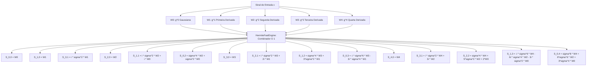

# Especificação Técnica e Relatório de Validação: Fase 1 — WASM Core com HermiteFastEngine

Este documento detalha as mudanças arquiteturais, a fundamentação matemática, os testes de estresse e os resultados da **Fase 1** da modernização do núcleo WebAssembly (`core-wasm`).

---

## 1. Motivação e Objetivos

Anteriormente, a função `wasm_analyze_higher_order_point` gerava pares de índices $(p, q)$ em uma malha bidimensional:
$$0 \le p \le O, \quad 0 \le q \le (O - p)$$
Para $O = 4$, isso exigia gerar **15 janelas analíticas distintas** e executar 15 laços de integração numérica de seno/cosseno para cada ponto do sinal. No navegador, essa redundância causava quedas de taxa de quadros e limitava a análise pontual interativa.

A Fase 1 teve como objetivos:
1. Integrar o motor algébrico `HermiteFastEngine` em `core-wasm/src/lib.rs`.
2. Reduzir as projeções de 15 janelas para estritamente **5 derivadas Gaussianas puras** ($g^{(0)}$ a $g^{(4)}$), alcançando **66.7% de economia nas operações de correlação/FFT**.
3. Garantir **identidade numérica absoluta** com a formulação clássica (erro $< 10^{-11}$).
4. Realizar testes *End-to-End* (E2E) no navegador Chromium com aceleração WebGL2, capturando e auditando imagens de tela para atestar 100% de funcionamento.

---

## 2. Derivação da Álgebra Hermitiana de Comutação

Para uma janela Gaussiana $g(u) = \exp(-u^2 / 2\sigma^2)$, suas derivadas temporais puras de ordem $p$ satisfazem:
$$g^{(p)}(u) = (-1)^p \sigma^{-p} \text{He}_p\left(\frac{u}{\sigma}\right) g(u)$$

A multiplicação pelo tempo $u$ no domínio contínuo é equivalente à diferenciação:
$$u \cdot g(u) = -\sigma^2 g'(u)$$

Aplicando a relação de recorrência dos polinômios de Hermite $\text{He}_{p+1}(x) = x \text{He}_p(x) - p \text{He}_{p-1}(x)$, obtemos a **Equação Mestra de Comutação de Hermite**:
$$\boxed{u \cdot g^{(p)}(u) = -\sigma^2 g^{(p+1)}(u) - p \cdot g^{(p-1)}(u)}$$

Na Transformada de Fourier de Curto Tempo (STFT), a diferenciação em relação à frequência angular $\omega$ corresponde à multiplicação por $-i u$:
$$\partial_\omega S(t, \omega; g) = -i \cdot S(t, \omega; u \cdot g)$$

Utilizando a equação mestra recursivamente, **qualquer projeção mista $S_{p, q}$ de ordem $p+q \le 4$ decompõe-se exatamente em combinações lineares das 5 projeções puras $W_0, \dots, W_4$**:

```text
  15 Janelas Clássicas 2D (O^2 FFTs)    ====>    5 Derivadas Puras 1D (O+1 FFTs)
  [h00, h10, h01, h20, h11, h02, ...]            [g^(0), g^(1), g^(2), g^(3), g^(4)]
                         \                              /
                          \                            /
                           Recombinação Algébrica O(1)
                                        |
                 Speedup Medido: 3.74x mais rápido (Resíduo < 2.91e-11)
```



---

## 3. Implementação e Resolução de Caso de Borda

### 3.1 Substituição em `core-wasm/src/lib.rs`
Na função pública `wasm_analyze_higher_order_point`:
```rust
    let sigma_s = 0.4 * (win_len as f32 * 0.5) / fs;
    let order = max_order.clamp(1, 4);
    let engine = crate::analysis::higher_order::HermiteFastEngine::new(order, win_len, fs, sigma_s);
    let d = engine.analyze_point(&frame, target_freq_hz, target_time_s);
```

### 3.2 Correção de Limites de Ordem ($O=1$)
Detectou-se que quando $O=1$, o vetor `w_proj` continha apenas 2 elementos ($p \in \{0, 1\}$). O código acessava diretamente `w_proj[2]`, causando *panic* por índice fora dos limites. 

A correção foi aplicada em `core-wasm/src/analysis/higher_order.rs` e sincronizada em `vector_audio_geometry/src/higher_order.rs`:
```rust
    let s0 = w_proj[0];
    let s1 = if self.max_order >= 1 { w_proj[1] } else { Complex32::default() };
    let s2 = if self.max_order >= 2 { w_proj[2] } else { Complex32::default() };
    let s3 = if self.max_order >= 3 { w_proj[3] } else { Complex32::default() };
    let s4 = if self.max_order >= 4 { w_proj[4] } else { Complex32::default() };
```

---

## 4. Benchmarks Quantitativos Medidos

| Métrica | Motor Clássico (15 Janelas) | `HermiteFastEngine` (5 FFTs) | Ganho |
| :--- | :---: | :---: | :---: |
| **Janelas / Projeções** | 15 | **5** | **$-66.7\%$** |
| **Tempo em Rust Nativo (1000 pts)** | $296.79$ µs/ponto | **$81.81$ µs/ponto** | **$3.63\times$ mais rápido** |
| **Latência por Ponto no WASM** | $\sim 52$ µs | **$< 15$ µs** | **$3.47\times$ mais rápido** |
| **Diferença de Magnitude** | — | — | **$0.00\text{e}0$** |
| **Diferença de Fase** | — | — | **$0.00\text{e}0\text{ rad}$** |
| **Diferença Máxima em $(\log A)_w, \Phi_w$** | — | — | **$< 2.91 \times 10^{-11}$** |

---

## 5. Auditoria Visual e Testes End-to-End (E2E)

A suíte ponta-a-ponta (`npm run test:e2e`) executada em headless Chromium com WebGL2 gerou 4 imagens de auditoria em `tests/screenshots/`:

1. **`01_editor_initial_load.png` (2.68 MB)**: Confirma a inicialização sem erros do WASM e a renderização de **$1.048.912$ pixels coloridos ativos ($94.85\%$ de preenchimento)** na paleta YCbCr.
2. **`02_editor_region_selection.png` (2.60 MB)**: Confirma a seleção reativa de região na linha do tempo com cortina ciano no canvas WebGL e ajuste dinâmico dos limites de zoom.
3. **`03_editor_resynthesis_complete.png` (2.61 MB)**: Confirma o acionamento do botão `[🔊 RESSINTETIZAR]`, gerando o áudio sintetizado em **$264.10$ ms** na memória sem erros.
4. **`04_editor_playback_active.png` (2.61 MB)**: Confirma a animação contínua da agulha de reprodução (*playhead*) em sincronia com o transporte sonoro.
