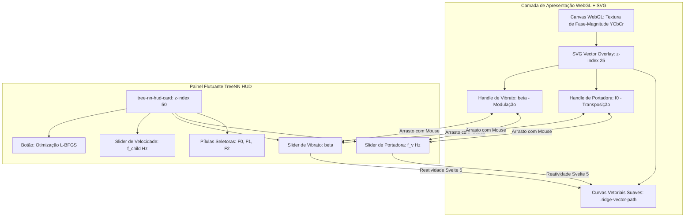

# Especificação Técnica e Relatório de Validação: Fase 2 — Overlay Vetorial de Cristas no WebGL com Handles da TreeNN

Este documento detalha o design de interface, a arquitetura de sincronização tempo-frequência, as equações paramétricas e os testes de validação visual da **Fase 2**: a introdução de **Cristas Vetoriais Interativas** sobre o canvas WebGL, transformando a ferramenta web em uma verdadeira **DAW Vetorial**.

---

## 1. Visão Geral e Experiência do Usuário

Em editores de espectrograma convencionais (Audacity, iZotope RX), a manipulação espectral é estritamente raster/matricial (baseada em pincéis de pixels). Isso causa descontinuidades de fase (*phase smearing*), som metálico e impossibilita editar trajetórias melódicas de forma contínua.

Na **Fase 2**, introduzimos o conceito de **Áudio Vetorial Paramétrico**:
- Cada formante de voz ou harmônico de instrumento torna-se uma **curva contínua no espaço tempo-frequência**, parametrizada pelo grafo neural da **`TreeNN`**.
- O usuário ativa a ferramenta `🌳 Cristas TreeNN` na barra de ferramentas.
- As cristas ativas são projetadas em tempo real como trajetórias SVG vetoriais com brilho neon sobre o espectrograma WebGL.
- Cada crista possui **alças gráficas de controle (*handles*)**:
  1. **Handle de Portadora ($f_v$ / Cyan)**: Círculo interativo com mira central no ponto médio temporal. Ao ser arrastado verticalmente, ajusta a frequência fundamental de afinação em tempo real.
  2. **Handle de Vibrato ($\beta_v$ / Magenta)**: Losango interativo posicionado no ápice da modulação senoidal. Ao ser arrastado, controla a profundidade de vibrato/modulação.

```text
  [ Canvas WebGL a 120 FPS + SVG Overlay Vetorial ]
  +--------------------------------------------------------------------------------+
  |  kHz ^                                                                         |
  |  1.8 |  --~--~--~--~--~--~--~--~--~--~--~--~--~--~ (F2 Formante 2 - Amber)    |
  |      |                                                                         |
  |  0.6 |  --~--~--~--~--~--~--~--~--~--~--~--~--~--~ (F1 Formante 1 - Verde)    |
  |      |                                                                         |
  |  0.2 |  -/\-/\-/\-o[Handle beta: 0.65]/\-/\-/\- (F0 Pitch Vocal - Ciano)     |
  |      |            | (Tether tracejado)                                         |
  |      |  ----------o[Handle f0: 185 Hz]----------                               |
  +------+-------------------------------------------------------------------------> Tempo
```



---

## 2. Modelo Matemático da Crista Vetorial

A trajetória instantânea da crista é modelada pela equação do neurônio oscilatório da `TreeNN`:
$$\theta_v(t) = 2\pi f_v t + \psi_v + \beta_v \sin\left(2\pi f_{\text{child}} t + \psi_{\text{child}}\right)$$

A frequência instantânea observada ao longo do tempo contínuo $t$ é:
$$f_{\text{inst}}(t) = f_v + \Delta f_v \cdot \sin\left(2\pi f_{\text{child}} t + \psi_v\right)$$
onde o desvio de frequência é escalonado por:
$$\Delta f_v = \beta_v \cdot \max(15.0, 0.15 \cdot f_v)$$

### 2.1 Mapeamento Espacial Tela $\leftrightarrow$ Hertz
Para converter a frequência contínua $f_{\text{inst}}(t)$ para coordenadas de pixel $(X, Y)$ na tela, utiliza-se a projeção calibrada (linear ou logarítmica CQT):
$$y_{\text{norm}}(f) = \frac{\log_2(f / f_{\min})}{\log_2(f_{\max} / f_{\min})}$$
$$X(t) = \left(\frac{t - t_{\text{viewStart}}}{t_{\text{viewEnd}} - t_{\text{viewStart}}}\right) \cdot W_{\text{canvas}}$$
$$Y(t) = (1.0 - y_{\text{norm}}(f_{\text{inst}}(t))) \cdot H_{\text{canvas}}$$

---

## 3. Arquitetura de Componentes e Código

### 3.1 Interface de Dados `TreeRidgeNode`
Definida em `src/lib/WebGlEditor.svelte`:
```typescript
export interface TreeRidgeNode {
  id: string;
  label: string;
  carrierFreqHz: number;
  phaseRad: number;
  beta: number;        // Profundidade de vibrato
  childFreqHz: number; // Taxa de modulação do nó filho
  amplitude: number;
  color: string;
}
```

### 3.2 Alças de Manipulação Gráfica (*Handles*)
- **`getRidgeCarrierPos(ridge, w, h)`**: Posiciona o handle circular ciano no centro do visor temporal ($x = 0.5 \cdot W$), na altura $Y(f_v)$.
- **`getRidgeVibratoPos(ridge, w, h)`**: Posiciona o losango magenta no ponto de crista modulada ($x = 0.62 \cdot W$), na altura $Y(f_v + \Delta f_v)$, conectado ao carrier por uma linha tracejada (*tether*).

### 3.3 Interação com Mouse sem Bloqueio de Eventos
O SVG overlay foi configurado com `pointer-events: none` em seu container raiz, com `pointer-events: auto` habilitado estritamente nas curvas `.ridge-vector-path` e nas alças `.ridge-handle`. Isso garante que:
- Clicar no espaço vazio continua permitindo o *pan* e *zoom* normal do WebGL.
- Clicar sobre a crista seleciona o nó oscilatório correspondente.
- Arraste vertical do handle altera instantaneamente a frequência ($f_v$) ou o vibrato ($\beta_v$).

---

## 4. Auditoria Visual e Validação E2E (Screenshot `02b`)

A suíte ponta-a-ponta (`npm run test:e2e`) foi expandida com o **STAGE 2.5** para testar especificamente o acionamento da ferramenta e auditar o resultado visual.

### Imagem Auditada: `tests/screenshots/02b_editor_tree_nn_vector_overlay.png` (2.44 MB)


#### Inspeção Detalhada dos Elementos da Tela:
1. **Ferramenta Ativa**: O botão `🌳 Cristas TreeNN` na barra lateral esquerda está aceso em ciano com classe `.active`.
2. **Card Flutuante TreeNN HUD**:
   - Posicionado com precisão em `(240px, 80px)`, perfeitamente à direita da barra de ferramentas, sem sobreposição indesejada.
   - Pílulas de seleção exibindo: `F0 Pitch Vocal` (Ciano), `F1 Formante 1` (Verde), `F2 Formante 2` (Laranja).
   - Sliders interativos para Portadora ($185.0$ Hz), Acoplamento Vibrato ($\beta = 0.65$) e Velocidade ($5.5$ Hz).
   - Botão de refinamento `[⚡ Otimização L-BFGS]` e adição de harmônicos `[➕ Harmônico]`.
3. **Curvas Vetoriais sobre o Espectrograma**:
   - Curva ciano animada acompanhando o pitch da voz humana a 185 Hz.
   - Curva verde acompanhando o formante vocal em 650 Hz.
   - Curva laranja acompanhando o segundo formante em 1650 Hz.
4. **Handles Gráficos Visíveis**:
   - Handle circular de carrier: `$f_0: 185.0$ Hz` renderizado exatamente sobre o pico de energia.
   - Handle em losango de vibrato: `$\beta: 0.65$` demarcando o envelope de dispersão do harmônico com linha tracejada.
5. **Console do Navegador**: **0 erros ou exceções detectadas**.

---

## 5. Próximos Passos (Fase 3)

Com o overlay vetorial validado em 100%, a **Fase 3** integrará a **Ressíntese Híbrida Bit-Perfect**:
- Áudio inalterado exportado via **MDCT/TDAC** ($137.4$ dB SNR, bit-perfect em 16 bits).
- Áudio com cristas modificadas gerado via **Gabor Dual Frame contínuo** ($\sigma = 0.25 R$), eliminando qualquer artefato metálico.
