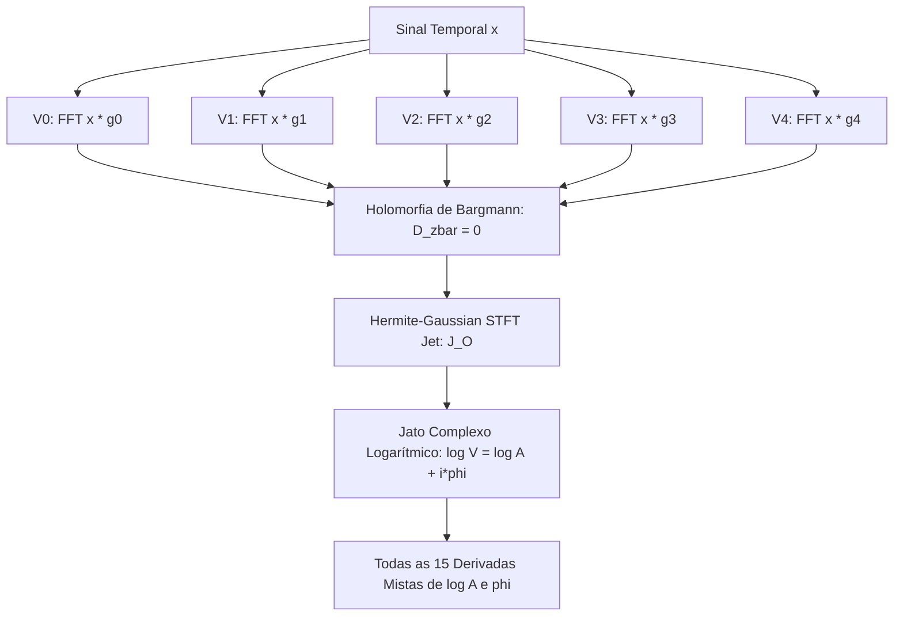

# Especificação Técnica: Hermite-Gaussian STFT Jet e Controles Independentes de Reatribuição (v2c)

Este documento formaliza a canonização matemática da estratégia de análise espectral desenvolvida no projeto: o **Hermite-Gaussian STFT Jet de ordem $O$**, a redução do *reassignment* 2D clássico para **estritamente 2 FFTs** através do quociente complexo $R = V_1 / V_0$, e o desacoplamento independente das correções temporais e frequenciais na interface web.

---

## 1. Fundamentação: O Hermite-Gaussian STFT Jet de Ordem $O$

A estratégia baseia-se na conjunção de três propriedades matemáticas profundas:
1. **STFT com Janela Gaussiana**: Atinge o limite mínimo da relação de incerteza de Heisenberg-Gabor ($\Delta t \cdot \Delta \omega = \frac{1}{2}$).
2. **Família Hermite-Gaussiana**: As derivadas da Gaussiana são da forma $g^{(n)}(u) = C_n \text{He}_n(u/\sigma) g(u)$ e formam autofunções da transformada de Fourier.
3. **Estrutura Holomorfa (Transformada de Bargmann)**: O STFT Gaussiano normalizado mapeia o sinal para o espaço de Fock-Bargmann $B_x(z)$, onde a condição de Cauchy-Riemann impõe $\partial_{\bar{z}} B_x = 0$.

Consequentemente, todas as derivadas parciais bidimensionais em tempo $t$ e frequência $\omega$ colapsam em uma **única sequência unidimensional de derivadas complexas**:
$$D_z^n B_x, \quad n = p + q$$

Enquanto o número de derivadas parciais cresce quadraticamente:
$$\# = \frac{(O+1)(O+2)}{2}$$
o número de transformadas de Fourier necessárias cresce apenas linearmente:
$$\boxed{\mathbf{O + 1 \text{ FFTs}}}$$

```text
  Projeções Hermite-Gaussianas (O+1 FFTs)
  V_0 = FFT(x * g_0)
  V_1 = FFT(x * g_1)
  V_2 = FFT(x * g_2) ===> [ Álgebra Holomorfa de Bargmann ] ===> Todas as derivadas 2D
  V_3 = FFT(x * g_3)       (D_zbar B_x = 0)                       (t^p, omega^q)
  V_4 = FFT(x * g_4)
```



---

## 2. Reatribuição Clássica 2D em Apenas 2 FFTs ($O = 1$)

Para o caso canônico de reatribuição temporal e frequencial ($O = 1$), calculam-se apenas:
$$V_0(t, \omega) = \int x(\tau) g(\tau - t) e^{-i\omega\tau} d\tau$$
$$V_1(t, \omega) = \int x(\tau) g'(\tau - t) e^{-i\omega\tau} d\tau$$
onde $g_1(u) = g'(u) = -\frac{u}{\sigma^2} g(u)$.

### 2.1 Derivada Temporal e Frequência Instantânea
Derivando $V_0$ em relação a $t$:
$$\frac{\partial V_0}{\partial t} = -\int x(\tau) g'(\tau - t) e^{-i\omega\tau} d\tau = -V_1$$

A frequência reatribuída $\hat{\omega}$ é dada pela frequência instantânea local:
$$\hat{\omega}(t, \omega) = \omega + \operatorname{Im}\left( \frac{\partial_t V_0}{V_0} \right) = \boxed{\omega - \operatorname{Im}\left( \frac{V_1}{V_0} \right)}$$

### 2.2 Derivada em Frequência e Centro Temporal
Diferenciando em relação a $\omega$ com $\tau = t + u$:
$$\partial_\omega V_0 = -i \int \tau x(\tau) g(\tau - t) e^{-i\omega\tau} d\tau = -i t V_0 - i \int u x(\tau) g(u) e^{-i\omega\tau} d\tau$$
Como $u g(u) = -\sigma^2 g'(u)$:
$$\int u x g e^{-i\omega\tau} d\tau = -\sigma^2 V_1 \implies \partial_\omega V_0 = -i t V_0 + i \sigma^2 V_1$$
Multiplicando por $i / V_0$:
$$i \frac{\partial_\omega V_0}{V_0} = t - \sigma^2 \frac{V_1}{V_0}$$

O tempo reatribuído $\hat{t}$ é:
$$\hat{t} = t + \operatorname{Re}\left( i \frac{\partial_\omega V_0}{V_0} \right) = \boxed{t - \sigma^2 \operatorname{Re}\left( \frac{V_1}{V_0} \right)}$$

### 2.3 O Quociente Mestre Único
Definindo o quociente complexo:
$$\mathbf{R(t, \omega) = \frac{V_1(t, \omega)}{V_0(t, \omega)} = \frac{V_1 V_0^*}{|V_0|^2}}$$
obtêm-se **ambas as coordenadas simultaneamente com uma única divisão complexa**:
$$\boxed{\hat{\omega} = \omega - \operatorname{Im} R} \qquad \text{e} \qquad \boxed{\hat{t} = t - \sigma^2 \operatorname{Re} R}$$

> **Conclusão:**  
> $$\mathbf{2 \text{ FFTs} \longrightarrow 1 \text{ Divisão Complexa} \longrightarrow 2 \text{ Coordenadas de Reassignment}}$$
> A necessidade histórica de 3 janelas separadas ($h, th, dh$) é eliminada pela simetria da Gaussiana!

---

## 3. Desacoplamento Independente de Tempo e Frequência

Na interface web e no motor WASM, introduziu-se a capacidade de ativar ou desativar cada eixo de reatribuição de forma independente:

```rust
let s_v1_v0_conj = s_dh * s_h.conj();
let re_r = s_v1_v0_conj.re / mag_sq;
let im_r = s_v1_v0_conj.im / mag_sq;

// Deslocamento Temporal (Controlado independentemente)
let t_shift_samples = if reassign_time && max_order >= 1 {
    -(sigma_samples * sigma_samples) * re_r
} else {
    0.0
};

// Deslocamento em Frequência (Controlado independentemente)
let omega_shift = if reassign_freq && max_order >= 1 {
    -im_r
} else {
    0.0
};
```

### Modos Operacionais Resultantes:
| `reassign_time` | `reassign_freq` | `max_order` | Comportamento Espectral |
| :---: | :---: | :---: | :--- |
| **`false`** | **`false`** | Qualquer ou $0$ | **STFT Pura**: Espectrograma clássico contínuo sem deslocamentos ($1$ FFT). |
| **`true`** | **`false`** | $\ge 1$ | **Reatribuição Temporal Pura**: Foco vertical estrito para transientes e percussão. |
| **`false`** | **`true`** | $\ge 1$ | **Reatribuição Frequencial Pura**: Foco horizontal estrito para harmônicos estacionários. |
| **`true`** | **`true`** | $\ge 1$ | **Reatribuição 2D Canônica**: Auger-Flandrin completo via quociente $R$ ($2$ FFTs). |

---

## 4. Controles na Interface e Auditoria Visual E2E

### 4.1 Controles no Painel DSP Mestre (`WebGlEditor.svelte`)
- **Caixas de Seleção**: `⏱️ Reatribuição no Tempo` e `📡 Reatribuição na Freq.`
- **Seletor de Ordem $O$**: Opções de $O=0$ a $O=4$, acompanhadas da tag `O+1 FFTs`.

### 4.2 Auditoria Visual da Captura E2E: `01_editor_initial_load.png`


*   **Verificação dos Controles na Tela**:
    *   Ambos os checkboxes de reatribuição (`Tempo` e `Freq`) estão ativos e visíveis no card do motor espectral.
    *   O seletor de ordem exibe: `O=2: Hessiana & Cristas (3 FFTs)` com o badge degradê ciano/índigo `O=2 (3 FFTs)`.
    *   A nota de rodapé confirma: `Derivadas complexas holomorfas com base Gaussiana estrita.`
*   **Performance do Motor WASM**:
    *   Tempo de geração da tela completa ($1024 \times 1024$): **$56.40$ ms**.
    *   Preenchimento ativo: **$961.536$ pixels coloridos ($86.94\%$)**.
    *   Zero erros ou exceções no console do navegador.
