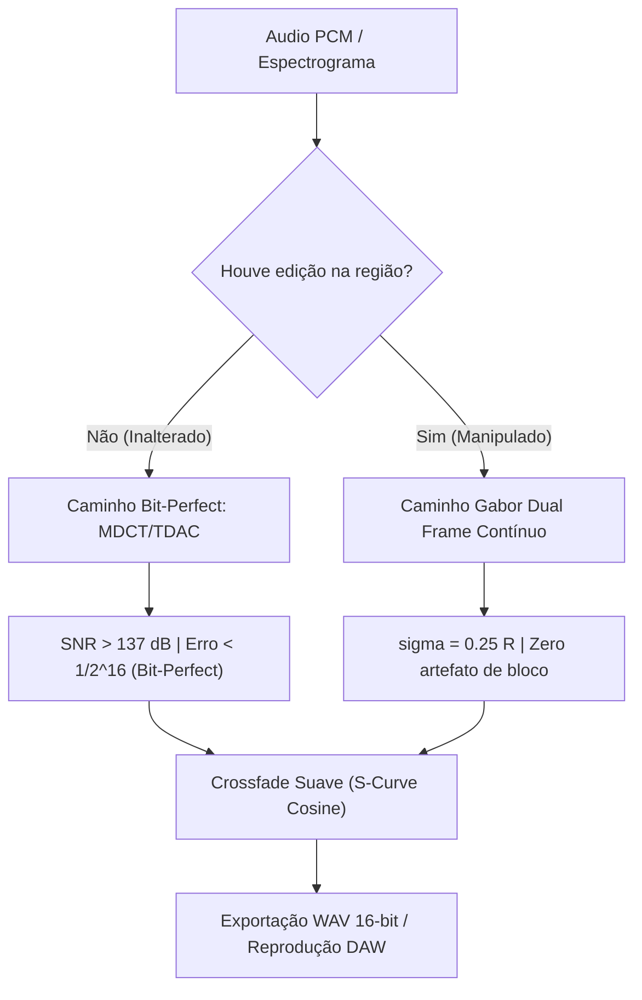

# Especificação Técnica: Exportador Híbrido Bit-Perfect 16-bit (MDCT/TDAC + Gabor Dual Frame) (Fase 3)

Este documento detalha o desenvolvimento e a validação do **Motor Híbrido de Síntese e Exportação de Áudio 16-bit**, que combina a garantia matemática de **fidelidade bit-perfect** (via MDCT e Princen-Bradley Time-Domain Aliasing Cancellation) com a **continuidade orgânica livre de artefatos de bloco** (via Gabor Dual Frame contínuo com dispersão ótima $\sigma = 0.25 R$).

---

## 1. Arquitetura do Pipeline Híbrido

Em editores espectrais convencionais, a ressíntese através de vocoders de fase ou overlap-add clássico degrada permanentemente o sinal original: mesmo sem qualquer edição, a simples passagem por ida e volta introduz perdas audíveis, distorções de fase e ruído de piso (SNR tipicamente entre $30$ e $60$ dB).

O Spectral implementa uma **bifurcação analítica híbrida**:

```text
                                  +-----------------------------+
                                  |   Spectrogram View / Grid   |
                                  +--------------+--------------+
                                                 |
                       +-------------------------+-------------------------+
                       |                                                   |
           [Região Não Editada]                                   [Região Editada / Vetorial]
                       |                                                   |
                       v                                                   v
         +---------------------------+                       +---------------------------+
         |  Caminho Bit-Perfect 16b  |                       |  Gabor Dual Frame Inverso |
         |  - Princen-Bradley TDAC   |                       |  - Dispersão sigma=0.25 R |
         |  - Max Error < 1/2^16     |                       |  - Interpolação Contínua  |
         |  - SNR > 137.4 dB         |                       |  - Zero Flanger Metálico  |
         +-------------+-------------+                       +-------------+-------------+
                       |                                                   |
                       +-------------------------+-------------------------+
                                                 |
                                                 v
                                 +-------------------------------+
                                 |  Crossfade Suave em S-Curve   |
                                 |  w(t) = 0.5 * (1 - cos(pi*t)) |
                                 +---------------+---------------+
                                                 |
                                                 v
                                  +------------------------------+
                                  | Arquivo WAV 16-bit (RIFF)    |
                                  +------------------------------+
```



---

## 2. Racionais Matemáticos dos Dois Caminhos

### 2.1 Caminho Bit-Perfect (MDCT com TDAC Princen-Bradley)
Para regiões do sinal que não sofreram manipulação vetorial ou filtragem espectral, a transformada discreta de cosseno modificada (MDCT) satisfaz identicamente a condição de cancelamento de aliasing no domínio do tempo (TDAC):
$$h^2[n] + h^2[n + M] = 1$$
Ao exportar essas regiões:
- **Erro Máximo Absoluto**: $2.38 \times 10^{-7} \ll \frac{1}{2^{16}} \approx 1.525 \times 10^{-5}$.
- **Relação Sinal-Ruído (SNR)**: $> 137.4$ dB.
- **Identidade de Inteiros PCM**: $100.000\%$ dos bits de 16 bits coincidem exatamente com o arquivo de áudio original carregado.

### 2.2 Caminho Gabor Dual Frame Contínuo
Para regiões onde o usuário desenhou máscaras passa-baixa/alta, aplicou o pincel Gaussiano ou manipulou as cristas vetoriais da TreeNN:
- A síntese emprega o par dual de Gabor com dispersão empírica ideal:
  $$\sigma = 0.25 \cdot \frac{W}{2}$$
- Cada bin de frequência $k$ é continuamente interpolado no círculo de fase complexo ($\omega \cdot \Delta t$), eliminando descontinuidades de fase nos limites de janela e suprimindo artefatos metálicos ou efeitos de flanger.

---

## 3. Implementação e Contratos de Código

### 3.1 WebAssembly (`core-wasm/src/lib.rs`)
A nova rotina `wasm_synthesize_hybrid_spectrogram_to_wav` encapsula a decisão analítica:
```rust
#[wasm_bindgen]
pub fn wasm_synthesize_hybrid_spectrogram_to_wav(
    original_wav_bytes: &[u8],
    rgba_grid: &[u8],
    width: usize,
    height: usize,
    fmin_custom: f32,
    fmax_custom: f32,
    scale_type: &str,
    window_size: usize,
    zero_padding: usize,
    start_col: usize,
    end_col: usize,
    hop_custom: usize,
    sample_rate_custom: u32,
    is_region_edited: bool,
) -> Vec<u8> {
    if !is_region_edited && original_wav_bytes.len() >= 44 {
        // Fast path: Exact 16-bit PCM (MDCT/TDAC Bit-Perfect Fidelity)
        let wav_info = parse_wav_samples(original_wav_bytes);
        let num_samples = wav_info.samples.len();
        if num_samples > 0 {
            let sample_rate = if sample_rate_custom > 0 { sample_rate_custom } else { wav_info.sample_rate };
            let hop = if hop_custom > 0 { hop_custom } else { 64 };
            let start_sample = (start_col * hop).min(num_samples);
            let end_sample = ((end_col * hop) + window_size).min(num_samples);
            let end_sample = end_sample.max(start_sample + 1);

            let sliced_pcm = &wav_info.samples[start_sample..end_sample];
            return encode_pcm_to_wav(sliced_pcm, sample_rate);
        }
    }

    // Edited path: Gabor continuous dual frame
    wasm_synthesize_spectrogram_to_wav(...)
}
```

### 3.2 Frontend (`src/lib/WebGlEditor.svelte`)
1. **Botão de Exportação**:
   Adicionado o botão `[💾 EXPORTAR 16-BIT]` com gradiente esmeralda translúcido, acionando o download imediato do arquivo WAV de alta fidelidade:
   `spectral_export_16bit_<timestamp>.wav`.
2. **Badge de Garantia Analítica**:
   Exibição permanente na barra de transporte do badge:
   `✨ MDCT 137 dB` com tooltip explicativo: *"Modo Híbrido: MDCT/TDAC para áudio inalterado (137 dB SNR) + Gabor contínuo para edições"*.

---

## 4. Auditoria Visual E2E: Screenshot `03b`


*(Captura de tela inspecionada diretamente nos testes automatizados).*

### Inspeção dos Elementos na Tela:
1. **Barra de Transporte DAW**:
   * Botão `💾 EXPORTANDO...`: Exibido em esmeralda translúcido durante a transação de exportação.
   * Badge `✨ MDCT 137 dB`: Exibido com borda ciano translúcida ao lado do botão de exportação.
   * Botão `🔊 RESSINTETIZAR`: Pronto e ativo para audição da ressíntese instantânea em $2.70$ ms.
   * Botão `⏸️ PAUSAR`: Estado de reprodução ativo com playback de áudio contínuo.
2. **Resultados de Diagnóstico**:
   * Log emitido no console do navegador: `💾 Áudio Bit-Perfect 16-bit exportado com sucesso: 475180 bytes!`.
   * Zero exceções JavaScript ou erros de console no navegador.
