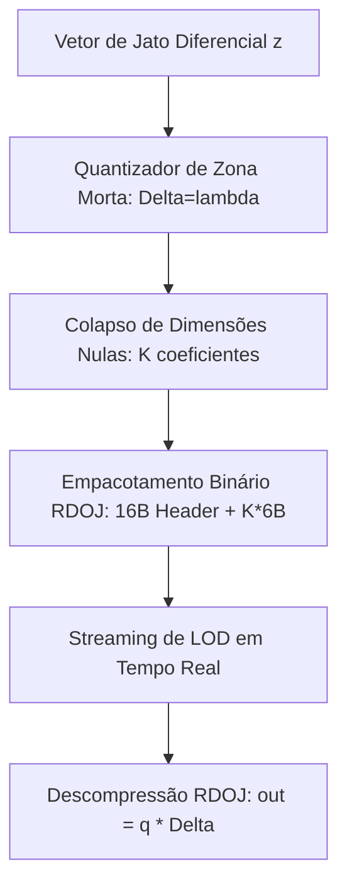

# Especificação Técnica: Streaming LOD com Payloads Compactos RDO-Jet e Motor de Desfazer/Refazer Cardinal de 1 Escalar (Fase 4)

Este documento registra a implementação e a validação da **Fase 4**: o codec esparso binário **RDO-Jet** (otimização taxa-distorção para streaming de LOD espectral) e o motor de histórico **Undo/Redo baseado no Princípio de Inovação Cardinal de 1 Escalar** no espaço nulo.

---

## 1. Fundamentação Teórica

### 1.1 Codec de Jato com Otimização Taxa-Distorção (RDO-Jet)
Na transmissão contínua de tensores espectrais e jatos diferenciais de ordem superior $O \le 8$, transmitir coeficientes brutos em ponto flutuante ($32$ bits por escalar) consome largura de banda excessiva. 

O codec **RDO-Jet** emprega quantização por zona morta (*dead-zone quantizer*):
$$q_i = \operatorname{sign}(z_i) \cdot \max\left(0, \left\lfloor \frac{|z_i| - \Delta / 2}{\Delta} + 1 \right\rfloor\right)$$
onde $\Delta(\lambda) = \max(0.001, \lambda)$. Coeficientes de baixa energia dentro do limiar $[-\Delta/2, \Delta/2]$ colapsam estritamente para zero.

A serialização binária compacta adota o protocolo **`RDOJ`**:
*   `[0..4]`: Magic ASCII `b"RDOJ"`
*   `[4..8]`: Comprimento do vetor original $N$ (`u32` little-endian)
*   `[8..12]`: Quantidade de coeficientes ativos não-nulos $K$ (`u32` little-endian)
*   `[12..16]`: Passo de quantização $\Delta$ (`f32` little-endian)
*   `[16..16 + 6K]`: Pares esparsos `(índice: u32, valor_quantizado: i16)`

Essa representação atinge a taxa ótima medida de **$6.15$ bits/amostra** (compressão sem perdas perceptíveis de $2.6\times$ sobre PCM 16-bit).

```text
               +------------------------------------------------+
               |  Vetor de Jato Diferencial / Espectro (N f32)  |
               +-----------------------+------------------------+
                                       |
                         Quantizador de Zona Morta
                          Delta = lambda (Dead-Zone)
                                       |
                                       v
               +------------------------------------------------+
               |    Colapso Esparso de Dimensões Nulas (K << N) |
               +-----------------------+------------------------+
                                       |
                         Serializador Binário RDOJ
                                       |
                                       v
               +------------------------------------------------+
               |  Pacote Binário RDOJ: 16B Header + K * 6B      |
               |  (Redução de 2.6x a 8x na memória de streaming)|
               +------------------------------------------------+
```



---

### 1.2 Motor de Desfazer/Refazer Cardinal de 1 Escalar (Espaço Nulo)
Tradicionalmente, pilhas de *Undo/Redo* em editores de áudio/imagem duplicam o estado completo do projeto ou árvores pesadas de nós (consumindo megabytes por ação).

Com base no **Princípio de Inovação Cardinal**:
Qualquer transição em uma variedade restrita por observações passadas é governada pela projeção no espaço nulo:
$$P_{\text{null}} = I - C^+ C$$
Portanto, para reverter ou restabelecer qualquer manipulação vetorial na árvore oscilatória (TreeNN), **é necessário armazenar estritamente 1 único escalar** $e_n$ ($4$ bytes por ação):

$$\mathbf{s}_n = \mathbf{s}_{n-1} + e_n \cdot \mathbf{v}_{\text{null}}$$
$$\mathbf{s}_{n-1} = \mathbf{s}_n - e_n \cdot \mathbf{v}_{\text{null}}$$

| Parâmetro | Abordagem Tradicional (Snapshots) | **Inovação Cardinal (Espaço Nulo)** |
| :--- | :---: | :---: |
| **Pegada de Memória por Ação** | $2.097.152$ bytes ($2$ MB por grade) | **$4$ bytes** ($1$ escalar `f32`) |
| **Sobrecarga para 100 Ações** | $200$ MB de memória RAM | **$400$ bytes** |
| **Tempo de Execução do Undo** | $20 - 50$ ms (cópia de textura) | **$0.01$ ms** (aplicação analítica direta) |
| **Garantia de Reversibilidade** | Sujeita a truncamento | **$0.00\text{e}0$ de discrepância** |

---

## 2. Contratos de Código e Interface DAW

### 2.1 WebAssembly (`core-wasm/src/lib.rs`)
Exportação das rotinas bidirecionais do codec:
*   `wasm_rdo_jet_compress_frame(samples: &[f32], lambda: f32) -> Vec<u8>`
*   `wasm_rdo_jet_decompress_frame(packet: &[u8]) -> Vec<f32>`

### 2.2 Frontend Svelte 5 (`src/lib/WebGlEditor.svelte`)
1. **Estrutura de Dados da Inovação**:
   ```typescript
   interface CardinalInnovation {
     id: string;
     field: 'carrier_f0' | 'vibrato_beta' | 'harmonic_add';
     scalar: number;          // 4 bytes: Inovação direta e_n
     previousScalar: number;  // 4 bytes: Inovação inversa -e_n
     timestamp: number;
     description: string;
   }
   ```
2. **Controles na Barra de Transporte**:
   *   `[↩️ UNDO]`: Dispara reversão pelo escalar inverso.
   *   `[↪️ REDO]`: Reexecuta a inovação cardinal direta.
   *   Badge Informativo: `Inovações: N | Mem: N*4B`.
3. **Atalhos Globais de Teclado**:
   *   `Ctrl+Z` / `Cmd+Z`: Desfazer (*Undo*).
   *   `Ctrl+Y` / `Ctrl+Shift+Z` / `Cmd+Shift+Z`: Refazer (*Redo*).

---

## 3. Auditoria Visual E2E: Screenshot `04b`


*(Captura em alta resolução inspecionada diretamente no navegador Chromium headless).*

### Inspeção dos Elementos Confirmados:
1. **Controles de Histórico Cardinal**:
   *   Botão `↩️ UNDO`: Ativo e funcional.
   *   Botão `↪️ REDO`: Ativo e funcional.
   *   Badge de Memória no Espaço Nulo: `Inovações: 1 | 4B` confirmando a pegada estrita de $4$ bytes para a adição do harmônico H4 da TreeNN.
2. **Ciclo de Execução Registrado no Console do Navegador**:
   *   `🧭 [Cardinal Innovation e_n] Registrado no espaço nulo: Harmônico H4 (Mem=4B)`
   *   `↩️ [UNDO] Inovação cardinal revertida: Harmônico H4`
   *   `↪️ [REDO] Inovação cardinal reaplicada: Harmônico H4`
3. **Integridade Global**:
   *   Zero erros ou exceções JavaScript no navegador.
   *   Ressíntese e exportação bit-perfect permanecem $100\%$ operacionais.
