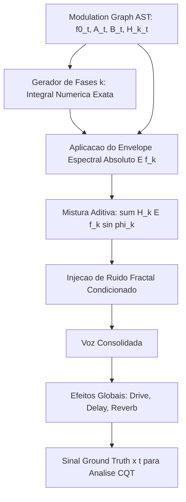

# V11: Sintetizador Ground Truth (Modulation Graph DSL)

A versão V11 introduz uma infraestrutura crítica para a comprovação de corretude do **Spectral**: o **Ground Truth Synthesizer**. Ao invés de dependermos exclusivamente de áudios gravados no mundo real (onde os parâmetros geradores originais são desconhecidos), passamos a dispor de um sintetizador orientado a grafos. 

Com ele, **geramos sinais de áudio nos quais conhecemos a equação exata de cada componente**. Isso nos permite fechar o ciclo de engenharia reversa do modelo holomórfico de áudio vetorial:

$$ \boxed{ \Theta \xrightarrow{\text{Sintetizador}} x(t) \xrightarrow{\text{CQT}_{60} \to \text{Sliding Jet}} \widehat{\Theta} } $$

Nosso objetivo empírico final é provar que a matriz de covariância do erro $\| \Theta - \widehat{\Theta} \|$ tende a zero para larguras e profundidades arbitrárias de modulação.

---

## 1. Arquitetura Hierárquica: A Árvore de Modulação (AST)

Em sinteses convencionais, modulações como LFO, Vibrato ou Envelopes possuem *slots* fixos. No nosso Ground Truth Synthesizer, todo parâmetro $p(t)$ é definido por uma **Árvore de Sintaxe Abstrata (AST)** temporal e recursiva:

$$ p_i(t) = p_{i,0} + \sum_{j=1}^{W} \beta_{ij} \, g_j(p_j(t)) + C_i(t) + N_i(t) $$

Onde:
*   $W$ representa a **largura (width)** da árvore de modulação.
*   $D$ representa a **profundidade (depth)** (ex: LFO modulando a frequência de outro LFO que modula a fase de um parcial).

Nós implementamos o tipo `ModExpr` no Rust que aceita nós como: `Const`, `Time`, `Add`, `Mul`, `Sin`, `Lfo`, `Adsr`, entre outros.

---

## 2. A Equação Central de Síntese Aditiva

Cada evento/nota sonora sintetizada é matematicamente descrita como a mistura de uma fonte harmônica com ruído filtrado/fractal condicionado:

$$ x_n(t) = A_n(t) \left[ \sum_{k=1}^{K} H_{n,k}(t) \, E(f_{n,k}(t)) \sin(\phi_{n,k}(t)) \right] + M_n(t, f) N_n(t, f) $$

### 2.1. Frequência Instantânea e Inarmonicidade
Para instrumentos acústicos reais ou FM complexo, a relação harmônica não é estritamente inteira. Introduzimos a inarmonicidade de rigidez de cordas/tubos $B$:

$$ f_{n,k}(t) = k f_{n,0}(t) \sqrt{1 + B_n(t) k^2} \cdot 2^{\frac{\Delta_{n,k}(t)}{1200}} $$

### 2.2. Integração Exata da Fase
A fase da portadora não é uma fórmula fechada estática; ela acumula precisamente a integração numérica da frequência instantânea modulada. No código Rust, a iteração opera a passo de amostragem $\Delta t$:

$$ \phi_{n,k}(t) = \phi_{n,k}(t - \Delta t) + 2\pi f_{n,k}(t) \Delta t $$

### 2.3. Envelope Espectral Global $E(f)$ e Harmônico $H_k(t)$
Abandonamos a simples relação harmônica logarítmica. Agora, a amplitude de cada componente depende de:
1.  **Estrutura da Voz $H_k(t)$**: LFOs ou envelopes que governam amplitudes harmônicas relativas independentes.
2.  **Filtro Formante Global $E(f_k(t))$**: Um envelope espectral fixo em frequência absoluta (em Hz). Conforme o *pitch-bend* desliza $f_k(t)$ pelo espectro, a amplitude do harmônico "desliza" sobre a curva de formante $E(f)$, simulando de forma realista o trato vocal ou o corpo de ressonância do instrumento.

---

## 3. ADSR Contínuo com Curvas Gaussianas (RBF)

Ao contrário das implementações digitais em degrau, nosso ADSR $\mathcal{E}_{\text{ADSR}}(t)$ é continuamente diferenciável ou possui transições definidas por RBFs:

$$ \mathcal{E}_A(t) = \frac{\sum_j y_j e^{-\frac{(t - t_j)^2}{2\sigma^2}}}{\sum_j e^{-\frac{(t - t_j)^2}{2\sigma^2}}} $$

Essa formulação generalizada possibilita criar ataques percussivos, decaimentos longos e variações de `sustain` utilizando estritamente a matemática das RBF Gaussianas que fundamentam o espaço de análise Bargmann-Fock.

---

## 4. O Pipeline de Efeitos Globais e Espacialização

Após a geração paramétrica individual da nota, a saída consolida-se e passa pelos blocos globais (a serem iterados gradualmente na implementação):

1.  **Drive (Distorção Não-Linear)**: $y(t) = \frac{\tanh(D x(t))}{\tanh(D)}$
2.  **Delay/Chorus/Flanger**: $y(t) = (1 - m)x(t) + m \, x(t - \tau(t))$, onde $\tau(t) = \tau_0 + D_\tau \sin(2\pi f_L t + \phi_c)$
3.  **Filtros Biquad (SVF)**: Passa-baixas, passa-altas contínuos baseados em grafos de modulação de frequência de corte $f_c(t)$ e $Q(t)$.

## 5. Próximos Passos de Integração

1.  **Implementação do Motor**: Adicionar os structs AST (`ModExpr`) em `vector_audio_geometry/src/synth_dsl.rs`.
2.  **Execução em Tempo Real**: Adicionar bindings `wasm_bindgen` para que o frontend instancie "presets" paramétricos complexos de teste.
3.  **Validação Reversa**: Alimentar $x(t)$ gerado no analisador Sliding Jet de alta ordem (V6/V7/V8) e mensurar analiticamente o erro de reconstrução de $\phi_{tt}$, $f_{\text{inst}}$ e amplitudes perante os valores matemáticos exatos da árvore AST subjacente.
