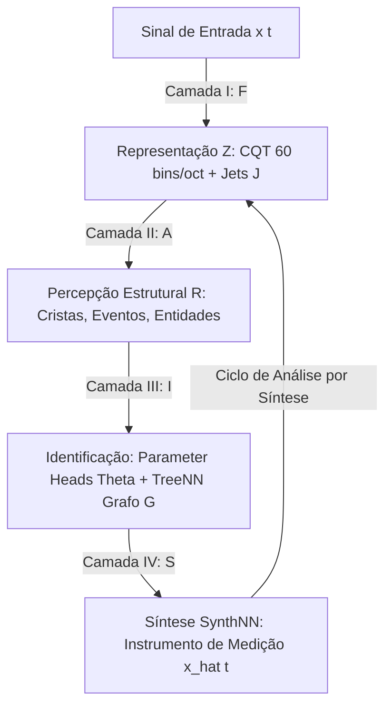

# V13: Matriz Operacional dos 22 Estágios (E0 a E21)
## Arquitetura de Identificação Hierárquica e Análise por Síntese

---

## 1. As Quatro Camadas Conceituais

O sistema é formalizado como uma cadeia de operadores desacoplados, onde cada transição é validada de forma independente:

$$
x(t) 
\xrightarrow{\mathcal{F}} 
Z_{\text{CQT}} 
\xrightarrow{\mathcal{A}} 
R 
\xrightarrow{\mathcal{I}} 
(\hat{G}, \hat{\Theta}) 
\xrightarrow{\mathcal{S}} 
\hat{x}(t)
$$

```text
+-------------------------------------------------------------------------------------------------+
|                                 CAMADA I: REPRESENTAÇÃO (F)                                     |
|           x(t) ──► CQT Gaussiana (60 bins/oct) ──► Reassignment ──► Hermite Jets J             |
+-------------------------------------------------------------------------------------------------+
                                                │
                                                ▼
+-------------------------------------------------------------------------------------------------+
|                            CAMADA II: PERCEPÇÃO ESTRUTURAL (A)                                  |
|         Z_CQT, J ──► Detecção de Cristas (Ridges) ──► Eventos ──► Entidades Acústicas R         |
+-------------------------------------------------------------------------------------------------+
                                                │
                                                ▼
+-------------------------------------------------------------------------------------------------+
|                              CAMADA III: IDENTIFICAÇÃO (I)                                      |
|    R ──► Parameter Heads (Física Local) + TreeNN (Grafo Causal) ──► Topologia G, Parâmetros Θ   |
+-------------------------------------------------------------------------------------------------+
                                                │
                                                ▼
+-------------------------------------------------------------------------------------------------+
|                                 CAMADA IV: SÍNTESE (S)                                          |
|            (G, Θ) ──► SynthNN (Instrumento de Medição Físico) ──► Sinal Sintetizado x_hat      |
+-------------------------------------------------------------------------------------------------+
```



* **Camada I ($\mathcal{F}$)**: Representação contínua tempo-frequência. Totalmente matemática e congelada.
* **Camada II ($\mathcal{A}$)**: Detecção e ordenação de ridges e eventos discretos. Quase puramente analítica.
* **Camada III ($\mathcal{I} = (\mathcal{E}, \mathcal{P}, \mathcal{G})$)**: Onde o aprendizado ocorre:
  * $\mathcal{E}$: observações $\to$ embeddings de entidades acústicas.
  * $\mathcal{P}$: embeddings $\to$ parâmetros físicos locais (heads pequenos compartilhados).
  * $\mathcal{G}$: embeddings $\to$ grafo de dependência causal (TreeNN).
* **Camada IV ($\mathcal{S}$)**: Sintetizador Ground Truth (DSL analítica). Não é aprendido; atua como o simulador do universo físico.

---

## 2. Gramática de Datasets e Amostragem

O espaço de síntese $\mathcal{X}$ é fatorado como uma gramática de composição:

$$
\mathcal{X} = \mathcal{X}_{\text{source}} \times \mathcal{X}_{\text{pitch}} \times \mathcal{X}_{\text{amp}} \times \mathcal{X}_{\text{harm}} \times \mathcal{X}_{\text{mod}} \times \mathcal{X}_{\text{noise}} \times \mathcal{X}_{\text{effect}} \times \mathcal{X}_{\text{event}} \times \mathcal{X}_{\text{graph}}
$$

O treinamento expande os subespaços de maneira rigorosamente aninhada:
$$
\mathcal{X}_1 \subset \mathcal{X}_2 \subset \mathcal{X}_3 \subset \cdots \subset \mathcal{X}_{21}
$$

### Três Variantes por Exemplo
Para cada configuração gerada, três sinais são produzidos:
1. $x_{\text{clean}}$: Amostra ideal determinística.
2. $x_{\text{perturbed}}$: Perturbação infinitesimal nos parâmetros $\theta' = \theta + \epsilon$ e ruído branco aditivo ($40\text{ dB}$ SNR).
3. $x_{\text{hard}}$: Casos limites intencionais ($f_m \approx f_c$, harmônicos mascarados por formantes, transientes curtos).

### Teste de Isolamento Contrafactual
Para validar que cada parâmetro possui significado semântico desacoplado, o sistema é avaliado em pares contrafactuais $(x, x')$ onde apenas uma dimensão varia ($\Theta' = \Theta + \Delta e_i$). A métrica de isolamento deve satisfazer:

$$
\boxed{ I_i = \frac{ |\Delta \hat{\theta}_i| }{ \displaystyle\sum_{j \ne i} |\Delta \hat{\theta}_j| + \epsilon } \gg 1 }
$$

---

## 3. Matriz Operacional Completa dos 22 Estágios (E0 a E21)

| Estágio | Nome do Experimento | Subespaço Ativo | Parâmetros Treináveis | Arquitetura Mínima | Função de Perda (Loss) | Critério de Promoção |
| :---: | :--- | :--- | :--- | :--- | :--- | :--- |
| **E0** | **Identificabilidade SynthNN** | $\Theta_{\text{source}}$ | Nenhum (Analítico) | Cálculo de $J_\Theta$ | SVD / $\kappa(J_\Theta)$ | $\sigma_{\min} > 10^{-4}$ sob gauge |
| **E1** | **Validação CQT e Jets** | Senoide pura | Nenhum (Analítico) | CQT 60 + Hermite Jets | $\text{RMSE}(f_{\text{inst}}, \dot{f})$ | Erro relativo $< 0.1\%$ |
| **E2** | **Detecção de Ridge** | Senoide + ruído | Nenhum (Analítico) | Reassignment CQT | Tracking Continuity | Ridge contínuo sem quebras |
| **E3** | **Estimação de $f_0$** | Senoide + Chirp | $\mathcal{P}_f$ (Pitch Head) | Linear ou MLP (16) | $\text{Huber}(\Delta f) + L_{\text{cents}}$ | $\text{RMSE} < 2.0\text{ cents}$ |
| **E4** | **Amplitude Estacionária** | Senoide ($A$ const.) | $\mathcal{P}_A$ (Amp Head) | $20\log_{10}|C| \to A$ | $\text{MSE}_{\text{dB}}$ | $\text{RMSE} < 0.2\text{ dB}$ |
| **E5** | **ADSR Paramétrico** | Senoide + ADSR | $\mathcal{P}_{\text{ADSR}}$ | $\mu_A, \dot{\mu}_A \to 16 \to 4$ | $\text{MSE}(\tau_A, \tau_D, S, \tau_R)$ | $\text{RMSE} < 0.05$ normalizado |
| **E6** | **Estrutura Harmônica $H_k$** | Harmônicos $k \le 16$ | $\mathcal{P}_H$ (Shared MLP) | $h_k = \text{MLP}(z, k)$ | $\text{MSE}(\log H_k)$ | Generaliza de $k \le 8$ para $k=16$ |
| **E7** | **Envelope Espectral $E(f)$** | Harmônicos + Filtro | $\mathcal{P}_E$ (Formant Head) | Coeficientes RBF/Spline | $\text{MSE}_{\text{dB}}(S(u))$ | Erro de formante $< 1.0\text{ dB}$ |
| **E8** | **Inarmonicidade $B$** | Cordas rígidas | $\Delta B$ (Residual) | Regressão $k^2$ + MLP residual | $\text{Huber}(\Delta B)$ | Erro em $B < 5\%$ |
| **E9** | **LFO Periódico** | Vibrato/Tremolo | $\mathcal{P}_{\text{LFO}}$ | $J_{\dot{f}} \to (d, f_m, \cos\phi, \sin\phi)$ | $L_f + L_\phi$ | $f_m \pm 0.05\text{ Hz}$, $I_{\text{vib}} \gg 1$ |
| **E10** | **FM Isolada** | FM 2-operadores | $\mathcal{P}_{\text{FM}}$ | Estimador $(f_c, f_m, \beta, \phi_m)$ | $L_{\text{FM}}$ | Desacoplamento de AM |
| **E11** | **PM Isolada** | PM 2-operadores | $\mathcal{P}_{\text{PM}}$ | Estimador $(\phi_c, I_{\text{PM}}, \phi_m)$ | $L_{\text{PM}}$ | Distinção exata de FM |
| **E12** | **AM Isolada** | Modulação de Amp. | $\mathcal{P}_{\text{AM}}$ | Estimador $(A_0, d_{\text{AM}}, f_m)$ | $L_{\text{AM}}$ | Distinção exata de tremolo |
| **E13** | **Ruído Fractal e Knee** | Harmônicos + Ruído | $\mathcal{P}_{\text{noise}}$ | Estimador $(\rho, \alpha, f_k)$ | $L_{\text{spectral\_noise}}$ | Separação harmônico/ruído $> 20\text{ dB}$ |
| **E14** | **Eventos e Onset/Offset** | Multi-notas ($N \le 4$) | $\mathcal{A}_{\text{event}}$ | $p_{\text{on}}(t), p_{\text{off}}(t) + \Delta t$ | $\text{BCE} + |\Delta t|$ sub-frame | Precisão temporal $< 5\text{ ms}$ |
| **E15** | **Multi-Voz e Permutação** | Polifonia ($V \le 8$) | Hungarian Matching | Matching Loss $\min_\pi \sum L$ | Permutation Invariant Loss | Erro de atribuição de voz $< 1\%$ |
| **E16** | **TreeNN Topologia Fixa** | Grafo $f_0 \leftarrow \text{LFO} \leftarrow \text{FM}$ | Arestas $(g_{ij}, \beta_{ij})$ | TreeNN (Teacher Forcing) | $L_x + L_\theta$ | Recuperação de $\beta_{ij} \pm 2\%$ |
| **E17** | **Inferência de Arestas** | Nós fixos, arestas livres | $p_{ij} = \sigma(s_{ij})$ | Classificador Relacional MLP | Binary Cross-Entropy $L_G$ | Acurácia de arestas $> 99\%$ |
| **E18** | **Topologia Variável** | $(W, D) \le (8, 4)$ | TreeNN Autoregressiva | $p(v_i \mid v_{<i}) p(e_{ji} \mid v_{\le i})$ | $L_G + \lambda_n N_v + \lambda_e N_e$ | Penalidade parcimoniosa ativa |
| **E19** | **Seleção de Módulos** | Módulos incógnitos | Gumbel-Softmax $\tau \to 0$ | Seletor Categorial Suave | Cross-Entropy de Módulos | Identificação correta de FM vs LFO |
| **E20** | **Análise por Síntese** | Áudio Real complexo | Encoder Rápido $\mathcal{E}$ | Distilação do Solver Offline | $L_{\text{cycle}} = \|R - \hat{R}\|^2$ | Reconstrução perceptualmente transparente |
| **E21** | **Codec Preditivo** | Extrapolação futura | Modelo Autoregressivo | $x_{1:n} \to \hat{x}_{n+1:n+H}$ | $E(H) = \|x - \hat{x}\| / \|x\|$ | Curva de Bits/Sample vs Horizonte $H$ |

---

## 4. Estrutura Modular do Código (`synthnn/`)

A árvore de código reflete diretamente a hierarquia conceitual:

```text
synthnn/
├── core/                       # Instrumento físico gerador (SynthNN analítico)
│   ├── oscillator.py           # Portadoras, fase contínua e microtuning
│   ├── envelope.py             # ADSR e transições suaves de Shepard
│   ├── harmonic.py             # Partição H_k, inarmonicidade B e formantes E(f)
│   ├── noise.py                # Ruído fractal colorido e condicionamento M(t, f)
│   └── effects.py              # Delay, Chorus, SVF Filter, Reverb e Panning
├── analysis/                   # Camadas I e II: Representação e Percepção
│   ├── cqt.py                  # CQT Gaussiana em banda-base (60 bins/oct)
│   ├── reassignment.py         # Operadores conformes de reatribuição
│   ├── jets.py                 # Álgebra analítica de Taylor jets de ordem 0..4
│   ├── ridges.py               # Extrator e rastreador contínuo de cristas
│   └── events.py               # Detector sub-frame de onset e offset
├── inverse/                    # Camada III: Parameter Heads Especializados
│   ├── pitch_head.py           # Estimador residual f0, f_dot, f_ddot
│   ├── amplitude_head.py       # Estimador A e envelope ADSR
│   ├── harmonic_head.py        # Decoder compartilhado H_k = MLP(z, k)
│   ├── modulation_head.py      # Estimador LFO, FM, PM e AM desacoplados
│   └── noise_head.py           # Estimador de parâmetros fractais (rho, alpha, knee)
├── graph/                      # Camada III: Inferência Estrutural
│   ├── node_encoder.py         # Mapeamento de entidades para embeddings h_v
│   ├── edge_classifier.py      # Classificador relacional p_ij = P(j -> i)
│   └── tree_decoder.py         # Decodificador autoregressivo parcimonioso
├── solver/                     # Algoritmos de Inversão e Otimização
│   ├── analytic.py             # Solvers de forma fechada (k^2 para B, de-biasing)
│   ├── gauge_fixing.py         # Mínimos quadrados com restrições E(440)=0, H_1=1
│   └── analysis_by_synthesis.py# Solver offline global para destilação
├── datasets/                   # Gramática e Geradores Sintéticos
│   ├── grammar.py              # Gerador de espaços aninhados X_1 ... X_21
│   ├── variants.py             # Gerador das variantes clean, perturbed, hard
│   └── counterfactual.py       # Gerador de pares contrafactuais (x, x')
└── experiments/                # Suíte Executável E00 a E21
    ├── e00_identifiability.py
    ├── e01_cqt_jets.py
    ├── e02_ridge_tracking.py
    ├── e03_pitch_head.py
    ├── e04_amplitude_head.py
    ├── e05_adsr_head.py
    ├── e06_harmonic_head.py
    ├── e07_spectral_envelope.py
    ├── e08_inharmonicity.py
    ├── e09_lfo_head.py
    ├── e10_fm_head.py
    ├── e11_pm_head.py
    ├── e12_am_head.py
    ├── e13_noise_head.py
    ├── e14_event_detector.py
    ├── e15_multivoice_matching.py
    ├── e16_treenn_known_topology.py
    ├── e17_treenn_edge_inference.py
    ├── e18_treenn_variable_topology.py
    ├── e19_treenn_module_selection.py
    ├── e20_analysis_by_synthesis.py
    └── e21_predictive_codec.py
```

---

## 5. Critérios de Promoção e Teste de Ciclo Completo

Um estágio $k$ só é considerado concluído quando cumprir quatro testes:
1. **Convergência no Quadrante**:
   $$L_{\text{train}} < \tau_{\text{train}}, \quad L_{\text{IID}} < \tau_{\text{IID}}, \quad L_{\text{comp}} < \tau_{\text{comp}}, \quad L_{\text{OOD}} < \tau_{\text{OOD}}$$
2. **Isolamento Semântico Contrafactual**:
   $$I_i = \frac{|\Delta \hat{\theta}_i|}{\sum_{j \ne i} |\Delta \hat{\theta}_j| + \epsilon} \ge 10.0$$
3. **Teste de Ciclo Completo ($\mathcal{I} \circ \mathcal{S}$)**:
   $$\Theta \xrightarrow{\mathcal{S}} x \xrightarrow{\mathcal{I}} \widehat{\Theta} \implies \|\Theta - \widehat{\Theta}\| \le \epsilon_\Theta$$
4. **Parcimônia Estrutural**:
   A inclusão de uma nova aresta ou nó na TreeNN só é aceita se reduzir o erro residual $r_k$ em magnitude estatisticamente significante:
   $$\Delta r > \lambda_e$$
