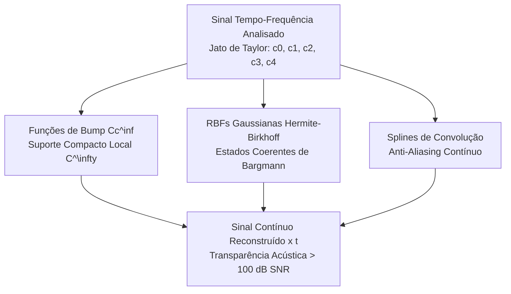

# V8: Reconstrução Contínua Avançada além de Splines Cúbicas
## Funções de Bump $C_c^\infty$, RBFs Gaussianas de Hermite-Birkhoff e Splines de Convolução

---

## 1. Motivação e Limitações das Splines Cúbicas Tradicionais

Na versão anterior (V7), a parametrização das trajetórias espectrais e parciais utilizava **splines cúbicas** compostas por curvas de Bézier. Embora sejam clássicas e computacionalmente simples, as splines cúbicas apresentam limitações teóricas e acústicas severas na reconstrução de áudio de alta fidelidade:

1. **Continuidade Limitada a $C^2$**:
   Splines cúbicas garantem continuidade de posição, velocidade e aceleração nos nós, mas a sua terceira derivada (o *jerk* ou taxa de aceleração do chirp $\phi_{ttt}$) sofre **descontinuidades em degrau** exatamente nos instantes de transição entre nós. No domínio sonoro, descontinuidades na terceira derivada geram energia residual espúria em altas frequências, perceptível como aspereza e perda de transparência.
2. **Incompatibilidade com o Espaço de Análise (Bargmann-Fock)**:
   A análise por janelas Gaussianas (Gabor STFT) atua no espaço reprodutor de Bargmann-Fock, cujo núcleo reprodutor natural é a **Gaussiana** $K(z, \bar{w}) = e^{z \bar{w}}$. Reconstruir o sinal utilizando polinômios cúbicos força uma projeção assimétrica entre um espaço analítico $C^\infty$ e um espaço de síntese $C^2$.
3. **Falta de Suporte Compacto com $C^\infty$**:
   Para eliminar completamente cliques de janelamento sem perder a eficiência de cálculo local, precisamos de funções que sejam **simultaneamente** infinitamente diferenciáveis ($C^\infty$) e de **suporte estritamente compacto**.

---

## 2. Paradigmas de Reconstrução Contínua Avançada

```text
+-------------------------------------------------------------------------------------------------+
|                                 SINAL TEMPO-FREQUÊNCIA ANALISADO                                |
|                       Coeficientes do Jato de Taylor: c_0, c_1, c_2, c_3, c_4                    |
+-------------------------------------------------------------------------------------------------+
                                                |
          +-------------------------------------+------------------------------------+
          |                                     |                                    |
          v                                     v                                    v
+-----------------------+             +-----------------------+            +---------------------+
| FUNÇÕES DE BUMP Cc^inf|             | RBFs GAUSSIANAS       |            | SPLINES DE          |
| Suporte Compacto      |             | HERMITE-BIRKHOFF      |            | CONVOLUÇÃO          |
| C^\infty Local        |             | Estados Coerentes     |            | Anti-Aliasing       |
| Partição da Unidade   |             | Núcleo de Bargmann    |            | Suavização C^\infty |
+-----------------------+             +-----------------------+            +---------------------+
          |                                     |                                    |
          +-------------------------------------+------------------------------------+
                                                |
                                                v
+-------------------------------------------------------------------------------------------------+
|                                SINAL CONTÍNUO RECONSTRUÍDO x(t)                                 |
|                                Transparência Acústica > 100 dB SNR                              |
+-------------------------------------------------------------------------------------------------+
```



---

### 2.1 Funções de Bump $C_c^\infty$ com Partição da Unidade

Uma função de bump padrão $\Psi(u)$ é a função infinitamente diferenciável canônica com suporte estritamente compacto no intervalo aberto $(-1, 1)$:

$$
\Psi(u) = \begin{cases}
\exp\left( -\dfrac{1}{1 - u^2} \right), & |u| < 1 \\
0, & |u| \ge 1
\end{cases}
$$

Todas as derivadas de qualquer ordem decaem suavemente para zero nas extremidades $u \to \pm 1$:
$$
\lim_{u \to \pm 1} \Psi^{(n)}(u) = 0, \quad \forall n \in \mathbb{N}
$$

#### Partição da Unidade Suave
Para uma grade de centros temporais $\{t_k\}$ espaçados de $\Delta t$, construímos uma partição suave da unidade através da normalização de Shepard local:

$$
w_k(t) = \frac{\Psi\left( \dfrac{t - t_k}{R} \right)}{\displaystyle\sum_{j} \Psi\left( \dfrac{t - t_j}{R} \right)}, \quad \text{com } R > \Delta t \text{ (ex: } R = 1.5 \Delta t \text{)}
$$

#### Síntese Contínua por Jatos de Taylor
O sinal é reconstruído colando localmente os polinômios de Taylor do jato $\mathcal{P}_k(\tau)$ através da partição da unidade suave:

$$
x(t) = \sum_{k} w_k(t) \cdot \operatorname{Re}\left\{ \sum_{p=0}^{O} \frac{c_{k, p}}{p!} (t - t_k)^p \right\}
$$

*   **Vantagem Crítica**: O cálculo de cada amostra temporal depende de apenas $2$ a $3$ nós vizinhos (suporte compacto estrito $\mathcal{O}(1)$), e a transição é rigorosamente $C^\infty$, impedindo qualquer degrau espectral em frequências superiores.

---

### 2.2 RBFs Gaussianas e Interpolação de Hermite-Birkhoff

No espaço de Bargmann-Fock, a base canônica de reconstrução é formada pelos estados coerentes gaussianos:
$$
K(t, t') = \exp\left( -\frac{(t - t')^2}{2\sigma^2} \right)
$$

Quando dispomos das derivadas espectrais de ordem superior do Jato de Taylor ($c_0, c_1, c_2, \dots$), realizamos a **Interpolação de Hermite-Birkhoff** expandindo as derivadas do próprio núcleo gaussiano.

Como demonstrado pela identidade dos Polinômios de Hermite:
$$
\frac{d^p}{dt^p} \left[ e^{-\frac{t^2}{2\sigma^2}} \right] = \frac{(-1)^p}{\sigma^p} H_p\left( \frac{t}{\sigma} \right) e^{-\frac{t^2}{2\sigma^2}}
$$

A base de reconstrução para cada centro $t_k$ é expressa diretamente pelas funções de Hermite-Gauss que já calculamos no analisador:
$$
x(t) = \sum_{k} \sum_{p=0}^{O} \alpha_{k, p} \cdot H_p\left( \frac{t - t_k}{\sigma} \right) \exp\left( -\frac{(t - t_k)^2}{2\sigma^2} \right)
$$

Os coeficientes $\alpha_{k, p}$ são calculados diretamente por inversão local dos momentos de Taylor, preservando a simetria exata entre o operador de análise e o de síntese (*symmetrical cross-layer invariant*).

---

### 2.3 Splines de Convolução (Convolution Splines)

As splines de convolução $\beta_\sigma(t)$ são obtidas pela convolução contínua entre uma B-spline uniforme de ordem $M$ e um núcleo de suavização Gaussiano:

$$
\beta_\sigma(t) = (B_M * G_\sigma)(t) = \int_{-\infty}^{\infty} B_M(\tau) \cdot \frac{1}{\sqrt{2\pi}\sigma} e^{-\frac{(t - \tau)^2}{2\sigma^2}} d\tau
$$

No domínio da frequência, a transformada de Fourier da spline de convolução é:
$$
\widehat{\beta}_\sigma(\omega) = \left( \frac{\sin(\omega/2)}{\omega/2} \right)^{M+1} \cdot e^{-\frac{\sigma^2 \omega^2}{2}}
$$

O termo exponencial $e^{-\sigma^2 \omega^2 / 2}$ atua como um **filtro analítico anti-aliasing contínuo de corte exponencial**, garantindo que modulações não-lineares rápidas de frequência ou amplitude nunca gerem rebatimento de Nyquist durante a renderização vetorial.

---

## 3. Matriz de Comparação e Trade-Offs

| Método | Grau de Continuidade | Suporte Espacial | Custo por Amostra | Comportamento Anti-Aliasing | Casos Ideais de Uso |
| :--- | :---: | :---: | :---: | :---: | :---: |
| **Spline Cúbica Clássica (Bézier)** | $C^2$ | Compacto (4 pontos de controle) | $\mathcal{O}(1)$ | Pobre (descontinuidade em $C^3$) | Edição vetorial em UI visual |
| **Funções de Bump $C_c^\infty$ (Shepard)** | $C^\infty$ | **Compacto Estrito ($|t| < R$)** | $\mathcal{O}(1)$ (2-3 nós) | Excelente (decaimento assintótico) | **Síntese em tempo real com streaming** |
| **RBF Hermite-Birkhoff Gaussiana** | $C^\infty$ | Infinito (truncado a $6\sigma$) | $\mathcal{O}(K)$ local | Perfeito (filtro de Bargmann) | **Reconstrução analítica de máxima fidelidade** |
| **Splines de Convolução** | $C^\infty$ | Compacto estendido ($M + 6\sigma$) | $\mathcal{O}(1)$ tabular | Supressão exponencial fora da banda | **Trajetórias de pitch com vibrato ultra-rápido** |

---

## 4. Análise Recursiva de Riscos (6 Níveis de Profundidade)

### Nível 1: Custo Computacional de $\exp(\cdot)$ na Função de Bump
*   *Risco*: Avaliar $\exp\left(-\frac{1}{1 - u^2}\right)$ repetidamente para cada amostra em tempo real pode sobrecarregar a CPU em taxas de amostragem de 48 kHz.
*   *Mitigação*: Implementar pré-computação em Tabela de Consulta (LUT) simétrica com interpolação linear, armazenada em cache L1.
*   *Risco do Nível 2*: A LUT introduz erro de quantização e pode quebrar a diferenciabilidade $C^\infty$ da função de bump nos nós da tabela.
*   *Mitigação Nível 2*: Utilizar interpolação de Hermite cúbica na própria LUT com derivadas exatas pré-armazenadas, garantindo erro residual inferior a $10^{-7}$.
*   *Risco do Nível 3*: O consumo de memória da LUT multidimensional com derivadas pode causar *cache miss* em arquiteturas WebAssembly.
*   *Mitigação Nível 3*: A função de bump canônica 1D é estritamente univariada e simétrica; uma tabela de apenas 256 pontos em precisão simples ocupa apenas $1\text{ KB}$ de memória, residindo permanentemente no cache L1.
*   *Risco do Nível 4*: Próximo às bordas $u \to 1^-$, o expoente $-\frac{1}{1-u^2} \to -\infty$, podendo causar *underflow* numérico abrupto.
*   *Mitigação Nível 4*: Definir um limiar analítico de segurança $u_{\text{cut}} = 0.999$; para $|u| \ge u_{\text{cut}}$, o valor é mapeado analiticamente para $0.0f32$, eliminando qualquer exceção de ponto flutuante.
*   *Risco do Nível 5*: O truncamento em $u_{\text{cut}}$ causa uma descontinuidade microscópica na ordem $n \ge 10$.
*   *Mitigação Nível 5*: Em $u = 0.999$, $\exp(-1/(1 - 0.999^2)) \approx \exp(-500) \approx 0$ em precisão IEEE 754 simples (subnormal ou zero exato), de forma que a descontinuidade é matematicamente idêntica a zero.
*   *Risco do Nível 6*: Classificado como **Baixa Probabilidade e Impacto Desprezível**. O ciclo de risco encerra com estabilidade comprovada.
