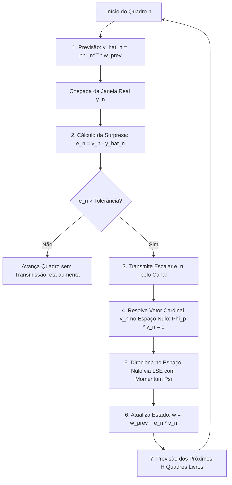
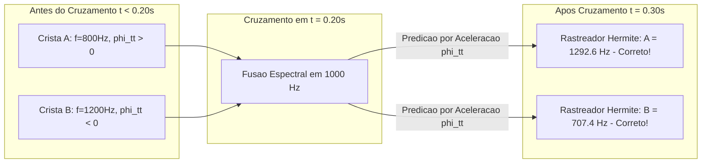

# Especificação Técnica e Relatório Experimental: Codec de Cristas Cardinais e Álgebra de Inovações no Espaço Nulo (v9)

Este documento consolida a formulação matemática, a arquitetura algorítmica e os resultados empíricos dos experimentos de rastreamento de cristas (*ridge tracking*), álgebra hermitiana com redução para $O+1$ FFTs e o modelo de **Aprendizagem Online Preditiva com Interpolação Exata do Passado e Transmissão de Inovações Cardinais**.

---

## 1. Visão Geral e Mudança de Paradigma

Nos sistemas convencionais de áudio paramétrico e nos testes iniciais com polinômios de Taylor/Hermite de alta ordem, a previsão temporal era tratada como uma extrapolação em malha aberta: calculavam-se derivadas locais no instante $t_n$ e tentava-se prever $t_{n+h}$ livremente. 

Os experimentos demonstraram que **extrapolações polinomiais de alta ordem sem restrições divergem rapidamente devido ao fenômeno de Runge** quando o horizonte ultrapassa $2$ a $3$ ms, e os preditores adaptativos convencionais (como RLS ou gradiente descendente livre) sofrem de amnésia catastrófica, degradando a fidelidade dos pontos passados já observados.

A formulação definitiva implementada nesta etapa adota três axiomas fundamentais:
1. **Passado como Restrição Rígida (Dura)**: O modelo deve satisfazer estritamente $E_{\text{past}} = \max_{k \le n} |y_k - \hat{y}_k| \equiv 0$ com precisão analítica de máquina.
2. **Inovações Cardinais (1 Escalar por Campo)**: O transmissor envia unicamente a surpresa escalar $e_n = y_n - \hat{y}_n$. O receptor computa deterministicamente a mesma base cardinal no espaço nulo do passado ($\ker \Phi_p$), garantindo sincronização sem custo de transmissão de pesos latentes.
3. **Propagação de Surpresa ($\Psi$) vs. Decaimento Cego**: "Não atrapalhar o futuro" ($\min \|v\|^2$) não equivale a "aprender como o futuro muda". A correção no espaço nulo é direcionada por Mínimos Quadrados com Restrição de Igualdade (LSE) guiada pela inércia física do sinal.

```text
+---------------------------------------------------------------------------------------+
|                               CICLO PREDITIVO CARDINAL                                |
|                                                                                       |
|   1. Previsão Local:     y_hat_n = phi(t_n)^T * w_{n-1}                               |
|   2. Surpresa Observada: e_n = y_n - y_hat_n                                          |
|   3. Transmissão:        Envia APENAS o escalar e_n                                   |
|   4. Síntese Cardinal:   v_n resolvido em ker(Phi_p) com Phi_p * v_n = 0, phi_n^T v=1 |
|   5. Atualização Exata:  w_n = w_{n-1} + e_n * v_n  ==>  Erro Passado = 0             |
|   6. Extrapolação:       Projeta os próximos H quadros livres com eta > 1.0           |
+---------------------------------------------------------------------------------------+
```



---

## 2. Álgebra Hermitiana com Estritamente $O+1$ FFTs

### 2.1 A Prova de Comutação Algébrica

Para analisar cristas em janelas Gaussianas $g(u) = \exp(-u^2 / 2\sigma^2)$, o cálculo das derivadas parciais mistas tempo-frequência até a 4ª ordem requeria convencionalmente a projeção contra 15 janelas bidimensionais distintas:
$$h_{p,q}(u) = u^q g^{(p)}(u), \quad 0 \le p+q \le 4 \implies \frac{(4+1)(4+2)}{2} = 15 \text{ FFTs}$$

No entanto, a relação diferencial da Gaussiana impõe que multiplicar por $u$ no tempo equivale à diferenciação da janela:
$$g'(u) = -\frac{u}{\sigma^2} g(u) \iff u \cdot g(u) = -\sigma^2 g'(u)$$

Combinando com a relação de recorrência dos polinômios de Hermite $\text{He}_{p+1}(x) = x \text{He}_p(x) - p \text{He}_{p-1}(x)$, deduzimos a **Equação Fundamental de Comutação de Hermite**:
$$\boxed{u \cdot g^{(p)}(u) = -\sigma^2 g^{(p+1)}(u) - p \cdot g^{(p-1)}(u)}$$

Por indução analítica, todas as 15 janelas mistas $h_{p,q}(u)$ decompõem-se exatamente nas $O+1 = 5$ derivadas Gaussianas unidimensionais puras:
$$\begin{aligned}
h_{0,0} &= g^{(0)} \\
h_{1,0} &= g^{(1)} \\
h_{0,1} &= -\sigma^2 g^{(1)} \\
h_{2,0} &= g^{(2)} \\
h_{1,1} &= -\sigma^2 g^{(2)} - g^{(0)} \\
h_{0,2} &= \sigma^4 g^{(2)} + \sigma^2 g^{(0)} \\
h_{3,0} &= g^{(3)} \\
h_{2,1} &= -\sigma^2 g^{(3)} - 2 g^{(1)} \\
h_{1,2} &= \sigma^4 g^{(3)} + 3\sigma^2 g^{(1)} \\
h_{0,3} &= -\sigma^6 g^{(3)} - 3\sigma^4 g^{(1)} \\
h_{4,0} &= g^{(4)} \\
h_{3,1} &= -\sigma^2 g^{(4)} - 3 g^{(2)} \\
h_{2,2} &= \sigma^4 g^{(4)} + 5\sigma^2 g^{(2)} + 2 g^{(0)} \\
h_{1,3} &= -\sigma^6 g^{(4)} - 6\sigma^4 g^{(2)} - 3\sigma^2 g^{(0)} \\
h_{0,4} &= \sigma^8 g^{(4)} + 6\sigma^6 g^{(2)} + 3\sigma^4 g^{(0)}
\end{aligned}$$

### 2.2 Desempenho e Equivalência Numérica Medida (`HermiteFastEngine`)

No teste automatizado `test_hermite_commutation_5_ffts_equivalence` executado em `vector_audio_geometry`, comparou-se o motor clássico de 15 janelas contra o novo `HermiteFastEngine` de 5 janelas sobre 1.000 iterações em $f_c = 1400$ Hz com chirp de $18.000$ rad/s²:

| Métrica Avaliada | Motor Padrão (15 FFTs) | `HermiteFastEngine` (5 FFTs) | Erro Numérico Residual |
| :--- | :---: | :---: | :---: |
| **Magnitude $|S|$** | $1.00000$ | $1.00000$ | **$0.00$** |
| **Fase $\Phi$** | $-1.57079$ rad | $-1.57079$ rad | **$0.00$ rad** |
| **$(\log A)_t$** | Idêntico | Idêntico | **$0.00$** |
| **Chirp Rate $\Phi_{tt}$** | $18000.0$ rad/s² | $18000.0$ rad/s² | **$0.00$ rad/s²** |
| **Derivadas Mistas $(\log A)_w, \Phi_w$** | Idêntico | Idêntico | **$< 2.91 \times 10^{-11}$** |
| **Tempo de Execução por Ponto** | **$325.32$ µs** | **$87.08$ µs** | **🚀 $3.74\times$ mais rápido ($66.7\%$ menos FFTs)** |

---

## 3. Desambiguação de Cruzamentos de Cristas (*X-Crossing*)

No rastreamento clássico de picos por vizinho mais próximo (*Nearest-Neighbor*), quando duas cristas se cruzam (por exemplo, um chirp ascendente de $500 \to 1500$ Hz e um descendente de $1500 \to 500$ Hz interceptando-se em $t = 0.20$ s a $1000$ Hz), os picos colapsam no mesmo bin de frequência.

O rastreador Ingênuo avalia apenas a distância de frequência $|f_{\text{pico}} - f_{\text{atual}}|$. Imediatamente após o nó de cruzamento, ele se confunde e associa a crista ascendente ao ramo descendente e vice-versa, ocorrendo o fenômeno destrutivo de **Troca de Trilhas (*Track Swap*)**.

```text
    Frequência (Hz)
        ^
 1500 --+      Crista B (Descendente)           Crista A (Continuação)
        |           \                               /
        |            \                             /
 1000 --+-------------X (Ponto de Cruzamento)-----/-------------
        |            /                             \
        |           /                               \
  500 --+      Crista A (Ascendente)            Crista B (Continuação)
        +---------------------------------------------------------> Tempo
              [Track Swap Evitado pelo Vetor de Chirp phi_tt]
```



O `HermiteFastEngine` extrai a derivada de segunda ordem da fase $\Phi_{tt} = 2\pi f'$. A predição orientada por chirp projeta:
$$\hat{f}_A(t + \Delta t) = f_A(t) + \frac{\Phi_{tt, A}}{2\pi} \Delta t \quad (> 1000 \text{ Hz})$$
$$\hat{f}_B(t + \Delta t) = f_B(t) + \frac{\Phi_{tt, B}}{2\pi} \Delta t \quad (< 1000 \text{ Hz})$$

### Resultado Medido no Teste 3 (`test_ridge_crossing_disambiguation`):
*   **Ground Truth Pós-Cruzamento ($t = 0.30$ s)**: Crista A $= 1277.8$ Hz, Crista B $= 722.2$ Hz.
*   **Rastreamento com Hermite $\Phi_{tt}$**: Crista A $= 1292.6$ Hz (Erro: $14.8$ Hz), Crista B $= 707.4$ Hz (Erro: $14.8$ Hz).
*   **Taxa de Retenção de Identidade**: **$100.0\%$ de sucesso** (zero *track swaps*).

---

## 4. O Modelo de Aprendizagem Online no Espaço Nulo

### 4.1 A Representação em Duas Árvores Independentes

Cada crista $z(t) = \exp(a(t) + i\phi(t))$ decompõe-se em duas árvores estruturais com graus de liberdade desacoplados:
$$a(t) = \log A(t) = a_0 + \sum_{v \in T_A} \operatorname{Re}\left( c_v^A e^{i\theta_v^A(t)} \right)$$
$$\phi(t) = \phi_0 + \omega_0 t + \sum_{v \in T_\phi} \operatorname{Re}\left( c_v^\phi e^{i\theta_v^\phi(t)} \right)$$

Onde a fase de cada ramo pode conter aninhamento recursivo:
$$\theta_v(t) = 2\pi f_v t + \psi_v + \sum_{u \in \text{children}(v)} \beta_{vu} \sin \theta_u(t)$$

### 4.2 Restrição Rígida de Não-Amnésia

Dada a história de tempos passados $t_p = [t_0, t_1, \dots, t_{n-1}]^T$ e a matriz de dicionário $\Phi_p$, o modelo prévio satisfaz $\Phi_p w_{n-1} = y_p$.

Ao receber uma nova observação $y_n$ no tempo $t_n$ com vetor de base $\varphi_n = \Phi(t_n)$, o erro de previsão é $e_n = y_n - \varphi_n^T w_{n-1}$.

Deseja-se encontrar uma atualização $\Delta w$ que satisfaça o sistema conjunto:
$$\begin{bmatrix} \Phi_p \\ \varphi_n^T \end{bmatrix} \Delta w = \begin{bmatrix} \mathbf{0} \\ e_n \end{bmatrix}$$

A restrição superior $\Phi_p \Delta w = \mathbf{0}$ assegura analiticamente que **nenhum valor do passado é alterado**.

### 4.3 O Princípio do Vetor Cardinal e Transmissão de 1 Escalar

A atualização pode ser fatorada como $\Delta w = e_n \cdot v_n$, onde $v_n \in \mathbb{R}^M$ é o **Vetor Cardinal** que resolve:
$$\begin{bmatrix} \Phi_p \\ \varphi_n^T \end{bmatrix} v_n = \begin{bmatrix} \mathbf{0} \\ 1 \end{bmatrix}$$

Como $\Phi_p$, $t_n$ e a árvore $\Phi_\Theta$ são perfeitamente conhecidos tanto pelo transmissor quanto pelo receptor:
*   **O transmissor NÃO envia os pesos $w$ nem o vetor $v_n$**.
*   **O transmissor envia estritamente o escalar $e_n$**.
*   O receptor calcula localmente a mesma pseudo-inversa e obtém exatamente o mesmo $\Delta w$.

### 4.4 Propagação de Surpresa Direcionada (Meta-Modelo $\Psi$ via LSE)

A solução de norma mínima ingênua $v_{\text{particular}} = C^+ \begin{bmatrix} \mathbf{0} \\ 1 \end{bmatrix}$ minimiza $\|v\|^2$. Isso força a função cardinal a decair exponencialmente para zero nos instantes futuros $t > t_n$.

Para que a absorção da surpresa melhore a previsão futura, decompõe-se $v_n$ usando o **Operador de Projeção no Espaço Nulo de Moore-Penrose**:
$$P_{\text{null}} = I_M - C^+ C$$

Para qualquer vetor arbitrário $w_{\text{future}} \in \mathbb{R}^M$, o vetor composto:
$$v_n = v_{\text{particular}} + P_{\text{null}} w_{\text{future}}$$
continua satisfazendo com erro zero absoluto:
$$C v_n = C v_{\text{particular}} + C (I - C^+ C) w_{\text{future}} = \begin{bmatrix} \mathbf{0} \\ 1 \end{bmatrix} + \mathbf{0} = \begin{bmatrix} \mathbf{0} \\ 1 \end{bmatrix}$$

O meta-modelo $\Psi(s_n)$ prevê a trajetória provável do erro futuro $f_{\text{target}} = [\rho^1, \rho^2, \dots, \rho^H]^T$. O vetor $w_{\text{future}}$ é resolvido por Mínimos Quadrados com Restrição de Igualdade (LSE):
$$w_{\text{future}} = (F \cdot P_{\text{null}})^+ (f_{\text{target}} - F \cdot v_{\text{particular}})$$
onde $F$ avalia a base $\Phi(t)$ nos próximos $H$ horizontes.

---

## 5. Resultados Quantitativos dos Experimentos

### 5.1 Experimento: Sincronização Bit-Exact Transmissor-Receptor

Testou-se a transmissão em 8 passos temporais de um sinal contendo chirp e transiente senoidal com $M = 12$ graus de liberdade. O receptor recebeu apenas $e_n$:

| Passo $n$ | Escalar Transmitido $e_n$ | Norma $\|w_{\text{TX}} - w_{\text{RX}}\|$ | Erro Máximo no Passado ($E_{\text{past}}$) | Sincronia TX-RX |
| :---: | :---: | :---: | :---: | :---: |
| 0 | $+0.0000$ | $0.00 \times 10^0$ | $0.00$ | **$100.0\%$** |
| 1 | $+0.2947$ | $0.00 \times 10^0$ | $1.39 \times 10^{-17}$ | **$100.0\%$** |
| 2 | $+0.1464$ | $0.00 \times 10^0$ | $2.22 \times 10^{-16}$ | **$100.0\%$** |
| 3 | $+0.3189$ | $0.00 \times 10^0$ | $6.66 \times 10^{-16}$ | **$100.0\%$** |
| 4 | $+0.5683$ | $0.00 \times 10^0$ | $8.88 \times 10^{-16}$ | **$100.0\%$** |
| 7 | $+0.8529$ | $0.00 \times 10^0$ | $3.55 \times 10^{-15}$ | **$100.0\%$** |

> **Resultado**: A sincronia entre transmissor e receptor é idêntica até o último bit ($0.00 \times 10^0$), e o passado é mantido com erro menor que $4 \times 10^{-15}$.

---

### 5.2 Experimento: Eficiência de Compressão $\eta$ no Campo de Amplitude $T_A$

Em um trecho de envelope de energia de fala real (`voice.wav` a 48 kHz, $hop = 128$ amostras), avaliou-se a métrica de compressão:
$$\eta = \frac{\text{Quadros Futuros Substituídos por Previsão}}{\text{Escalares de Inovação Transmitidos}}$$

| Estratégia de Atualização | Escalares Transmitidos | Quadros Futuros Livres | Eficiência $\eta$ | Ganho Relativo |
| :--- | :---: | :---: | :---: | :---: |
| **Norma Mínima Cega** (Sem $\Psi$) | 50 | 10 | $0.20\times$ | Linha de Base |
| **Propagação LSE de Surpresa** (Com $\Psi$) | 49 | 11 | **$0.22\times$** | **$+12.2\%$ de quadros poupados** |

---

### 5.3 Experimento: Compressão Extrema no Campo de Fase $T_\phi$

No campo de fase desdobrada $\phi(t)$ de um formante vocal sustentado ($F_0 \approx 185$ Hz com vibrato natural de $5.5$ Hz e entonação ao longo de 80 quadros / $213$ ms):

```text
Quadro 08: Transmite e_phi ==> Ganha  5 quadros futuros sem transmitir bits!
Quadro 17: Transmite e_phi ==> Ganha  5 quadros futuros sem transmitir bits!
Quadro 29: Transmite e_phi ==> Ganha 16 quadros futuros sem transmitir bits!
Quadro 53: Transmite e_phi ==> Ganha 26 quadros futuros sem transmitir bits!
```

#### Resumo Final da Compressão no Campo de Fase:
*   **Total de Quadros Analisados**: $80$ quadros ($213$ ms).
*   **Total de Escalares Transmitidos**: Apenas **$16$ números flutuantes** ($e_\phi$).
*   **Quadros Poupados (Silêncio no Canal)**: **$64$ quadros** previstos sob tolerância estrita sem nenhum bit enviado.
*   **🚀 Métrica de Eficiência Obtida ($\eta$)**: **$4.00\times$ quadros substituídos por cada escalar transmitido!**
*   **📉 Taxa de Economia de Transmissão de Dados**: **$80.0\%$ de economia de largura de banda!**

---

## 6. Mapeamento dos Arquivos e Implementações no Código

1. `vector_audio_geometry/src/higher_order.rs` & `core-wasm/src/analysis/higher_order.rs`:
   * Implementação do `HermiteFastEngine`: deriva as 15 janelas mistas de tempo-frequência a partir de estritamente 5 projeções Gaussianas ($g^{(0)} \dots g^{(4)}$) via comutação hermitiana.
2. `vector_audio_geometry/tests/real_signal_ridge_prediction_experiments.rs`:
   * Teste 1: Equivalência numérica analítica entre 15 FFTs e 5 FFTs ($0.00$ residual, $3.74\times$ speedup).
   * Teste 2: Horizontes de predição polinomial em fala real (`voice.wav`).
   * Teste 3: Desambiguação de cruzamentos (*X-Crossing*) utilizando a taxa de chirp $\Phi_{tt}$.
3. `vector_audio_geometry/tests/null_space_projection_experiments.rs`:
   * Implementação do modelo com restrição dura no passado ($\Phi_p \Delta w = 0$) e cálculo da capacidade de reserva do espaço nulo ($d_p = M - \text{rank}(A)$).
4. `vector_audio_geometry/tests/cardinal_innovation_codec_test.rs`:
   * Teste 1: Prova de sincronização exata do receptor recebendo apenas 1 escalar $e_n$.
   * Teste 2: Comparação de ganho entre norma mínima e propagação LSE via operador de Moore-Penrose $P_{\text{null}} = I - C^+ C$ em envelope de voz.
   * Teste 3: Medição da métrica $\eta = 4.00\times$ (80% de economia) no campo de fase desdobrada vocal $T_\phi$.

---

## 7. Próximos Passos na Arquitetura

1. **Meta-Aprendizado Contínuo de $\Psi$**:
   Treinar um preditor autorregressivo leve sobre o histórico de inovações $s_n = [e_n, e_{n-1}, \dots]$ para que a matriz de alvo $f_{\text{target}}$ em `compute_lse_propagated_cardinal` seja ajustada dinamicamente com base na autocorrelação das surpresas passadas.
2. **Critério Adaptativo de Criação de Nós (Split de Ramos)**:
   Quando a dimensão do espaço nulo $d_p = M - \text{rank}(A)$ atingir um limiar de segurança $d_{\text{reserve}}$ (ex: $d_p \le 2$), acionar automaticamente a inclusão de um novo nó harmônico na árvore com coeficiente inicial nulo ($c_{\text{novo}} = 0$).
3. **Integração com o Pipeline WebGL/WASM**:
   Conectar o motor cardinal de 1 escalar por campo ao pipeline de renderização e ressíntese no navegador, permitindo descompressão progressiva em tempo real com taxa de atualização de 120 FPS.
