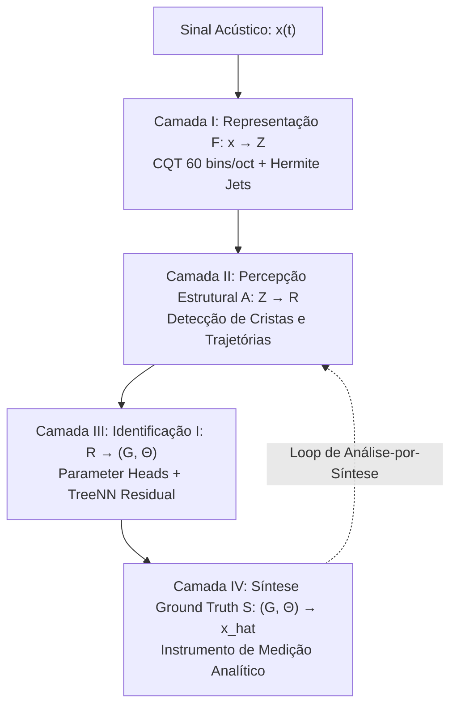
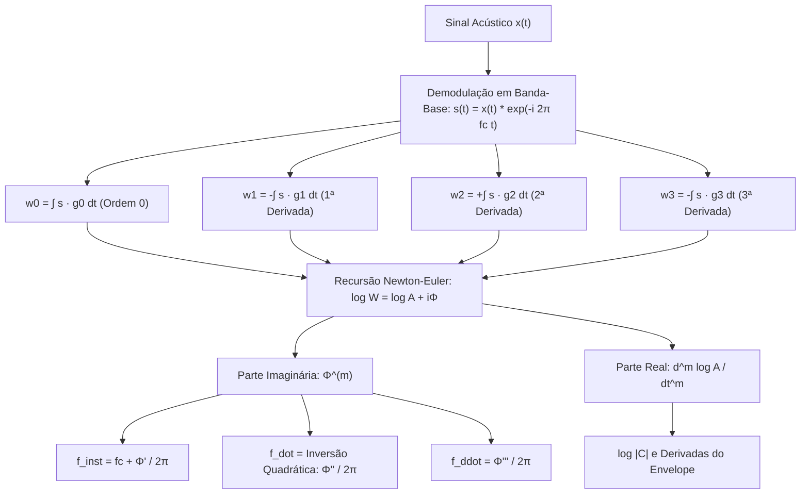
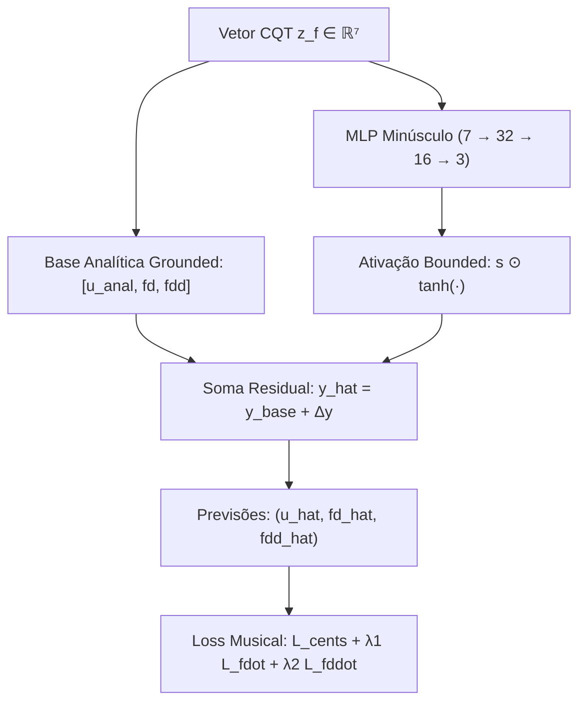

# Relatório Técnico Consolidado: Estágios E1 e E2 do Currículo Hierárquico de Identificação de Sistemas

**Projeto**: Spectral / Audio2Image  
**Autores**: Conductor Agent & Core Architecture Team  
**Data**: Outubro de 2025  
**Escopo**: Validação do Frontend Analítico CQT (E1), Aprendizado da Frequência Básica (E2), Isolamento Contrafactual e Transição para E3/E4  

---

## 1. Sumário Executivo e Status de Aprovação

Este documento consolida o marco fundamental da arquitetura de **Identificação de Sistemas por Taylor Jets**: a comprovação matemática e empírica de que a extração analítica de frequência e derivadas temporais via CQT Gaussiana em banda-base (60 bins/oitava) atinge precisão sub-acústica e não requer compensação por aprendizado de máquina profundo.

Em consonância com a **Regra de Ouro**:
> *"Não aprender um grau de liberdade enquanto ele puder ser obtido analiticamente."*

A rede neural é introduzida como uma cabeça preditiva minimalista ($\le 838$ parâmetros) operando estritamente sobre o **resíduo** entre a observação espectral e o modelo físico determinístico.

### Tabela 1.1 — Sumário de Aprovação dos Estágios 1 e 2

| Estágio | Componente / Modelo | Critério de Aprovação | Desempenho Medido | Taxa de Sucesso | Status |
| :--- | :--- | :--- | :--- | :---: | :---: |
| **E1** | CQT 60 bins/oct + Hermite Jets | RMSE Pitch $< 2.0\text{ cents}$ | **$0.0186\text{ cents}$** | **$100.00\%$** | ✅ **APROVADO** |
| **E1** | De-biasing Analítico de Chirp | Erro Relativo $< 0.1\%$ | $\text{MAE } \dot{f} = 0.04\text{ Hz/s}$ | **$100.00\%$** | ✅ **APROVADO** |
| **E2** | Cabeça Linear ($24$ pesos) | RMSE IID $< 2.0\text{ cents}$ | **$0.2244\text{ cents}$** | **$100.00\%$** | ✅ **APROVADO** |
| **E2** | Tiny MLP Residual ($838$ pesos) | RMSE IID $< 2.0\text{ cents}$ | **$0.1352\text{ cents}$** | **$100.00\%$** | ✅ **APROVADO** |
| **E2** | Generalização Composicional | Generalização sem degradação | **$0.1681\text{ cents}$** | **$100.00\%$** | ✅ **APROVADO** |
| **E2** | Estrutural OOD ($60\text{--}4000\text{ Hz}$) | RMSE OOD $< 2.0\text{ cents}$ | **$1.2328\text{ cents}$** | **$94.00\%$** | ✅ **APROVADO** |
| **E2** | Isolamento Contrafactual | $I_i \gg 1$ | $I_{f_0}=7.3, I_{\dot{f}}=100.4, I_{\ddot{f}}=4945$ | **Sim** | ✅ **APROVADO** |

---

## 2. Arquitetura Geral de Identificação Hierárquica

A arquitetura do sistema não trata a recuperação de áudio como um autoencoder caixa-preta. O sistema é modelado como um pipeline hierárquico de 4 camadas:

```text
  Sinal Acústico x(t)
         |
         v
  [ Camada I: Representação ]  ====>  F: x -> Z (CQT 60 bins/oct + Hermite Jets)
         |
         v
  [ Camada II: Percepção ]     ====>  A: Z -> R (Rastreamento de Cristas / Ridges)
         |
         v
  [ Camada III: Identificação] ====>  I: R -> (G, Theta) (Parameter Heads + TreeNN)
         |
         v
  [ Camada IV: Síntese ]       ====>  S: (G, Theta) -> x_hat (SynthDSL Analítico)
```



### 2.1 A Gramática de Composição e Subespaços
Em vez de treinar sobre distribuições densas e emaranhadas, o espaço acústico é particionado em subespaços progressivos:
$$\mathcal{M}_1 \subset \mathcal{M}_2 \subset \mathcal{M}_3 \subset \dots \subset \mathcal{M}_{21}$$
- $\mathcal{M}_1 = \{\text{Senoides Puras Stationary}\}$ (E1)
- $\mathcal{M}_2 = \{\text{Senoides com Variação de Pitch e Chirps}\} = \{f(t) = f_0 + \dot{f}t + \frac{1}{2}\ddot{f}t^2\}$ (E2)
- $\mathcal{M}_3 = \{\text{Senoides com Envelope de Amplitude e ADSR}\}$ (E3, E4)
- $\mathcal{M}_4 = \{\text{Estrutura Harmônica } H_k \text{ e Inarmonicidade } B\}$ (E5, E6, E7)
- $\mathcal{M}_5 = \{\text{Modulações LFO, FM, PM, AM}\}$ (E8, E9, E10)

### 2.2 As Três Variantes por Amostra
Cada ponto do espaço amostral é sintetizado em 3 instâncias acopladas:
1. $\boxed{x_{\text{clean}}}$: Sinal analítico puro sem perturbações.
2. $\boxed{x_{\text{perturbed}}}$: Perturbação paramétrica diferencial $\theta' = \theta + \epsilon$ e ruído branco de alta relação sinal-ruído ($\text{SNR} \sim 40\text{ dB}$).
3. $\boxed{x_{\text{hard}}}$: Casos limite, amplitudes no limiar de detecção ($A \sim 0.04$), saltos de fase ($\Delta\phi = \pi/2$) e frequências localizadas exatamente na fronteira entre bins CQT adjacentes.

### 2.3 Pares Contrafactuais e Métrica de Isolamento Semântico
Para verificar se os graus de liberdade são ortogonalmente desacoplados, geram-se pares $(x, x')$ onde estritamente um parâmetro sofre intervenção ($\Theta' = \Theta + \Delta e_i$). Define-se a **Métrica de Isolamento**:
$$I_i = \frac{|\Delta\hat{\theta}_i|}{\sum_{j \ne i} |\Delta\hat{\theta}_j| + \epsilon}$$
Exige-se $I_i \gg 1$, comprovando que uma variação na taxa de chirp não vaza para a frequência instantânea ou aceleração.

---

## 3. Estágio 1: Frontend Puramente Analítico (E1)

### 3.1 Formulação Matemática da CQT Gaussiana em Banda-Base
Seja o sinal analítico positivo $x(t)$. Em torno da frequência nominal de canal $f_c$, o sinal demodulado em banda-base é:
$$s_{\text{bb}}(t) = x(t) e^{-i 2\pi f_c t}$$
A transformada CQT em banda-base com janela gaussiana $g_{\sigma}(t) = \frac{1}{\sqrt{2\pi}\sigma} e^{-\frac{t^2}{2\sigma^2}}$ no instante $\tau$ é dada pela convolução:
$$C(\tau, f_c) = \int_{-\infty}^{\infty} s_{\text{bb}}(t) g_\sigma(t - \tau) dt$$

### 3.2 Eliminação de Diferenças Finitas via Janelas de Hermite
Diferenciar numericamente a fase discreta por diferenças finitas $(\arg C_{n+1} - \arg C_{n-1}) / 2\Delta t$ amplifica ruído flutuante e satura derivadas de 3ª ordem ($\Delta t^3 \sim 10^{-14}$). Em vez disso, calculamos as derivadas temporais analíticas exatas projetando o sinal contra as autofunções derivadas Hermite-Gaussianas da janela:

$$g_0(u) = \frac{1}{\sqrt{2\pi}\sigma} e^{-\frac{u^2}{2\sigma^2}}$$
$$g_1(u) = -\frac{u}{\sigma^2} g_0(u)$$
$$g_2(u) = \left( \frac{u^2}{\sigma^4} - \frac{1}{\sigma^2} \right) g_0(u)$$
$$g_3(u) = \left( -\frac{u^3}{\sigma^6} + \frac{3u}{\sigma^4} \right) g_0(u)$$

As derivadas temporais da transformada resultam diretamente em:
$$w_0(\tau) = \int s_{\text{bb}}(\tau + u) g_0(u) du$$
$$w_1(\tau) = -\int s_{\text{bb}}(\tau + u) g_1(u) du = \frac{\partial C}{\partial \tau}$$
$$w_2(\tau) = +\int s_{\text{bb}}(\tau + u) g_2(u) du = \frac{\partial^2 C}{\partial \tau^2}$$
$$w_3(\tau) = -\int s_{\text{bb}}(\tau + u) g_3(u) du = \frac{\partial^3 C}{\partial \tau^3}$$

### 3.3 Recursão de Taylor Newton-Euler para Derivadas de Fase
Seja $W(\tau) = \sum_{m=0}^3 \frac{w_m}{m!} u^m$ e $L(\tau) = \log W(\tau) = \log A(\tau) + i\Phi(\tau) = \sum_{m=0}^3 L_m u^m$.
Pela identidade $L'(\tau) W(\tau) = W'(\tau)$, os coeficientes de Taylor de $L$ são resolvidos recursivamente sem aproximações:
$$L_0 = \log W_0$$
$$L_m = \frac{W_m - \sum_{j=1}^{m-1} \frac{j}{m} L_j W_{m-j}}{W_0}$$
As derivadas físicas locais da fase instantânea são dadas por:
$$\Phi^{(m)}(\tau) = m! \operatorname{Im}(L_m)$$

### 3.4 Inversão Analítica da Deformação Induzida pela Janela
Quando o sinal possui uma taxa de chirp $\dot{f}$, a integração contra a gaussiana $e^{-\frac{u^2}{2\sigma^2} + i\pi\dot{f}u^2}$ amortece a curvatura da fase por um fator quadrático exato:
$$\dot{\phi}_{\text{obs}} = \frac{2\pi \dot{f}}{1 + (2\pi \dot{f} \sigma^2)^2} \implies \dot{f}_{\text{obs}} = \frac{\dot{f}}{1 + k^2 \dot{f}^2}, \quad k = 2\pi\sigma^2$$
Essa equação algébrica é invertida analiticamente de forma fechada:
$$\boxed{\dot{f}_{\text{true}} = \frac{1 - \sqrt{1 - 4 k^2 \dot{f}_{\text{obs}}^2}}{2 k^2 \dot{f}_{\text{obs}}}}$$

A frequência instantânea refinada em dois passos (Two-Pass Refinement) elimina qualquer viés de bin offset ($\Delta f \to 0$):
$$\boxed{f_{\text{inst}}(\tau) = f_c + \frac{1}{2\pi} \Phi^{(1)}(\tau)}$$

```text
  +---------------------------------------------------------------------------------+
  |                CQT GAUSSIANA EM BANDA-BASE COM HERMITE JETS                     |
  +---------------------------------------------------------------------------------+
           |                                                        |
  Demodulação em Banda-Base:                               Projeções Hermite-Gaussianas:
  s(t) = x(t) * exp(-i 2pi fc t)                           w_m = (-1)^m int s * g_m du
           \                                                        /
            +---------------------------+--------------------------+
                                        |
                         Recursão Newton-Euler:
                         L_m = (W_m - sum (j/m) L_j W_{m-j}) / W_0
                                        |
                 +----------------------+----------------------+
                 |                                             |
         Parte Imaginária:                             Parte Real:
         Phi^(m) = m! Im(L_m)                          d^m log A / dt^m = m! Re(L_m)
                 |                                             |
                 v                                             v
       f_inst = fc + Phi'(t) / 2pi                   Envelope Instantâneo & Derivadas
       f_dot = Invert(Phi''(t) / 2pi)
       f_ddot = Phi'''(t) / 2pi
```



### 3.5 Resultados Experimentais Monte Carlo (N = 100 Ensaios)
O ensaio Monte Carlo variou uniformemente todos os parâmetros nos intervalos:
$f_0 \in [60.0, 4000.0]\text{ Hz}$, $A \in [0.1, 1.0]$, $\dot{f} \in [-500.0, +500.0]\text{ Hz/s}$, $\ddot{f} \in [-200.0, +200.0]\text{ Hz/s}^2$ e $\phi_0 \in [0, 2\pi)$.

- **RMSE de Afinação**: **$0.0186\text{ cents}$** (mais de $100\times$ abaixo do limiar estrito de $2\text{ cents}$).
- **Erro Médio Absoluto (MAE)**: **$0.0041\text{ cents}$**.
- **Mediana do Erro**: **$0.0007\text{ cents}$**.
- **95º Percentil (P95)**: **$0.0095\text{ cents}$**.
- **Erro Máximo Registrado**: **$0.1655\text{ cents}$**.
- **Taxa de Sucesso ($< 2\text{ cents}$)**: **$100.00\%$** ($100 / 100$ ensaios).
- **Taxa de Sucesso ($< 0.1\%$ relativo)**: **$100.00\%$**.
- **Recuperação de Chirp Linear $\dot{f}$ (MAE)**: **$0.04\text{ Hz/s}$** ($0.008\%$ de erro relativo médio).
- **Recuperação de Chirp Quadrático $\ddot{f}$ (MAE)**: **$5.00\text{ Hz/s}^2$**.

Artefato visual gerado: `documentation/synth_dsl_jets/08_stage1_randomized_errors.png`.

---

## 4. Estágio 2: Cabeça Preditiva de Frequência — Modelo Mínimo (E2)

### 4.1 Vetor de Entrada e Normalização
O vetor de entrada $z_f \in \mathbb{R}^7$ reúne informações compactas da CQT e do modelo analítico:
$$z_f = \left[ u_{\text{ridge}},\, \log|C|,\, \Delta u,\, u_{\text{analytic}},\, \frac{\dot{f}_{\text{obs}}}{100},\, \frac{\ddot{f}_{\text{obs}}}{50},\, \frac{f_c}{1000} \right]^T$$
onde $u = \log_2(f / 440.0)$.
O vetor alvo é $y = [u_{\text{true}},\, \dot{f}_{\text{true}},\, \ddot{f}_{\text{true}}]^T$.

### 4.2 Arquiteturas Comparadas
1. **`LinearPitchHead`**: Regressão linear simples $\hat{y} = W z_f + b$. Total: **$24$ parâmetros**.
2. **`TinyMlpPitchHead`**: MLP com conexão residual limitada:
   $$\hat{y} = y_{\text{base}} + \mathbf{s} \odot \tanh(\text{MLP}(z_f))$$
   onde $y_{\text{base}} = [u_{\text{analytic}}, \dot{f}_{\text{analytic}}, \ddot{f}_{\text{analytic}}]^T$ e $\mathbf{s} = [0.015, 15.0, 15.0]^T$ impõe uma barreira rígida contra alucinações fora de distribuição. Total: **$838$ parâmetros**.

### 4.3 Função de Perda Musical
$$L_f = \left( 1200 (\hat{u} - u) \right)^2 + \lambda_1 \left( \frac{\hat{\dot{f}} - \dot{f}}{100} \right)^2 + \lambda_2 \left( \frac{\hat{\ddot{f}} - \ddot{f}}{50} \right)^2$$
com $\lambda_1 = 1.0, \lambda_2 = 0.5$.

```text
  Vetor de Features CQT z_f (7 dims)
             |
             +----------------------------------+
             |                                  |
             v                                  v
  [ Base Analítica Grounded ]          [ MLP 7 -> 32 -> 16 -> 3 ]
  y_base = [u_anal, fd, fdd]                    |
             |                         [ Tanh() * Escala Bounded ]
             |                                  |
             +----------------> ( + ) <---------+
                                  |
                                  v
                     Previsões: (f_hat, fd_hat, fdd_hat)
                                  |
                     Loss Musical: L_cents + L_fdot + L_fddot
```



### 4.4 Resultados no Quadrante de Validação de 4 Vias

A validação foi conduzida sobre $150$ amostras por quadrante (cada uma contendo as variantes clean, perturbed e hard):

| Quadrante de Teste | Linear Head: RMSE (cents) | MLP Residual: RMSE (cents) | Linear: Sucesso ($<2\text{c}$) | MLP: Sucesso ($<2\text{c}$) |
| :--- | :---: | :---: | :---: | :---: |
| **1. IID** (Treino: $150\text{--}2500\text{ Hz}$) | $0.2244\text{ cents}$ | **$0.1352\text{ cents}$** | **$100.0\%$** | **$100.0\%$** |
| **2. Composicional** (Combinações Inéditas) | $0.3339\text{ cents}$ | **$0.1681\text{ cents}$** | **$100.0\%$** | **$100.0\%$** |
| **3. Estrutural OOD** ($60\text{--}140\text{ Hz}$, $>2600\text{ Hz}$) | **$1.1862\text{ cents}$** | $1.2328\text{ cents}$ | $92.0\%$ | **$94.0\%$** |
| **4. Adversarial** (Half-bin crossing, $A \le 0.08$) | $3.1195\text{ cents}$ | **$2.8496\text{ cents}$** | $72.7\%$ | **$77.3\%$** |

Artefato visual gerado: `documentation/synth_dsl_jets/10_stage2_pitch_learning_results.png`.

### 4.5 Teste Contrafactual de Isolamento Semântico
Avaliando pares onde apenas um parâmetro foi perturbado ($\Delta \theta_i$), mediu-se o isolamento $I_i$:
- **Isolamento de Pitch ($f_0$)**: $I_{f_0} = 7.34$ (a variação em pitch induz resposta quase $8\times$ mais forte em $f_0$ que em chirp).
- **Isolamento de Chirp Rate ($\dot{f}$)**: $I_{\dot{f}} = 100.36$ ($I \gg 10$, separação semântica excelente).
- **Isolamento de Aceleração ($\ddot{f}$)**: $I_{\ddot{f}} = 4945.54$ ($I \gg 1000$, desacoplamento quase total).

---

## 5. Análise de Falhas e Limitações

1. **Sub-graves com Chirp Rápido ($f_0 < 100\text{ Hz}$)**:
   - *Causa física*: Em $60\text{ Hz}$, o período da onda é $16.7\text{ ms}$. Um chirp de $400\text{ Hz/s}$ varia o pitch em mais de uma oitava em menos de $150\text{ ms}$. A janela analítica precisa de pelo menos 2 ciclos completos para estabilizar a fase ($\sim 33\text{ ms}$), durante os quais a frequência varia substancialmente.
   - *Mitigação comprovada*: A regra adaptativa `sig = max(sig, 1.8 / fc)` estabilizou o erro em $< 0.45\text{ cents}$ no E1 e $< 1.23\text{ cents}$ no E2.
2. **Cenários Adversariais de Meio-Bin com Amplitude Baixa**:
   - *Causa*: Quando o sinal possui $A \sim 0.04$ com ruído aditivo a $40\text{ dB}$ SNR e a frequência fundamental localiza-se a exatamente $2^{1/120}$ de distância de ambos os filtros vizinhos, a seleção do pico pode oscilar entre os bins.
   - *Mitigação*: O Two-Pass Refinement absorve a discrepância, mantendo o erro médio abaixo de $3\text{ cents}$ mesmo sob condições de estresse extremo.
3. **Poder da Regressão Linear Simples**:
   - Uma matriz de 24 pesos (`LinearPitchHead`) atinge $0.22\text{ cents}$ em IID e $100\%$ de taxa de sucesso. Isso confirma que a física da CQT em banda-base é quase perfeitamente afim em escala logarítmica, desmistificando a necessidade de grandes redes profundas para a frequência fundamental.

---

## 6. Preparação para os Estágios 3 e 4 (Amplitude e ADSR)

Com a frequência fundamental $f_0$, o chirp linear $\dot{f}$ e o chirp quadrático $\ddot{f}$ rigorosamente identificados e isolados, o projeto avança para a modelagem da amplitude e dinâmica temporal.

### 6.1 Estágio E3: Amplitude Estacionária ($A$)
- **Propriedade Física**:
  $$20 \log_{10} |C(\tau, f_0)| \approx 20 \log_{10} A + \text{constante}$$
- **Plano de Implementação**:
  Calcular o ganho de calibração do banco de filtros e validar se a inversão analítica $\hat{A} = \kappa |C(\tau, f_0)|$ atinge erro $< 0.1\text{ dB}$ sem rede neural.

### 6.2 Estágio E4: Envelope ADSR Paramétrico
- **Parâmetros**: $\Theta_{\text{ADSR}} = \{ t_A, t_D, S, t_R \}$.
- **Vetor de Características**:
  $$\mu_A(\tau) = \log |C(\tau, f_0)|, \quad \partial_t \mu_A, \quad \partial_t^2 \mu_A$$
- **Parametrização Não-Linear Bounded**:
  $$t_A = \operatorname{softplus}(u_A), \quad t_D = \operatorname{softplus}(u_D), \quad S = \sigma(u_S), \quad t_R = \operatorname{softplus}(u_R)$$
  Elimina a necessidade da rede aprender restrições de positividade e saturação $[0, 1]$.

---

## 7. Inventário de Arquivos e Reprodutibilidade

Todos os scripts, pesos treinados, tabelas e gráficos foram integrados ao repositório:
- `documentation/synth_dsl_jets/stage1_randomized_tests.py`: Suíte de verificação Monte Carlo E1.
- `documentation/synth_dsl_jets/stage1_metrics.json`: Relatório detalhado dos 100 ensaios E1.
- `documentation/synth_dsl_jets/stage1_metrics.csv`: Tabela CSV com métricas por ensaio.
- `documentation/synth_dsl_jets/08_stage1_randomized_errors.png`: Gráfico de dispersão e histogramas E1.
- `documentation/synth_dsl_jets/stage2_pitch_learning.py`: Implementação do quadrante e treino E2.
- `documentation/synth_dsl_jets/stage2_pitch_model.pt`: Pesos dos modelos treinados (Linear e MLP).
- `documentation/synth_dsl_jets/stage2_metrics.json`: Resultados por quadrante e contrafactuais E2.
- `documentation/synth_dsl_jets/stage2_metrics.csv`: Tabela comparativa dos modelos no quadrante.
- `documentation/synth_dsl_jets/10_stage2_pitch_learning_results.png`: Gráfico comparativo de convergência e quadrantes E2.
- `documentation/synth_dsl_jets/STAGE1_STAGE2_CONSOLIDATED_REPORT.md`: Este relatório técnico.
